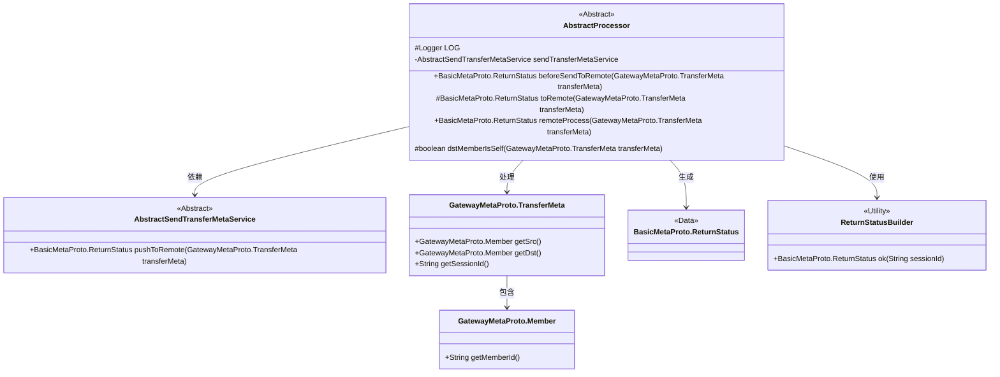
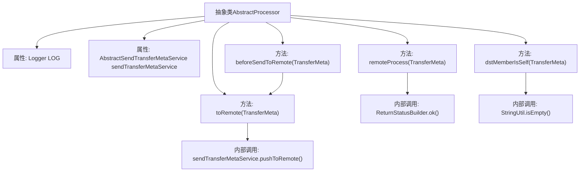

# 基础信息

|      |      |
|------|------|
| 名称 | AbstractProcessor |
| 编码语言 | .java |
| 代码路径 | WeFe/gateway/src/main/java/com/welab/wefe/gateway/service/processors/AbstractProcessor.java |
| 包名 | com.welab.wefe.gateway.service.processors |
| 依赖项 | ['com.welab.wefe.common.util.StringUtil', 'com.welab.wefe.gateway.api.meta.basic.BasicMetaProto', 'com.welab.wefe.gateway.api.meta.basic.GatewayMetaProto', 'com.welab.wefe.gateway.common.ReturnStatusBuilder', 'com.welab.wefe.gateway.service.base.AbstractSendTransferMetaService', 'org.slf4j.Logger', 'org.slf4j.LoggerFactory', 'org.springframework.beans.factory.annotation.Autowired'] |
| 概述说明 | 抽象类AbstractProcessor提供消息处理框架，包含发送前处理、远程推送及接收处理等方法，支持子类扩展。关键方法包括beforeSendToRemote、toRemote和remoteProcess，并包含目标成员检查功能dstMemberIsSelf。 |

# 说明

这是一个抽象处理器类，提供消息传输的核心处理逻辑。类中包含日志记录器和消息发送服务的自动注入。主要方法包括：beforeSendToRemote用于消息发送前的预处理，默认直接调用toRemote方法；toRemote方法实际执行远程消息推送，通常无需子类重写；remoteProcess处理远程接收到的消息，默认返回成功状态；dstMemberIsSelf判断目标成员是否为本机。该类为子类提供了基础消息处理框架，关键操作可通过重写方法扩展。

# 类列表 Class Summary

| 名称   | 类型  | 说明 |
|-------|------|-------------|
| AbstractProcessor | class | 抽象类AbstractProcessor提供消息处理框架，包含发送前处理beforeSendToRemote、远程推送toRemote、远程处理remoteProcess等方法，支持子类扩展，并检查目标成员是否为本节点dstMemberIsSelf。 |

## 类 AbstractProcessor

|      |      |
|------|------|
| 访问范围 | public abstract |
| 类型 | class |
| 名称 | AbstractProcessor |
| 说明 | 抽象类AbstractProcessor提供消息处理框架，包含发送前处理beforeSendToRemote、远程推送toRemote、远程处理remoteProcess等方法，支持子类扩展，并检查目标成员是否为本节点dstMemberIsSelf。 |

### UML类图

这段类图描述了一个消息处理框架的核心结构。AbstractProcessor作为抽象基类，定义了消息发送前(beforeSendToRemote)、远程处理(remoteProcess)等核心流程，并通过组合方式使用AbstractSendTransferMetaService实现消息推送。系统通过GatewayMetaProto.TransferMeta传输消息元数据，其中包含源/目标成员信息(Member类)，最终返回BasicMetaProto.ReturnStatus类型的状态响应。特别值得注意的是处理器提供了目标成员校验(dstMemberIsSelf)等实用方法，整体设计体现了模板方法模式的思想。

### 内部方法调用关系图

这段代码展示了一个抽象消息处理器类，主要处理消息传输前后的逻辑。核心流程包括：beforeSendToRemote作为前置钩子调用toRemote方法推送消息，remoteProcess处理远程接收的消息，dstMemberIsSelf校验目标成员是否为本节点。类通过sendTransferMetaService执行实际远程推送，使用ReturnStatusBuilder构建响应状态，并依赖StringUtil进行字符串判空操作。各方法形成清晰的调用链，体现了消息处理的生命周期管理。

### 字段列表 Field List

| 名称  | 类型  | 说明 |
|-------|-------|------|
| sendTransferMetaService | AbstractSendTransferMetaService | 自动注入转账元数据服务实例。 |
| LOG = LoggerFactory.getLogger(getClass()) | Logger | 声明一个受保护的日志记录器变量LOG，使用当前类初始化日志工厂。 |

### 方法列表

| 名称  | 类型  | 说明 |
|-------|-------|------|
| beforeSendToRemote | BasicMetaProto.ReturnStatus | Java方法beforeSendToRemote调用toRemote处理传输元数据并返回状态。 |
| remoteProcess | BasicMetaProto.ReturnStatus | 方法remoteProcess接收TransferMeta参数，返回包含其sessionId的成功状态。 |
| toRemote | BasicMetaProto.ReturnStatus | 将GatewayMetaProto.TransferMeta对象通过sendTransferMetaService推送到远程，返回BasicMetaProto.ReturnStatus状态。 |
| dstMemberIsSelf | boolean | 检查目标成员是否与源成员相同或目标成员ID为空。 |

