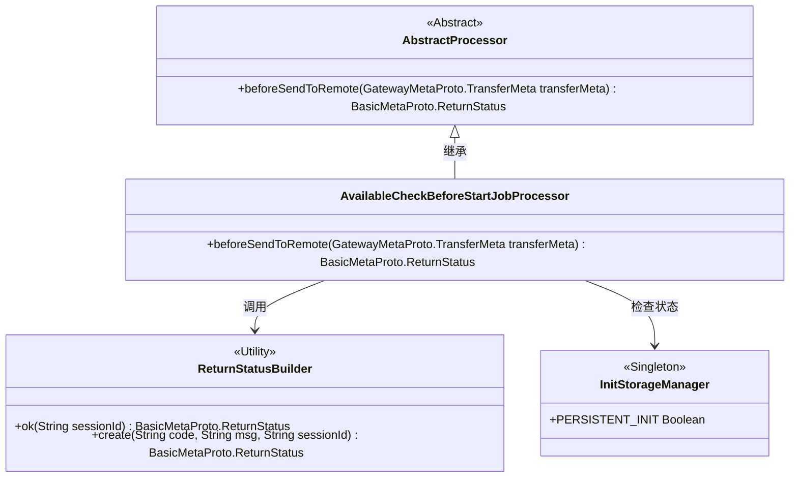
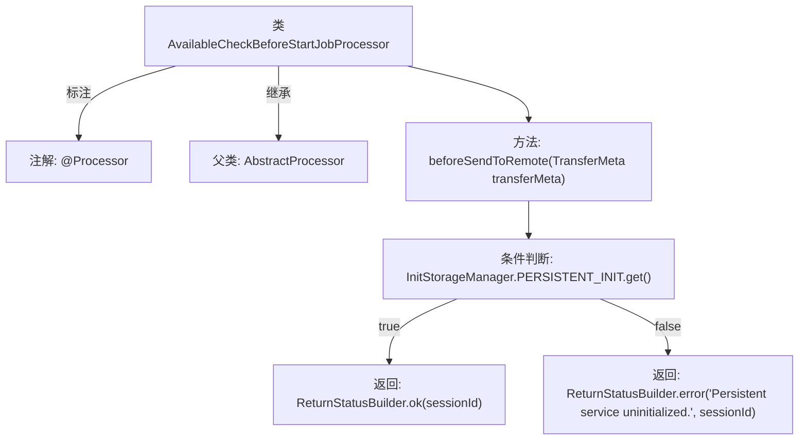

# 基础信息

|      |      |
|------|------|
| 名称 | AvailableCheckBeforeStartJobProcessor |
| 编码语言 | .java |
| 代码路径 | WeFe/gateway/src/main/java/com/welab/wefe/gateway/service/processors/AvailableCheckBeforeStartJobProcessor.java |
| 包名 | com.welab.wefe.gateway.service.processors |
| 依赖项 | ['com.welab.wefe.common.wefe.enums.GatewayProcessorType', 'com.welab.wefe.gateway.api.meta.basic.BasicMetaProto', 'com.welab.wefe.gateway.api.meta.basic.GatewayMetaProto', 'com.welab.wefe.gateway.base.Processor', 'com.welab.wefe.gateway.common.ReturnStatusBuilder', 'com.welab.wefe.gateway.common.ReturnStatusEnum', 'com.welab.wefe.gateway.init.InitStorageManager'] |
| 概述说明 | 可用性检查处理器，在任务启动前检查持久化服务是否初始化，未初始化则返回异常状态。 |

# 说明

这是一个名为AvailableCheckBeforeStartJobProcessor的处理器类，用于在作业启动前进行可用性检查。它继承自AbstractProcessor，标注为GatewayProcessorType.availableCheckBeforeStartJobProcessor类型。核心方法beforeSendToRemote会在发送到远程前执行检查：若持久化存储服务已初始化（PERSISTENT_INIT为true），返回成功状态；否则返回系统异常状态，提示持久化服务未初始化。该方法接收TransferMeta参数，返回包含会话ID的状态对象。

# 类列表 Class Summary

| 名称   | 类型  | 说明 |
|-------|------|-------------|
| AvailableCheckBeforeStartJobProcessor | class | 可用性检查处理器，在任务启动前验证持久化服务是否初始化，未初始化则返回系统异常状态。 |

## 类 AvailableCheckBeforeStartJobProcessor

|      |      |
|------|------|
| 访问范围 | @Processor(type = GatewayProcessorType.availableCheckBeforeStartJobProcessor, desc = "Available check before start job processor");public |
| 类型 | class |
| 名称 | AvailableCheckBeforeStartJobProcessor |
| 说明 | 可用性检查处理器，在任务启动前验证持久化服务是否初始化，未初始化则返回系统异常状态。 |

### UML类图

该类图展示了网关处理器架构的核心关系。AvailableCheckBeforeStartJobProcessor继承自抽象类AbstractProcessor，实现前置检查逻辑。它依赖ReturnStatusBuilder构造返回状态，并通过InitStorageManager单例检查持久化服务初始化状态。处理器通过注解标识其类型和描述，体现了典型的责任链模式实现方式。

### 内部方法调用关系图

该流程图描述了AvailableCheckBeforeStartJobProcessor类的结构和核心逻辑。该类通过@Processor注解标记，继承自AbstractProcessor，核心方法是beforeSendToRemote。该方法会检查持久化服务是否初始化：若已初始化则返回成功状态，否则返回系统异常状态码及错误信息。流程清晰展现了条件分支和两种返回路径，完整映射了代码的业务判断逻辑。

### 字段列表 Field List

| 名称  | 类型  | 说明 |
|-------|-------|------|

### 方法列表

| 名称  | 类型  | 说明 |
|-------|-------|------|
| beforeSendToRemote | BasicMetaProto.ReturnStatus | 方法检查持久化服务是否初始化，未初始化则返回异常状态，否则返回成功状态及会话ID。 |

