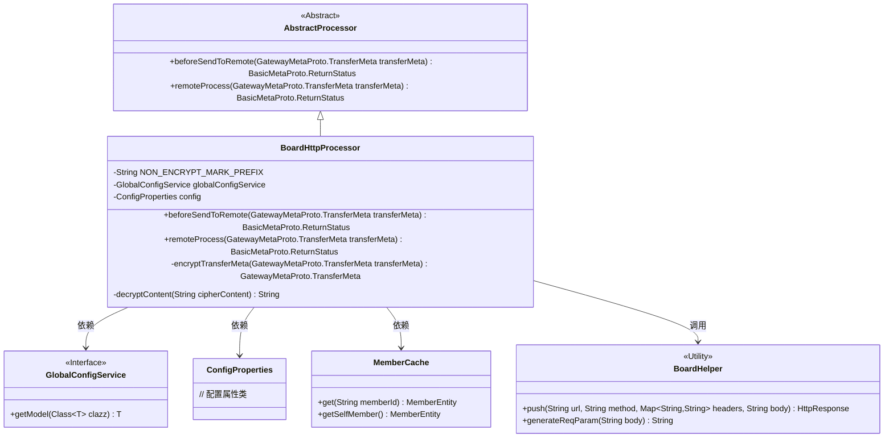
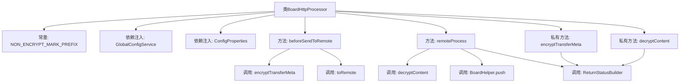
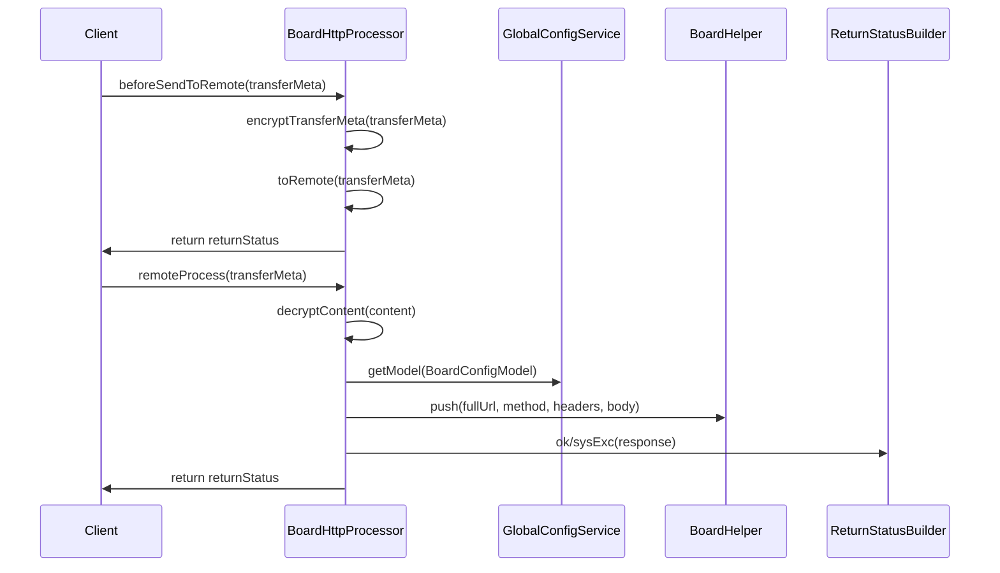

# 基础信息

|      |      |
|------|------|
| 名称 | BoardHttpProcessor |
| 编码语言 | .java |
| 代码路径 | WeFe/gateway/src/main/java/com/welab/wefe/gateway/service/processors/BoardHttpProcessor.java |
| 包名 | com.welab.wefe.gateway.service.processors |
| 依赖项 | ['java.util.HashMap', 'java.util.Map', 'org.springframework.beans.factory.annotation.Autowired', 'com.welab.wefe.common.http.HttpResponse', 'com.welab.wefe.common.util.AsymmetricCryptoUtil', 'com.welab.wefe.common.util.JObject', 'com.welab.wefe.common.util.SM4Util', 'com.welab.wefe.common.util.StringUtil', 'com.welab.wefe.common.wefe.dto.global_config.BoardConfigModel', 'com.welab.wefe.common.wefe.enums.GatewayProcessorType', 'com.welab.wefe.gateway.api.meta.basic.BasicMetaProto', 'com.welab.wefe.gateway.api.meta.basic.GatewayMetaProto', 'com.welab.wefe.gateway.base.Processor', 'com.welab.wefe.gateway.cache.MemberCache', 'com.welab.wefe.gateway.common.ReturnStatusBuilder', 'com.welab.wefe.gateway.config.ConfigProperties', 'com.welab.wefe.gateway.entity.MemberEntity', 'com.welab.wefe.gateway.sdk.BoardHelper', 'com.welab.wefe.gateway.service.GlobalConfigService'] |
| 概述说明 | BoardHttpProcessor是HTTP模式的消息处理器，负责加密传输数据并推送至board模块，记录耗时及处理异常。包含加解密逻辑和远程请求处理。 |

# 说明

BoardHttpProcessor是一个HTTP模式的消息处理器，用于推送消息到board模块。它继承自AbstractProcessor，包含加密传输数据、远程处理和加解密内容的功能。在beforeSendToRemote方法中，处理器对传输数据进行加密并记录时间消耗。remoteProcess方法负责解密内容，构建请求URL和头部，调用BoardHelper推送请求并处理响应。加解密方法encryptTransferMeta和decryptContent分别处理数据的加密和解密，支持非加密标记和SM4加密算法。处理器依赖GlobalConfigService和ConfigProperties获取配置信息，并通过日志记录关键操作和时间消耗。

# 类列表 Class Summary

| 名称   | 类型  | 说明 |
|-------|------|-------------|
| BoardHttpProcessor | class | BoardHttpProcessor是HTTP模式下的消息处理器，负责加密传输数据并推送至board模块，处理请求和响应，记录耗时和错误日志。 |

## 类 BoardHttpProcessor

|      |      |
|------|------|
| 访问范围 | @Processor(type = GatewayProcessorType.boardHttpProcessor, desc = "push to the board module message processor in HTTP mode");public |
| 类型 | class |
| 名称 | BoardHttpProcessor |
| 说明 | BoardHttpProcessor是HTTP模式下的消息处理器，负责加密传输数据并推送至board模块，处理请求和响应，记录耗时和错误日志。 |

### UML类图

该类图展示了BoardHttpProcessor作为AbstractProcessor的子类，实现了HTTP模式下的消息处理逻辑。它依赖GlobalConfigService获取配置，通过MemberCache访问成员信息，并调用BoardHelper工具类执行HTTP请求。核心功能包括传输元数据加密/解密(beforeSendToRemote)和远程处理(remoteProcess)，涉及非对称加密(SM4Util/AsymmetricCryptoUtil)和网络通信。系统通过日志记录各阶段耗时，并处理包括加密异常、地址配置错误等边缘情况。

### 内部方法调用关系图

这段代码实现了一个HTTP模式的消息处理器，主要完成两个核心功能：1) 发送前的数据加密处理(beforeSendToRemote)，包含SM4和RSA混合加密；2) 远程处理流程(remoteProcess)，包含请求参数解密、Board服务地址拼接和HTTP请求转发。流程图展示了类结构和方法调用关系，时序图则详细描述了两个主要方法的执行流程和组件交互。该处理器具有完善的错误处理和日志记录机制，能够跟踪每个环节的耗时情况。

### 字段列表 Field List

| 名称  | 类型  | 说明 |
|-------|-------|------|
| globalConfigService | GlobalConfigService | 使用@Autowired自动注入GlobalConfigService实例。 |
| NON_ENCRYPT_MARK_PREFIX = "NON_ENCRYPT:" | String | 定义静态常量字符串NON_ENCRYPT_MARK_PREFIX，值为"NON_ENCRYPT:"，用于标记非加密内容。 |
| config | ConfigProperties | 自动注入配置属性对象config。 |

### 方法列表

| 名称  | 类型  | 说明 |
|-------|-------|------|
| remoteProcess | BasicMetaProto.ReturnStatus | 远程处理网关请求，解密数据后提取URL、方法和请求体，设置请求头并调用Board服务接口，返回处理结果或错误信息。 |
| beforeSendToRemote | BasicMetaProto.ReturnStatus | 方法在发送数据前进行加密并记录耗时，包括加密、远程调用及总耗时，出错时返回加密异常状态。 |
| encryptTransferMeta | GatewayMetaProto.TransferMeta | 该方法用于加密传输元数据。若内容为空或目标成员未启用TLS，则直接返回原数据；否则使用SM4和公钥加密生成加密密钥和密文，拼接后更新元数据内容返回。 |
| decryptContent | String | 解密方法：空或非加密内容直接返回；加密内容用私钥解密密钥后，再用SM4解密内容。 |

