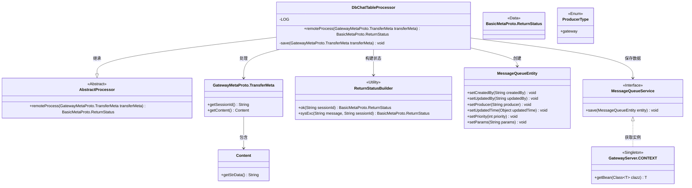
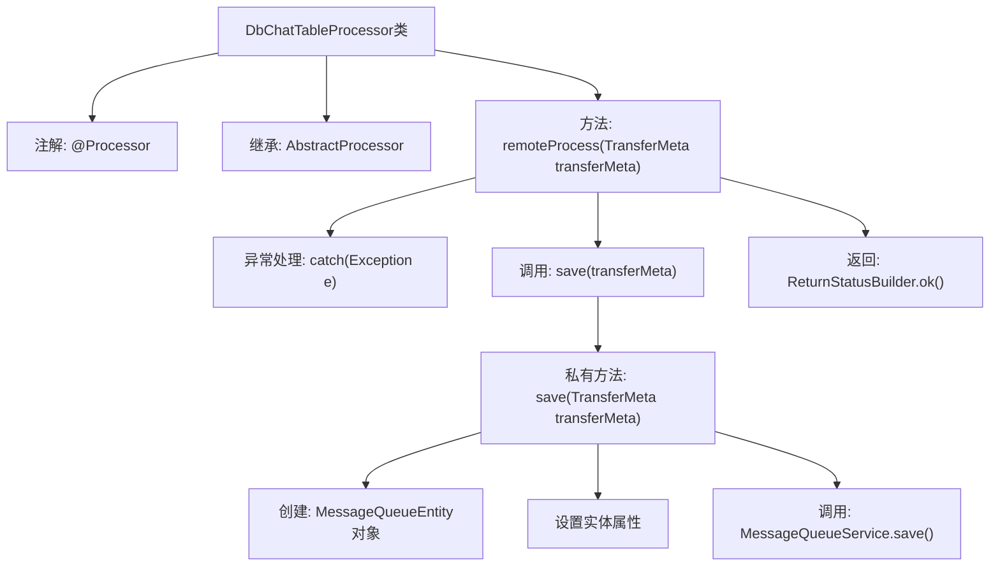

# 基础信息

|      |      |
|------|------|
| 名称 | DbChatTableProcessor |
| 编码语言 | .java |
| 代码路径 | WeFe/gateway/src/main/java/com/welab/wefe/gateway/service/processors/DbChatTableProcessor.java |
| 包名 | com.welab.wefe.gateway.service.processors |
| 依赖项 | ['com.welab.wefe.common.wefe.enums.GatewayProcessorType', 'com.welab.wefe.common.wefe.enums.ProducerType', 'com.welab.wefe.gateway.GatewayServer', 'com.welab.wefe.gateway.api.meta.basic.BasicMetaProto', 'com.welab.wefe.gateway.api.meta.basic.GatewayMetaProto', 'com.welab.wefe.gateway.base.Processor', 'com.welab.wefe.gateway.common.ReturnStatusBuilder', 'com.welab.wefe.gateway.entity.MessageQueueEntity', 'com.welab.wefe.gateway.service.MessageQueueService'] |
| 概述说明 | DbChatTableProcessor将消息存入MySQL交换中心队列，处理异常并返回状态。 |

# 说明

DbChatTableProcessor是一个MySQL交换中心队列列表处理器，用于保存消息。它继承自AbstractProcessor，通过remoteProcess方法处理传输元数据，调用save方法将数据存入消息队列。若处理失败，返回系统异常状态；成功则返回正常状态。save方法创建MessageQueueEntity对象，设置生产者、参数等信息，并通过MessageQueueService保存到数据库。

# 类列表 Class Summary

| 名称   | 类型  | 说明 |
|-------|------|-------------|
| DbChatTableProcessor | class | DbChatTableProcessor类将消息存入MySQL交换中心队列，处理异常并返回状态。通过save方法构造消息实体并调用服务保存。 |

## 类 DbChatTableProcessor

|      |      |
|------|------|
| 访问范围 | @Processor(type = GatewayProcessorType.dbChatTableProcessor, desc = "The message is saved to the exchange center queue list processor of MySQL");public |
| 类型 | class |
| 名称 | DbChatTableProcessor |
| 说明 | DbChatTableProcessor类将消息存入MySQL交换中心队列，处理异常并返回状态。通过save方法构造消息实体并调用服务保存。 |

### UML类图

该代码实现了一个数据库聊天表处理器，继承自抽象处理器类，主要功能是将传输元数据保存到消息队列中。通过消息队列实体类封装数据，并调用消息队列服务进行持久化操作。处理过程中会捕获异常并返回相应的状态信息，正常执行则返回成功状态。类图展示了处理器与消息队列服务、实体类、状态构建器等组件之间的交互关系。

### 内部方法调用关系图

流程图描述了DbChatTableProcessor类的处理逻辑：这是一个数据库聊天表处理器，通过remoteProcess方法接收传输元数据，调用save方法将数据存入消息队列。save方法会创建消息队列实体并设置相关属性，最终通过MessageQueueService保存数据。若出现异常则返回系统错误状态，正常处理则返回成功状态。

### 字段列表 Field List

| 名称  | 类型  | 说明 |
|-------|-------|------|

### 方法列表

| 名称  | 类型  | 说明 |
|-------|-------|------|
| remoteProcess | BasicMetaProto.ReturnStatus | 远程处理方法，保存传输元数据，成功返回OK状态，失败记录错误并返回异常状态。 |
| save | void | 私有方法save接收TransferMeta对象，创建MessageQueueEntity并设置属性，最后通过MessageQueueService保存。生产者类型为gateway，参数来自transferMeta内容。 |

