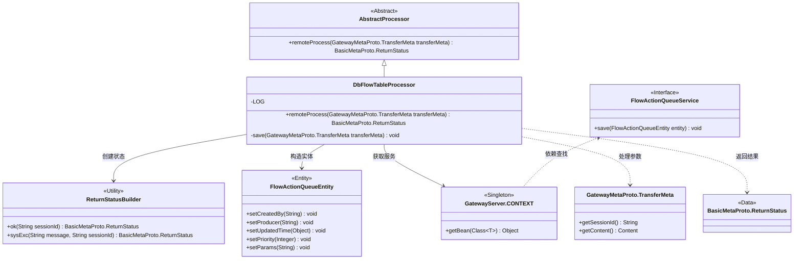
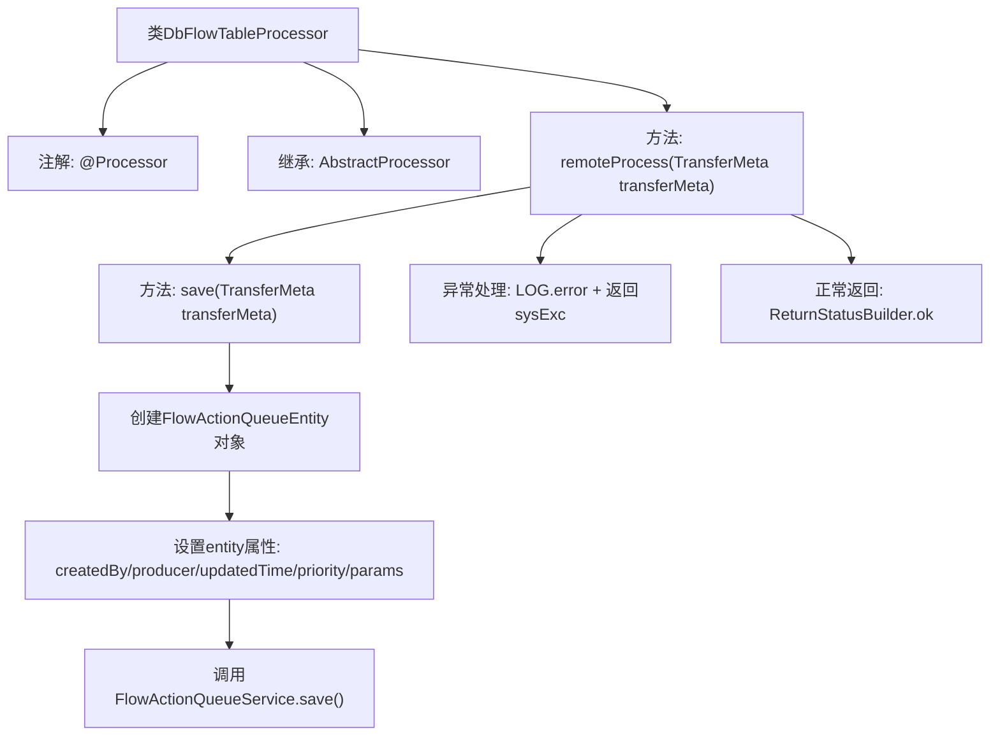

# 基础信息

|      |      |
|------|------|
| 名称 | DbFlowTableProcessor |
| 编码语言 | .java |
| 代码路径 | WeFe/gateway/src/main/java/com/welab/wefe/gateway/service/processors/DbFlowTableProcessor.java |
| 包名 | com.welab.wefe.gateway.service.processors |
| 依赖项 | ['com.welab.wefe.common.wefe.enums.GatewayProcessorType', 'com.welab.wefe.common.wefe.enums.ProducerType', 'com.welab.wefe.gateway.GatewayServer', 'com.welab.wefe.gateway.api.meta.basic.BasicMetaProto', 'com.welab.wefe.gateway.api.meta.basic.GatewayMetaProto', 'com.welab.wefe.gateway.base.Processor', 'com.welab.wefe.gateway.common.ReturnStatusBuilder', 'com.welab.wefe.gateway.entity.FlowActionQueueEntity', 'com.welab.wefe.gateway.service.FlowActionQueueService'] |
| 概述说明 | DbFlowTableProcessor将消息存入MySQL流程动作队列，处理异常并返回状态。 |

# 说明

该内容描述了一个名为DbFlowTableProcessor的处理器类，属于GatewayProcessorType.dbFlowTableProcessor类型，功能是将消息保存到MySQL的流动作队列列表。处理器继承自AbstractProcessor，通过remoteProcess方法处理传入的TransferMeta数据，调用save方法将数据存入FlowActionQueueEntity实体。若处理过程中出现异常，会记录错误日志并返回系统异常状态；成功则返回正常状态。save方法设置实体属性并通过FlowActionQueueService保存数据。

# 类列表 Class Summary

| 名称   | 类型  | 说明 |
|-------|------|-------------|
| DbFlowTableProcessor | class | DbFlowTableProcessor类继承AbstractProcessor，将消息存入MySQL流程动作队列表。处理成功返回OK状态，异常则记录错误并返回系统异常状态。 |

## 类 DbFlowTableProcessor

|      |      |
|------|------|
| 访问范围 | @Processor(type = GatewayProcessorType.dbFlowTableProcessor, desc = "The message is saved to the flow action queue list processor of MySQL");public |
| 类型 | class |
| 名称 | DbFlowTableProcessor |
| 说明 | DbFlowTableProcessor类继承AbstractProcessor，将消息存入MySQL流程动作队列表。处理成功返回OK状态，异常则记录错误并返回系统异常状态。 |

### UML类图

该流程图展示了数据库流表处理器的核心结构。DbFlowTableProcessor继承自抽象处理器，通过远程处理方法接收传输元数据，使用实体类构建流程动作队列，并依赖上下文获取服务进行存储操作。处理过程中会捕获异常并返回相应状态，正常执行时返回成功状态。类图清晰地呈现了处理器与实体、服务、工具类之间的交互关系，体现了消息存储到MySQL队列的完整处理链路。

### 内部方法调用关系图

这段代码展示了一个数据库流表处理器，主要功能是将传输元数据保存到MySQL的流动作队列中。流程图清晰呈现了从接收传输数据到最终保存或异常处理的完整流程，包括实体对象创建、属性设置、服务层调用以及异常捕获机制。注解表明这是一个网关处理器，专门用于处理数据库流表操作。

### 字段列表 Field List

| 名称  | 类型  | 说明 |
|-------|-------|------|

### 方法列表

| 名称  | 类型  | 说明 |
|-------|-------|------|
| save | void | 方法save接收TransferMeta对象，创建FlowActionQueueEntity并设置属性，最后通过FlowActionQueueService保存实体。 |
| remoteProcess | BasicMetaProto.ReturnStatus | 远程处理方法，保存传输元数据，成功返回OK状态，异常则记录错误并返回系统异常状态。 |

