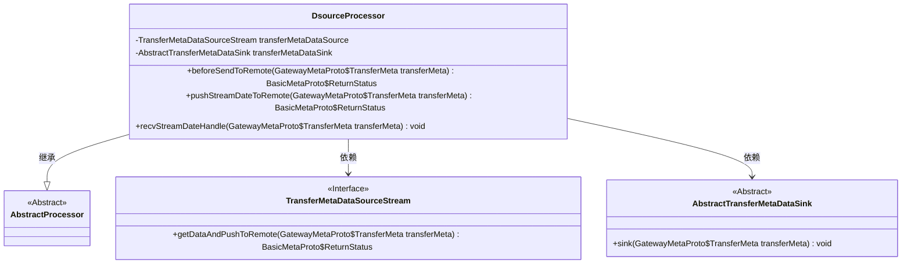
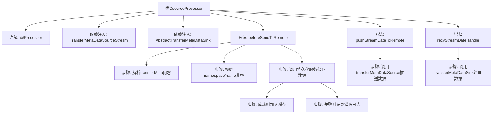

# 基础信息

|      |      |
|------|------|
| 名称 | DsourceProcessor |
| 编码语言 | .java |
| 代码路径 | WeFe/gateway/src/main/java/com/welab/wefe/gateway/service/processors/DsourceProcessor.java |
| 包名 | com.welab.wefe.gateway.service.processors |
| 依赖项 | ['com.welab.wefe.common.StatusCode', 'com.welab.wefe.common.exception.StatusCodeWithException', 'com.welab.wefe.common.util.JObject', 'com.welab.wefe.common.util.StringUtil', 'com.welab.wefe.common.wefe.enums.GatewayProcessorType', 'com.welab.wefe.gateway.GatewayServer', 'com.welab.wefe.gateway.api.meta.basic.BasicMetaProto', 'com.welab.wefe.gateway.api.meta.basic.GatewayMetaProto', 'com.welab.wefe.gateway.base.Processor', 'com.welab.wefe.gateway.cache.SendTransferMetaCache', 'com.welab.wefe.gateway.common.ReturnStatusBuilder', 'com.welab.wefe.gateway.common.ReturnStatusEnum', 'com.welab.wefe.gateway.common.StorageConstant', 'com.welab.wefe.gateway.service.MessageService', 'com.welab.wefe.gateway.service.TransferMetaDataSourceParallelStream', 'com.welab.wefe.gateway.service.TransferMetaDataSourceStream', 'com.welab.wefe.gateway.service.base.AbstractSendTransferMetaCachePersistentService', 'com.welab.wefe.gateway.service.base.AbstractTransferMetaDataSink', 'com.welab.wefe.gateway.service.base.AbstractTransferMetaDataSource', 'com.welab.wefe.gateway.util.TransferMetaUtil', 'org.springframework.beans.factory.annotation.Autowired'] |
| 概述说明 | DsouceProcessor类负责大数据传输处理，如CK数据库数据。包含发送前验证、数据持久化及缓存、推送流数据到远程端及接收处理远程数据的方法。验证数据结构和必填字段，持久化成功后缓存数据，失败记录错误。推送和接收数据分别调用transferMetaDataSource和transferMetaDataSink处理。 |

# 说明

这是一个名为DsourceProcessor的处理器类，用于大数据传输转发处理。它继承自AbstractProcessor，标注为数据源处理器类型。类中注入了TransferMetaDataSourceStream和AbstractTransferMetaDataSink两个依赖，分别用于数据推送和接收处理。主要功能包括：在发送数据前验证数据结构，检查命名空间和名称是否为空；持久化消息到缓存并异步处理转发；提供推送流数据到远程端的方法；以及远程端接收数据后的处理方法。处理过程中会记录日志并返回相应的状态信息。

# 类列表 Class Summary

| 名称   | 类型  | 说明 |
|-------|------|-------------|
| DsourceProcessor | class | DsouceProcessor类处理大数据传输，验证数据并持久化消息后转发。包含远程推送和接收处理方法。 |

## 类 DsourceProcessor

|      |      |
|------|------|
| 访问范围 | @Processor(type = GatewayProcessorType.dSourceProcessor, desc = "Forwarding big data transmission processor (such as CK database data)");public |
| 类型 | class |
| 名称 | DsourceProcessor |
| 说明 | DsouceProcessor类处理大数据传输，验证数据并持久化消息后转发。包含远程推送和接收处理方法。 |

### UML类图

这段代码展示了一个大数据传输处理器`DsourceProcessor`，它继承自`AbstractProcessor`，并依赖两个核心接口：`TransferMetaDataSourceStream`（数据源流处理）和`AbstractTransferMetaDataSink`（数据接收处理）。主要功能包括：1) 预处理传输元数据（验证数据结构、持久化消息）；2) 推送流数据到远程；3) 处理远程接收到的流数据。类图清晰地反映了其继承关系和关键依赖，体现了处理器在数据传输流程中的核心协调作用。

### 内部方法调用关系图

这段代码是用于大数据传输处理的网关处理器，主要包含三个核心方法：beforeSendToRemote用于消息预处理和持久化，pushStreamDateToRemote负责将数据推送到远程，recvStreamDateHandle处理远程接收到的数据。流程图清晰展示了类结构、依赖关系和方法调用链，特别突出了beforeSendToRemote方法中的参数校验、持久化处理和异常处理分支逻辑。

### 字段列表 Field List

| 名称  | 类型  | 说明 |
|-------|-------|------|
| transferMetaDataSink | AbstractTransferMetaDataSink | 使用@Autowired自动注入AbstractTransferMetaDataSink实例。 |
| transferMetaDataSource | TransferMetaDataSourceStream | 代码片段显示使用@Autowired注入TransferMetaDataSourceStream实例，注释掉ParallelStream版本。 |

### 方法列表

| 名称  | 类型  | 说明 |
|-------|-------|------|
| pushStreamDateToRemote | BasicMetaProto.ReturnStatus | 该方法将传输元数据推送至远程服务器，并返回操作状态。 |
| recvStreamDateHandle | void | Java方法recvStreamDateHandle接收TransferMeta对象并调用sink方法处理数据。 |
| beforeSendToRemote | BasicMetaProto.ReturnStatus | 方法检查传输元数据内容，验证命名空间和名称非空后持久化存储。成功则缓存并返回成功状态，失败则记录错误并返回失败状态。 |

