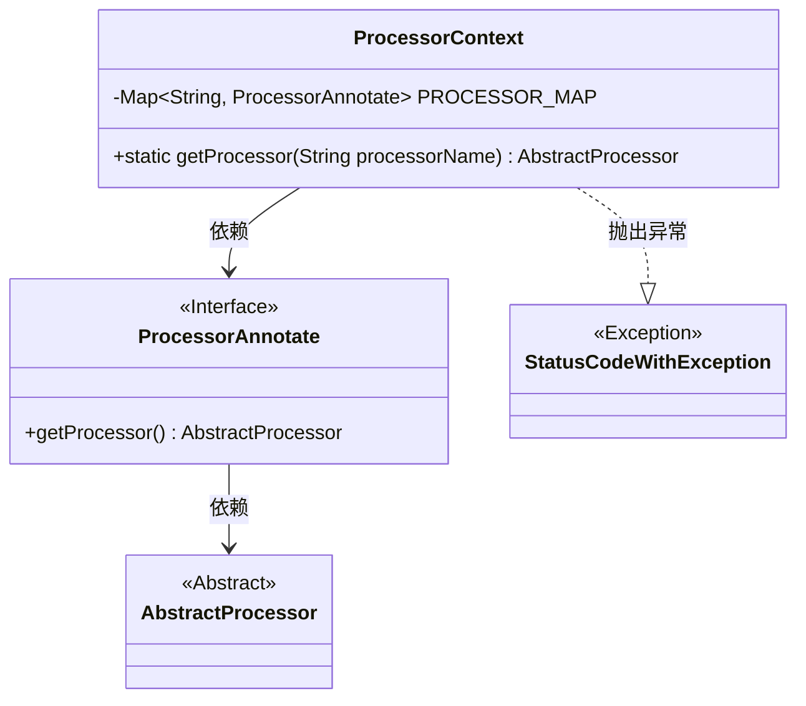
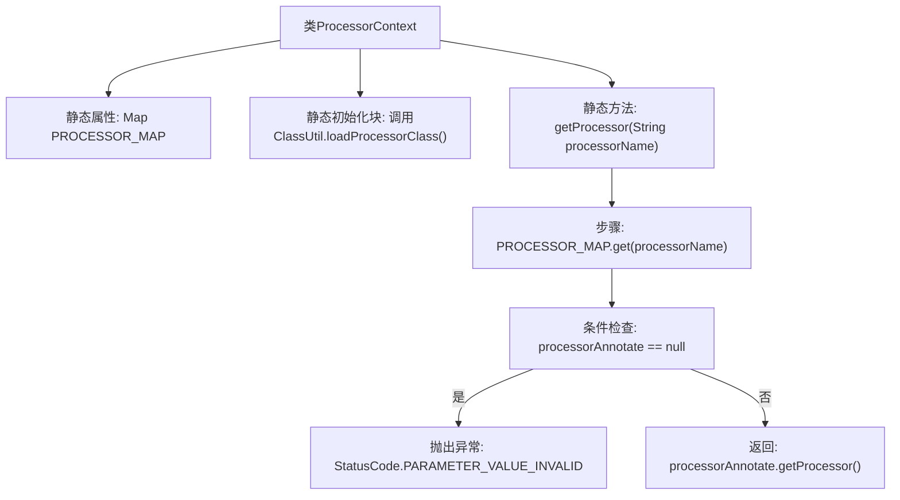

# 基础信息

|      |      |
|------|------|
| 名称 | ProcessorContext |
| 编码语言 | .java |
| 代码路径 | WeFe/gateway/src/main/java/com/welab/wefe/gateway/service/processors/ProcessorContext.java |
| 包名 | com.welab.wefe.gateway.service.processors |
| 依赖项 | ['com.welab.wefe.common.StatusCode', 'com.welab.wefe.common.exception.StatusCodeWithException', 'com.welab.wefe.gateway.base.ProcessorAnnotate', 'com.welab.wefe.gateway.util.ClassUtil', 'java.util.Map'] |
| 概述说明 | ProcessorContext类通过静态块加载所有处理器类到PROCESSOR_MAP，提供getProcessor方法根据名称获取处理器实例，若不存在则抛出异常。 |

# 说明

ProcessorContext类是一个静态工具类，用于管理和获取处理器实例。它包含一个静态Map变量PROCESSOR_MAP，在类加载时通过ClassUtil.loadProcessorClass方法初始化，存储所有处理器类的信息。提供getProcessor方法，根据传入的处理器名称从Map中获取对应的ProcessorAnnotate注解对象，若不存在则抛出参数无效异常，存在则返回其包装的AbstractProcessor实例。

# 类列表 Class Summary

| 名称   | 类型  | 说明 |
|-------|------|-------------|
| ProcessorContext | class | ProcessorContext类通过静态块加载处理器类到PROCESSOR_MAP，提供getProcessor方法根据名称获取处理器实例，若不存在则抛出异常。 |

## 类 ProcessorContext

|      |      |
|------|------|
| 访问范围 | public |
| 类型 | class |
| 名称 | ProcessorContext |
| 说明 | ProcessorContext类通过静态块加载处理器类到PROCESSOR_MAP，提供getProcessor方法根据名称获取处理器实例，若不存在则抛出异常。 |

### UML类图

类图描述：该图展示了ProcessorContext类的静态结构及其关联关系。ProcessorContext通过静态Map维护处理器名称与ProcessorAnnotate接口的映射，提供getProcessor方法获取AbstractProcessor实例。ProcessorAnnotate接口定义获取处理器的方法，AbstractProcessor是抽象处理器基类。当处理器不存在时，会抛出StatusCodeWithException异常。

### 内部方法调用关系图

这段代码流程图展示了ProcessorContext类的核心结构和工作流程。该类通过静态初始化块加载所有处理器类到PROCESSOR_MAP中，提供了获取处理器实例的静态方法getProcessor。方法首先从映射表中查找指定名称的处理器注解，若不存在则抛出参数无效异常，否则返回对应的处理器实例。整个流程清晰地展现了类初始化、异常处理和实例获取的逻辑路径。

### 字段列表 Field List

| 名称  | 类型  | 说明 |
|-------|-------|------|
| PROCESSOR_MAP = null | Map<String, ProcessorAnnotate> | 静态映射变量PROCESSOR_MAP，键为字符串，值为ProcessorAnnotate类型，初始化为null。 |

### 方法列表

| 名称  | 类型  | 说明 |
|-------|-------|------|
| getProcessor | AbstractProcessor | 该方法根据处理器名称获取对应的处理器实例。若名称无效则抛出异常，否则返回处理器实例。 |

