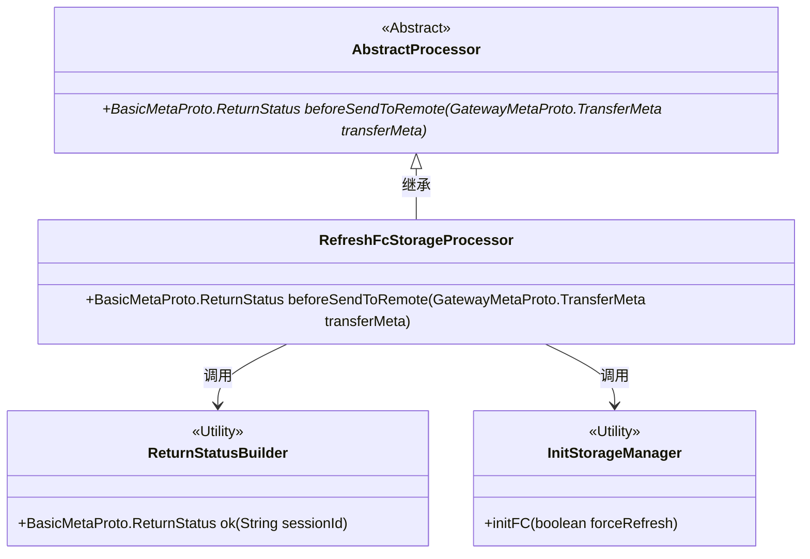
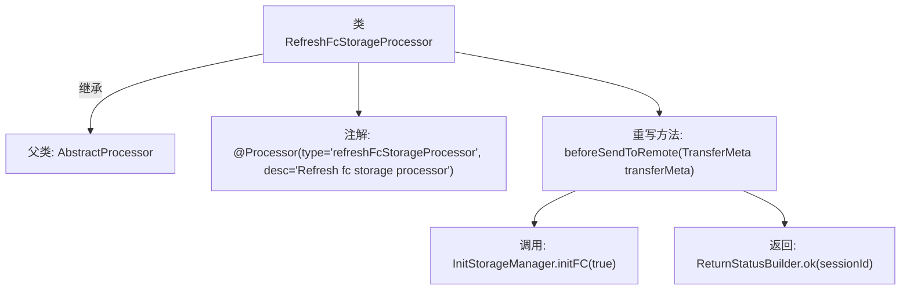

# 基础信息

|      |      |
|------|------|
| 名称 | RefreshFcStorageProcessor |
| 编码语言 | .java |
| 代码路径 | WeFe/gateway/src/main/java/com/welab/wefe/gateway/service/processors/RefreshFcStorageProcessor.java |
| 包名 | com.welab.wefe.gateway.service.processors |
| 依赖项 | ['com.welab.wefe.common.wefe.enums.GatewayProcessorType', 'com.welab.wefe.gateway.api.meta.basic.BasicMetaProto', 'com.welab.wefe.gateway.api.meta.basic.GatewayMetaProto', 'com.welab.wefe.gateway.base.Processor', 'com.welab.wefe.gateway.common.ReturnStatusBuilder', 'com.welab.wefe.gateway.init.InitStorageManager'] |
| 概述说明 | 刷新FC存储处理器，初始化存储管理器并返回成功状态。 |

# 说明

该内容描述了一个名为RefreshFcStorageProcessor的处理器类，用于刷新FC存储。该类继承自AbstractProcessor，并通过注解标识其类型为GatewayProcessorType.refreshFcStorageProcessor。主要功能是在发送数据到远程之前调用InitStorageManager.initFC方法初始化FC存储，并返回一个包含会话ID的成功状态。整个处理逻辑简洁明确，专注于FC存储的刷新操作。

# 类列表 Class Summary

| 名称   | 类型  | 说明 |
|-------|------|-------------|
| RefreshFcStorageProcessor | class | 刷新FC存储处理器类，继承自AbstractProcessor，通过beforeSendToRemote方法初始化存储管理器并返回成功状态。 |

## 类 RefreshFcStorageProcessor

|      |      |
|------|------|
| 访问范围 | @Processor(type = GatewayProcessorType.refreshFcStorageProcessor, desc = "Refresh fc storage processor");public |
| 类型 | class |
| 名称 | RefreshFcStorageProcessor |
| 说明 | 刷新FC存储处理器类，继承自AbstractProcessor，通过beforeSendToRemote方法初始化存储管理器并返回成功状态。 |

### UML类图

类图描述：该代码展示了一个刷新FC存储的处理器类RefreshFcStorageProcessor，它继承自抽象类AbstractProcessor并实现了beforeSendToRemote方法。该方法通过调用InitStorageManager.initFC初始化存储，并使用ReturnStatusBuilder构建返回状态。类图中清晰体现了继承关系（抽象处理器与具体实现）、工具类调用（状态构建器和存储管理器）等关键设计结构。

### 内部方法调用关系图

该流程图展示了RefreshFcStorageProcessor类的结构，它是一个继承自AbstractProcessor的处理器类，带有特定类型和描述的注解。主要逻辑在重写的beforeSendToRemote方法中，该方法首先调用InitStorageManager初始化FC存储，然后构建并返回一个包含会话ID的成功状态。整个流程清晰地反映了类继承关系和方法调用顺序。

### 字段列表 Field List

| 名称  | 类型  | 说明 |
|-------|-------|------|

### 方法列表

| 名称  | 类型  | 说明 |
|-------|-------|------|
| beforeSendToRemote | BasicMetaProto.ReturnStatus | 方法`beforeSendToRemote`在发送数据前初始化存储管理器，并返回包含会话ID的成功状态。 |

