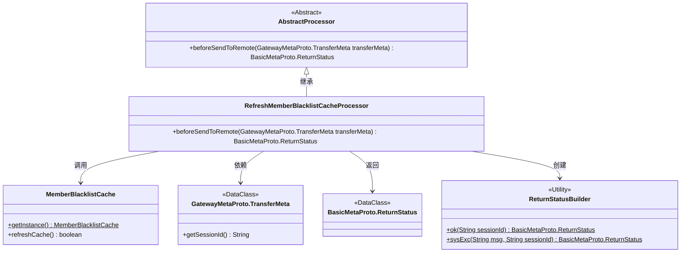
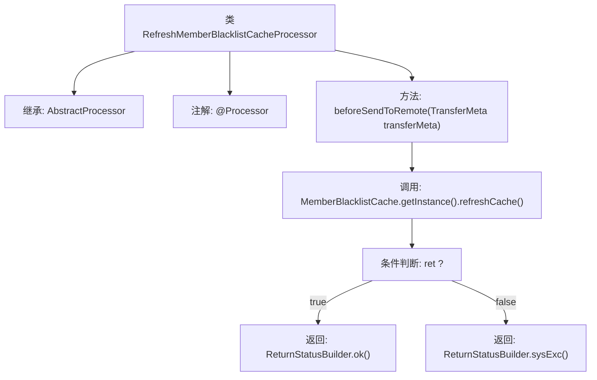

# 基础信息

|      |      |
|------|------|
| 名称 | RefreshMemberBlacklistCacheProcessor |
| 编码语言 | .java |
| 代码路径 | WeFe/gateway/src/main/java/com/welab/wefe/gateway/service/processors/RefreshMemberBlacklistCacheProcessor.java |
| 包名 | com.welab.wefe.gateway.service.processors |
| 依赖项 | ['com.welab.wefe.common.wefe.enums.GatewayProcessorType', 'com.welab.wefe.gateway.api.meta.basic.BasicMetaProto', 'com.welab.wefe.gateway.api.meta.basic.GatewayMetaProto', 'com.welab.wefe.gateway.base.Processor', 'com.welab.wefe.gateway.cache.MemberBlacklistCache', 'com.welab.wefe.gateway.common.ReturnStatusBuilder'] |
| 概述说明 | 刷新成员黑名单缓存的处理器类，继承自AbstractProcessor，通过beforeSendToRemote方法调用MemberBlacklistCache刷新缓存，返回成功或失败状态。 |

# 说明

该内容描述了一个名为RefreshMemberBlacklistCacheProcessor的处理器类，用于刷新成员黑名单缓存。该类继承自AbstractProcessor，并通过注解标识其类型为GatewayProcessorType.refreshMemberBlacklistCacheProcessor。主要功能是在发送远程请求前调用MemberBlacklistCache的refreshCache方法刷新缓存，并根据操作结果返回成功或失败状态。成功时返回包含会话ID的成功状态，失败时返回包含错误信息和会话ID的系统异常状态。

# 类列表 Class Summary

| 名称   | 类型  | 说明 |
|-------|------|-------------|
| RefreshMemberBlacklistCacheProcessor | class | 刷新成员黑名单缓存的处理器类，继承自AbstractProcessor。通过beforeSendToRemote方法调用MemberBlacklistCache的refreshCache方法更新缓存，返回操作状态。成功返回OK，失败返回错误信息。 |

## 类 RefreshMemberBlacklistCacheProcessor

|      |      |
|------|------|
| 访问范围 | @Processor(type = GatewayProcessorType.refreshMemberBlacklistCacheProcessor, desc = "Refresh member blacklist cache processor");public |
| 类型 | class |
| 名称 | RefreshMemberBlacklistCacheProcessor |
| 说明 | 刷新成员黑名单缓存的处理器类，继承自AbstractProcessor。通过beforeSendToRemote方法调用MemberBlacklistCache的refreshCache方法更新缓存，返回操作状态。成功返回OK，失败返回错误信息。 |

### UML类图

这段代码描述了一个刷新成员黑名单缓存处理器，继承自抽象处理器类。主要功能是通过调用MemberBlacklistCache单例的refreshCache方法更新缓存，并根据结果构造不同的返回状态。类图展示了处理器与缓存组件、数据传输对象及状态构建器的交互关系，体现了网关处理器的典型分层架构设计。

### 内部方法调用关系图

流程图描述了RefreshMemberBlacklistCacheProcessor处理器的核心逻辑流程。该类通过注解声明为网关处理器，继承抽象处理器类。主要方法beforeSendToRemote在执行远程发送前刷新成员黑名单缓存，根据刷新结果返回不同的状态：成功返回OK状态，失败返回系统异常状态。流程清晰展示了从方法调用到条件分支的完整处理路径。

### 字段列表 Field List

| 名称  | 类型  | 说明 |
|-------|-------|------|

### 方法列表

| 名称  | 类型  | 说明 |
|-------|-------|------|
| beforeSendToRemote | BasicMetaProto.ReturnStatus | 方法beforeSendToRemote检查成员黑名单缓存刷新状态，成功返回OK状态和会话ID，失败返回系统异常信息及会话ID。 |

