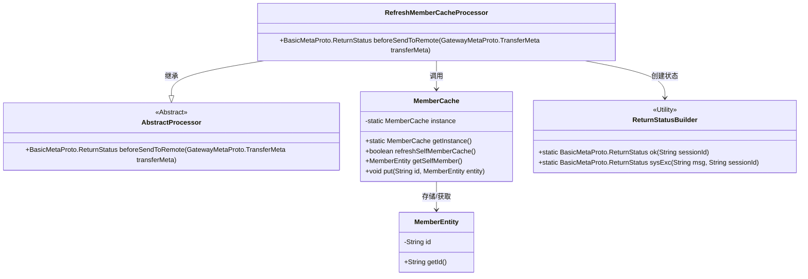
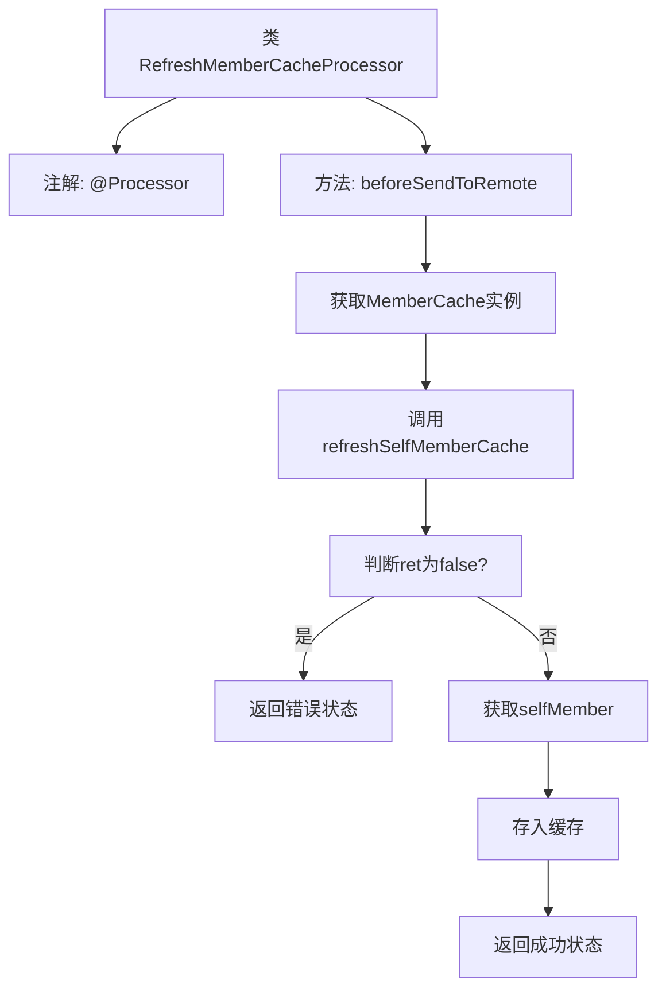

# 基础信息

|      |      |
|------|------|
| 名称 | RefreshMemberCacheProcessor |
| 编码语言 | .java |
| 代码路径 | WeFe/gateway/src/main/java/com/welab/wefe/gateway/service/processors/RefreshMemberCacheProcessor.java |
| 包名 | com.welab.wefe.gateway.service.processors |
| 依赖项 | ['com.welab.wefe.common.wefe.enums.GatewayProcessorType', 'com.welab.wefe.gateway.api.meta.basic.BasicMetaProto', 'com.welab.wefe.gateway.api.meta.basic.GatewayMetaProto', 'com.welab.wefe.gateway.base.Processor', 'com.welab.wefe.gateway.cache.MemberCache', 'com.welab.wefe.gateway.common.ReturnStatusBuilder', 'com.welab.wefe.gateway.entity.MemberEntity'] |
| 概述说明 | 刷新成员缓存处理器，检查并更新本地缓存，失败返回错误，成功返回状态。 |

# 说明

该内容描述了一个名为RefreshMemberCacheProcessor的处理器类，用于刷新本地成员缓存。该类继承自AbstractProcessor，并通过注解标识其类型为GatewayProcessorType.refreshMemberCacheProcessor。主要功能在beforeSendToRemote方法中实现：首先获取MemberCache实例并尝试刷新自身成员缓存，若失败则返回错误状态；成功则获取自身成员实体并存入缓存，最后返回成功状态。整个过程涉及TransferMeta和ReturnStatus等辅助类。

# 类列表 Class Summary

| 名称   | 类型  | 说明 |
|-------|------|-------------|
| RefreshMemberCacheProcessor | class | 刷新成员缓存处理器，检查并更新本地成员缓存，失败返回错误状态，成功则存储当前成员信息并返回成功状态。 |

## 类 RefreshMemberCacheProcessor

|      |      |
|------|------|
| 访问范围 | @Processor(type = GatewayProcessorType.refreshMemberCacheProcessor, desc = "Refresh local member cache processor");public |
| 类型 | class |
| 名称 | RefreshMemberCacheProcessor |
| 说明 | 刷新成员缓存处理器，检查并更新本地成员缓存，失败返回错误状态，成功则存储当前成员信息并返回成功状态。 |

### UML类图

这段代码展示了一个刷新成员缓存处理器（RefreshMemberCacheProcessor），它继承自抽象处理器（AbstractProcessor），通过单例模式获取MemberCache实例来刷新和操作成员缓存数据。主要流程包括：1) 刷新本地缓存；2) 获取当前成员实体；3) 更新缓存；4) 返回操作状态。类图中清晰呈现了继承关系、工具类调用以及缓存与实体类之间的关联，体现了网关系统中缓存同步的核心逻辑。

### 内部方法调用关系图

该流程图展示了RefreshMemberCacheProcessor类的核心处理逻辑。流程从beforeSendToRemote方法开始，首先获取MemberCache单例并尝试刷新本地成员缓存。若刷新失败则返回错误状态，否则获取当前成员实体并更新到缓存中，最后返回成功状态。整个过程体现了缓存刷新的关键控制流和异常处理路径，箭头清晰展示了各步骤间的逻辑关系。

### 字段列表 Field List

| 名称  | 类型  | 说明 |
|-------|-------|------|

### 方法列表

| 名称  | 类型  | 说明 |
|-------|-------|------|
| beforeSendToRemote | BasicMetaProto.ReturnStatus | 方法beforeSendToRemote刷新成员缓存，失败返回错误状态，成功则更新缓存并返回成功状态。 |

