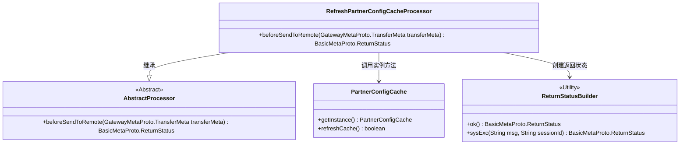
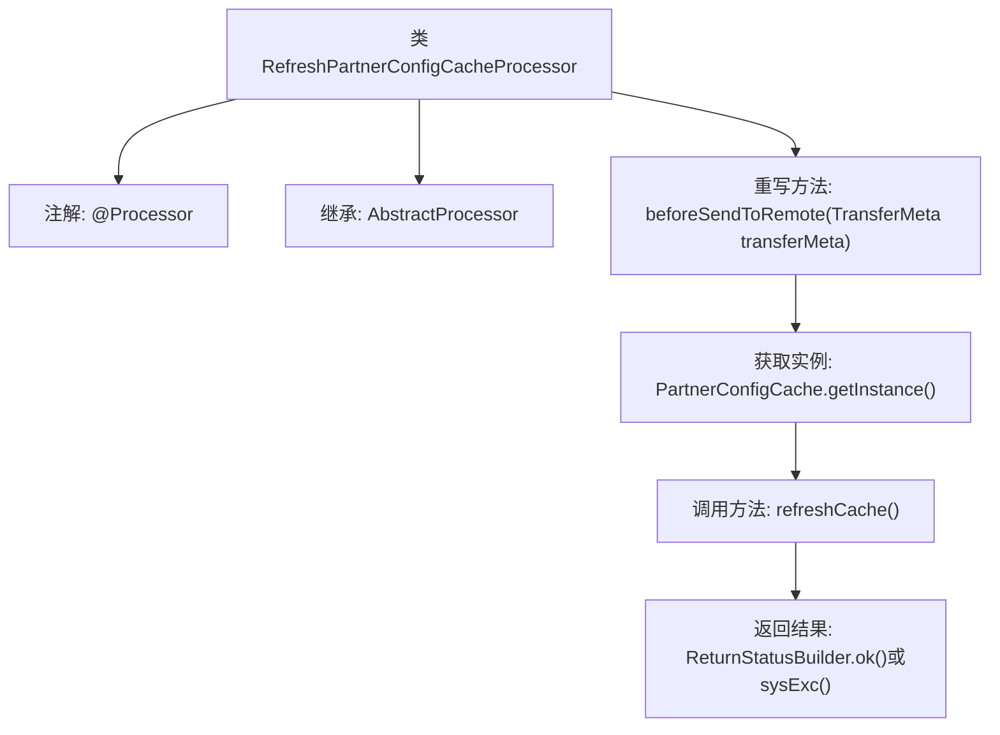

# 基础信息

|      |      |
|------|------|
| 名称 | RefreshPartnerConfigCacheProcessor |
| 编码语言 | .java |
| 代码路径 | WeFe/gateway/src/main/java/com/welab/wefe/gateway/service/processors/RefreshPartnerConfigCacheProcessor.java |
| 包名 | com.welab.wefe.gateway.service.processors |
| 依赖项 | ['com.welab.wefe.common.wefe.enums.GatewayProcessorType', 'com.welab.wefe.gateway.api.meta.basic.BasicMetaProto', 'com.welab.wefe.gateway.api.meta.basic.GatewayMetaProto', 'com.welab.wefe.gateway.base.Processor', 'com.welab.wefe.gateway.cache.PartnerConfigCache', 'com.welab.wefe.gateway.common.ReturnStatusBuilder'] |
| 概述说明 | 刷新合作伙伴配置缓存的处理器类，通过调用PartnerConfigCache实例的refreshCache方法更新缓存，成功返回OK状态，失败返回错误信息及会话ID。 |

# 说明

这是一个名为RefreshPartnerConfigCacheProcessor的处理器类，继承自AbstractProcessor。它被标注为GatewayProcessorType.refreshPartnerConfigCacheProcessor类型，描述为"Refresh local partner config processor"。该处理器重写了beforeSendToRemote方法，在方法中通过PartnerConfigCache单例实例调用refreshCache方法来刷新合作伙伴配置缓存。若刷新成功返回OK状态，失败则返回包含错误信息和会话ID的系统异常状态。

# 类列表 Class Summary

| 名称   | 类型  | 说明 |
|-------|------|-------------|
| RefreshPartnerConfigCacheProcessor | class | 刷新合作伙伴配置缓存的处理器类，通过refreshCache方法更新缓存，成功返回OK状态，失败返回错误信息及会话ID。 |

## 类 RefreshPartnerConfigCacheProcessor

|      |      |
|------|------|
| 访问范围 | @Processor(type = GatewayProcessorType.refreshPartnerConfigCacheProcessor, desc = "Refresh local partner config processor");public |
| 类型 | class |
| 名称 | RefreshPartnerConfigCacheProcessor |
| 说明 | 刷新合作伙伴配置缓存的处理器类，通过refreshCache方法更新缓存，成功返回OK状态，失败返回错误信息及会话ID。 |

### UML类图

该类图展示了刷新合作伙伴配置缓存处理器的核心结构。RefreshPartnerConfigCacheProcessor继承自AbstractProcessor，通过PartnerConfigCache单例刷新缓存，并使用ReturnStatusBuilder工具类构造返回状态。处理器在beforeSendToRemote方法中实现核心逻辑，成功时返回OK状态，失败时返回系统异常状态并携带会话ID。各组件通过清晰的依赖关系协同工作，形成完整的缓存刷新流程。

### 内部方法调用关系图

这段代码流程图展示了RefreshPartnerConfigCacheProcessor类的核心结构和工作流程。该类通过@Processor注解标记为网关处理器，继承自AbstractProcessor基类。主要逻辑在重写的beforeSendToRemote方法中实现：首先获取PartnerConfigCache单例实例，然后调用其refreshCache方法更新缓存，最后根据刷新结果返回成功状态或包含错误信息的系统异常状态。整个流程清晰地反映了缓存刷新处理器的责任链和异常处理机制。

### 字段列表 Field List

| 名称  | 类型  | 说明 |
|-------|-------|------|

### 方法列表

| 名称  | 类型  | 说明 |
|-------|-------|------|
| beforeSendToRemote | BasicMetaProto.ReturnStatus | 方法beforeSendToRemote检查合作伙伴配置缓存刷新状态，成功返回OK，失败返回错误信息及会话ID。 |

