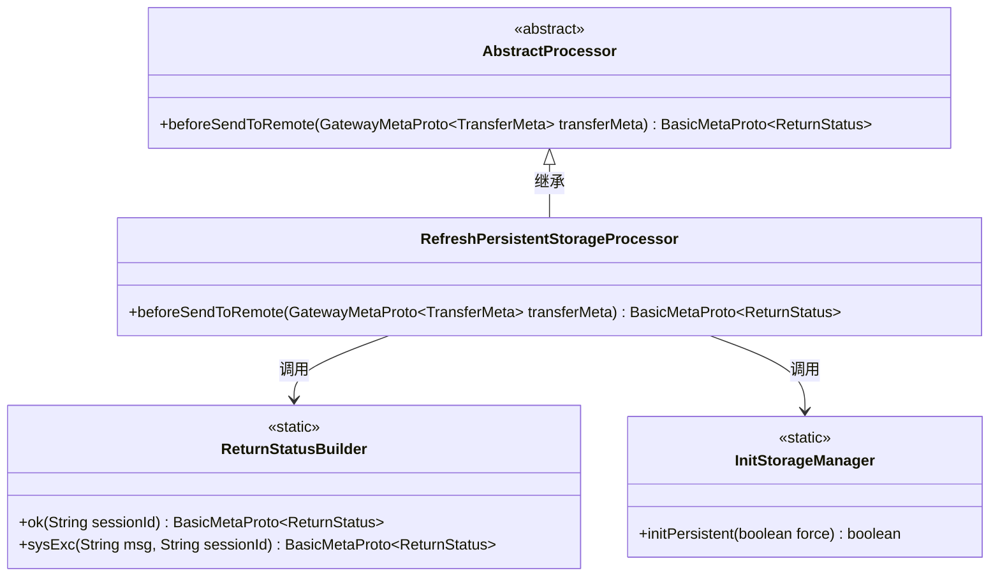
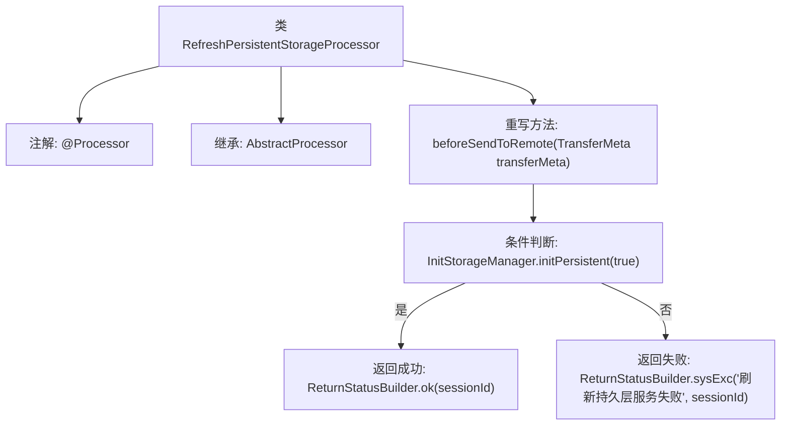

# 基础信息

|      |      |
|------|------|
| 名称 | RefreshPersistentStorageProcessor |
| 编码语言 | .java |
| 代码路径 | WeFe/gateway/src/main/java/com/welab/wefe/gateway/service/processors/RefreshPersistentStorageProcessor.java |
| 包名 | com.welab.wefe.gateway.service.processors |
| 依赖项 | ['com.welab.wefe.common.wefe.enums.GatewayProcessorType', 'com.welab.wefe.gateway.api.meta.basic.BasicMetaProto', 'com.welab.wefe.gateway.api.meta.basic.GatewayMetaProto', 'com.welab.wefe.gateway.base.Processor', 'com.welab.wefe.gateway.common.ReturnStatusBuilder', 'com.welab.wefe.gateway.init.InitStorageManager'] |
| 概述说明 | 刷新持久存储处理器类，继承抽象处理器，通过初始化存储管理器返回操作状态，成功返回OK，失败返回错误信息。 |

# 说明

该内容描述了一个名为RefreshPersistentStorageProcessor的处理器类，属于GatewayProcessorType.refreshPersistentStorageProcessor类型。该类继承自AbstractProcessor，重写了beforeSendToRemote方法。该方法接收TransferMeta参数，通过调用InitStorageManager.initPersistent(true)来初始化持久层存储。若初始化成功，返回包含会话ID的成功状态；若失败，则返回包含错误信息和会话ID的系统异常状态。整个过程用于刷新持久层服务。

# 类列表 Class Summary

| 名称   | 类型  | 说明 |
|-------|------|-------------|
| RefreshPersistentStorageProcessor | class | 刷新持久存储处理器类，继承抽象处理器，重写远程发送前方法，成功初始化存储返回OK状态，失败返回系统异常状态。 |

## 类 RefreshPersistentStorageProcessor

|      |      |
|------|------|
| 访问范围 | @Processor(type = GatewayProcessorType.refreshPersistentStorageProcessor, desc = "Refresh persistent storage processor");public |
| 类型 | class |
| 名称 | RefreshPersistentStorageProcessor |
| 说明 | 刷新持久存储处理器类，继承抽象处理器，重写远程发送前方法，成功初始化存储返回OK状态，失败返回系统异常状态。 |

### UML类图

类图描述：该图展示了RefreshPersistentStorageProcessor继承自抽象类AbstractProcessor，并重写了beforeSendToRemote方法。处理器通过调用静态类InitStorageManager的initPersistent方法来初始化持久层，并根据结果使用ReturnStatusBuilder构造返回状态。整体结构体现了网关处理器对持久层刷新操作的处理流程，包含错误处理和状态返回机制。

### 内部方法调用关系图

这段代码展示了一个刷新持久存储的处理器类，继承自抽象处理器类，通过注解标识其类型和描述。核心方法是beforeSendToRemote，它会根据初始化持久存储的结果返回不同的状态：成功时返回带有会话ID的成功状态，失败时返回包含错误信息的系统异常状态。流程图清晰地呈现了类的结构和主要方法逻辑。

### 字段列表 Field List

| 名称  | 类型  | 说明 |
|-------|-------|------|

### 方法列表

| 名称  | 类型  | 说明 |
|-------|-------|------|
| beforeSendToRemote | BasicMetaProto.ReturnStatus | 方法检查持久层初始化状态，成功返回OK，失败返回错误信息及会话ID。 |

