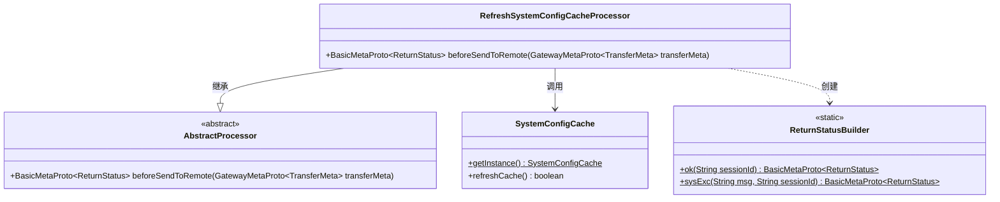
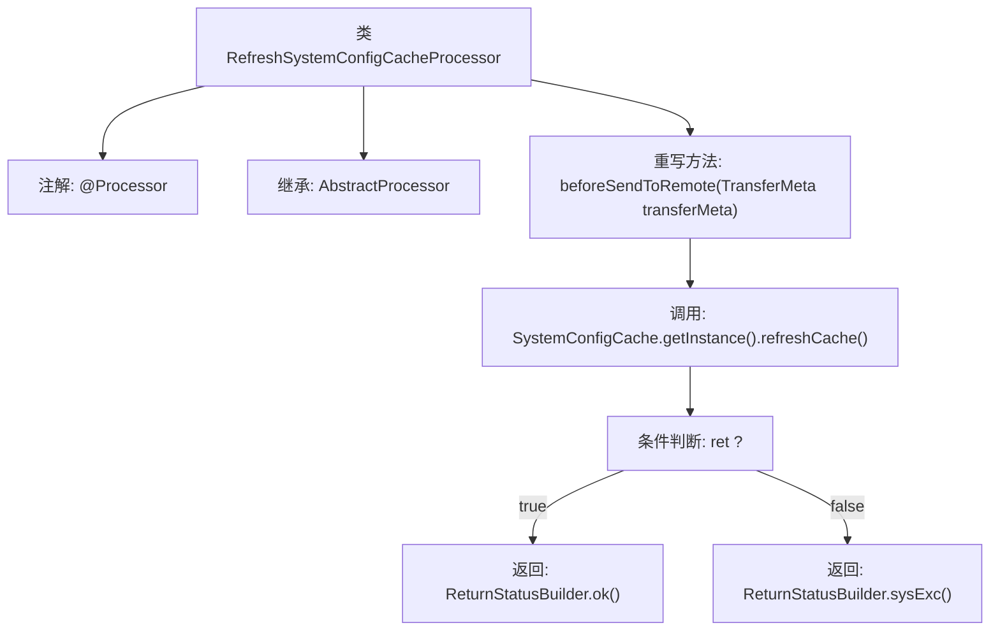

# 基础信息

|      |      |
|------|------|
| 名称 | RefreshSystemConfigCacheProcessor |
| 编码语言 | .java |
| 代码路径 | WeFe/gateway/src/main/java/com/welab/wefe/gateway/service/processors/RefreshSystemConfigCacheProcessor.java |
| 包名 | com.welab.wefe.gateway.service.processors |
| 依赖项 | ['com.welab.wefe.common.wefe.enums.GatewayProcessorType', 'com.welab.wefe.gateway.api.meta.basic.BasicMetaProto', 'com.welab.wefe.gateway.api.meta.basic.GatewayMetaProto', 'com.welab.wefe.gateway.base.Processor', 'com.welab.wefe.gateway.cache.SystemConfigCache', 'com.welab.wefe.gateway.common.ReturnStatusBuilder'] |
| 概述说明 | 刷新系统配置缓存的处理器类，通过refreshCache方法更新缓存，返回操作状态（成功或失败）。 |

# 说明

这是一个用于刷新系统配置缓存的处理器类，继承自抽象处理器基类。处理器类型定义为刷新系统配置缓存处理器。核心逻辑在beforeSendToRemote方法中实现，该方法通过调用SystemConfigCache单例的refreshCache方法来刷新缓存。操作成功时返回包含会话ID的成功状态，失败时返回包含错误信息和会话ID的系统异常状态。整个处理器专注于系统配置缓存的刷新功能。

# 类列表 Class Summary

| 名称   | 类型  | 说明 |
|-------|------|-------------|
| RefreshSystemConfigCacheProcessor | class | 刷新系统配置缓存的处理器类，继承自AbstractProcessor，通过refreshCache方法更新缓存，返回成功或失败状态。 |

## 类 RefreshSystemConfigCacheProcessor

|      |      |
|------|------|
| 访问范围 | @Processor(type = GatewayProcessorType.refreshSystemConfigCacheProcessor, desc = "Refresh system configuration cache processor");public |
| 类型 | class |
| 名称 | RefreshSystemConfigCacheProcessor |
| 说明 | 刷新系统配置缓存的处理器类，继承自AbstractProcessor，通过refreshCache方法更新缓存，返回成功或失败状态。 |

### UML类图

该代码展示了一个刷新系统配置缓存的处理器类，继承自抽象处理器类。主要功能是通过SystemConfigCache单例刷新缓存，并根据结果使用ReturnStatusBuilder构造返回状态。类图清晰地呈现了继承关系、工具类调用和静态构建器的使用，体现了责任链模式中具体处理器的实现方式。

### 内部方法调用关系图

该流程图展示了RefreshSystemConfigCacheProcessor类的结构和工作流程。该类通过@Processor注解标记为网关处理器，继承自AbstractProcessor，并重写了beforeSendToRemote方法。方法内首先调用SystemConfigCache的refreshCache方法刷新缓存，根据返回结果分别构建成功或失败的ReturnStatus对象返回。整个过程清晰展现了条件分支和状态返回的逻辑路径。

### 字段列表 Field List

| 名称  | 类型  | 说明 |
|-------|-------|------|

### 方法列表

| 名称  | 类型  | 说明 |
|-------|-------|------|
| beforeSendToRemote | BasicMetaProto.ReturnStatus | 方法在发送远程请求前刷新系统配置缓存，成功返回OK状态，失败返回系统异常状态及会话ID。 |

