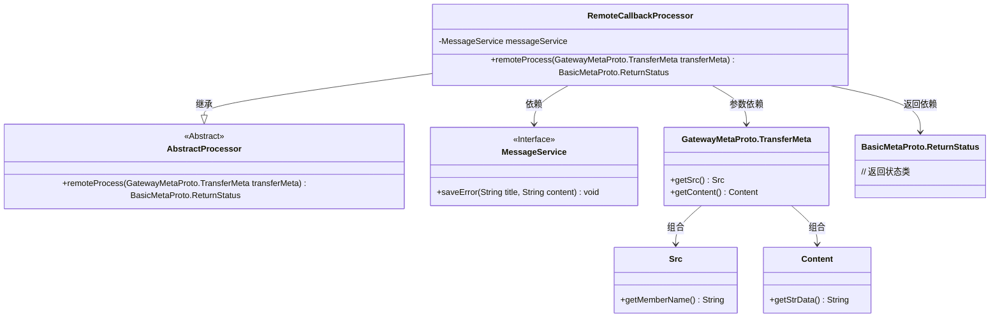
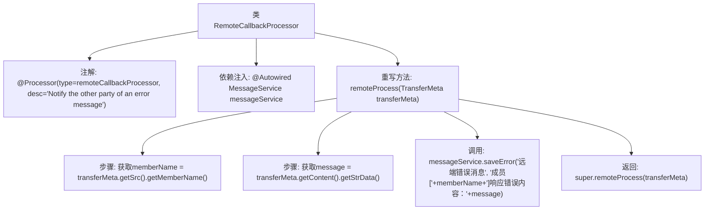

# 基础信息

|      |      |
|------|------|
| 名称 | RemoteCallbackProcessor |
| 编码语言 | .java |
| 代码路径 | WeFe/gateway/src/main/java/com/welab/wefe/gateway/service/processors/RemoteCallbackProcessor.java |
| 包名 | com.welab.wefe.gateway.service.processors |
| 依赖项 | ['com.welab.wefe.common.wefe.enums.GatewayProcessorType', 'com.welab.wefe.gateway.api.meta.basic.BasicMetaProto', 'com.welab.wefe.gateway.api.meta.basic.GatewayMetaProto', 'com.welab.wefe.gateway.base.Processor', 'com.welab.wefe.gateway.service.MessageService', 'org.springframework.beans.factory.annotation.Autowired'] |
| 概述说明 | 远程回调处理器类，通过消息服务保存成员错误消息并返回处理状态。 |

# 说明

这是一个名为RemoteCallbackProcessor的远程回调处理器类，用于通知对方错误消息。它继承自AbstractProcessor，标注为远程回调处理器类型。类中注入了MessageService用于消息处理。核心方法remoteProcess接收传输元数据，从中提取成员名称和消息内容，调用消息服务保存错误信息，格式为"成员[名称]响应错误内容：消息"，最后调用父类方法处理。

# 类列表 Class Summary

| 名称   | 类型  | 说明 |
|-------|------|-------------|
| RemoteCallbackProcessor | class | 远程回调处理器类，通过消息服务保存错误信息，包含成员名和错误内容。 |

## 类 RemoteCallbackProcessor

|      |      |
|------|------|
| 访问范围 | @Processor(type = GatewayProcessorType.remoteCallbackProcessor, desc = "Notify the other party of an error message");public |
| 类型 | class |
| 名称 | RemoteCallbackProcessor |
| 说明 | 远程回调处理器类，通过消息服务保存错误信息，包含成员名和错误内容。 |

### UML类图

这段代码展示了一个远程回调处理器`RemoteCallbackProcessor`，它继承自`AbstractProcessor`并实现了错误消息通知功能。类图清晰地呈现了核心类之间的关系：处理器通过依赖`MessageService`接口保存错误日志，处理`TransferMeta`参数时解析其中的`Src`和`Content`数据，最终返回`ReturnStatus`状态对象。整个结构体现了责任链模式与依赖注入的结合，适用于分布式系统中的错误回调场景。

### 内部方法调用关系图

这段代码流程图展示了RemoteCallbackProcessor类的核心处理流程。该类通过@Processor注解标记为远程回调处理器，注入MessageService服务后，在remoteProcess方法中依次执行：从传输元数据中提取成员名和消息内容，调用消息服务保存带有上下文信息的错误日志，最后调用父类处理方法。整个过程实现了对远端错误消息的捕获、格式化存储和传递处理。

### 字段列表 Field List

| 名称  | 类型  | 说明 |
|-------|-------|------|
| messageService | MessageService | 自动注入MessageService实例。 |

### 方法列表

| 名称  | 类型  | 说明 |
|-------|-------|------|
| remoteProcess | BasicMetaProto.ReturnStatus | 方法remoteProcess处理远端传输元数据，记录成员错误消息并调用父类方法。 |

