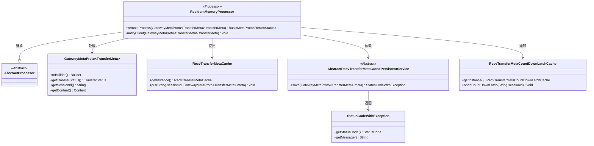
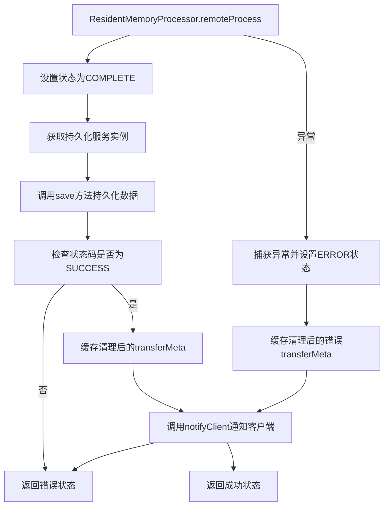
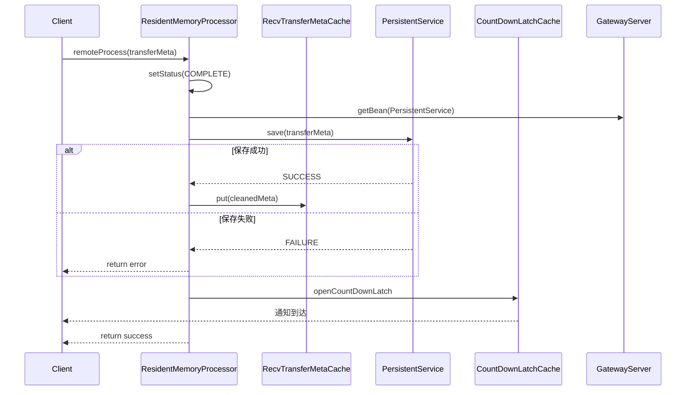

# 基础信息

|      |      |
|------|------|
| 名称 | ResidentMemoryProcessor |
| 编码语言 | .java |
| 代码路径 | WeFe/gateway/src/main/java/com/welab/wefe/gateway/service/processors/ResidentMemoryProcessor.java |
| 包名 | com.welab.wefe.gateway.service.processors |
| 依赖项 | ['com.welab.wefe.common.StatusCode', 'com.welab.wefe.common.exception.StatusCodeWithException', 'com.welab.wefe.common.wefe.enums.GatewayProcessorType', 'com.welab.wefe.gateway.GatewayServer', 'com.welab.wefe.gateway.api.meta.basic.BasicMetaProto', 'com.welab.wefe.gateway.api.meta.basic.GatewayMetaProto', 'com.welab.wefe.gateway.base.Processor', 'com.welab.wefe.gateway.cache.RecvTransferMetaCache', 'com.welab.wefe.gateway.cache.RecvTransferMetaCountDownLatchCache', 'com.welab.wefe.gateway.common.ReturnStatusBuilder', 'com.welab.wefe.gateway.service.base.AbstractRecvTransferMetaCachePersistentService'] |
| 概述说明 | 常驻内存处理器，处理传输元数据，设置状态为完成并持久化，成功则存入缓存（不含内容），失败则标记错误并通知客户端。 |

# 说明

ResidentMemoryProcessor是一个内存常驻处理器，继承自AbstractProcessor。它处理远程传输元数据，首先将状态设为COMPLETE，然后通过持久化服务保存数据。若保存失败返回错误状态，成功则清除内容后存入缓存。处理过程中发生异常会记录日志并设置ERROR状态。最后通过notifyClient方法通知客户端数据到达。整个过程确保数据持久化和状态更新，同时避免缓存过大。

# 类列表 Class Summary

| 名称   | 类型  | 说明 |
|-------|------|-------------|
| ResidentMemoryProcessor | class | 常驻内存处理器，处理传输元数据，设置状态为完成并持久化，异常时记录错误并通知客户端，成功时通知客户端数据到达。 |

## 类 ResidentMemoryProcessor

|      |      |
|------|------|
| 访问范围 | @Processor(type = GatewayProcessorType.residentMemoryProcessor, desc = "Memory resident processor");public |
| 类型 | class |
| 名称 | ResidentMemoryProcessor |
| 说明 | 常驻内存处理器，处理传输元数据，设置状态为完成并持久化，异常时记录错误并通知客户端，成功时通知客户端数据到达。 |

### UML类图

该图展示了ResidentMemoryProcessor类及其相关依赖关系。ResidentMemoryProcessor继承自AbstractProcessor，处理GatewayMetaProto.TransferMeta对象，使用RecvTransferMetaCache进行缓存操作，依赖AbstractRecvTransferMetaCachePersistentService进行持久化，并通过RecvTransferMetaCountDownLatchCache通知客户端。持久化服务返回StatusCodeWithException状态对象。整体结构清晰展示了处理器与缓存、持久化服务及客户端通知机制之间的交互关系。

### 内部方法调用关系图

这段代码展示了一个内存常驻处理器的核心流程，主要处理传输元数据的持久化和客户端通知。流程图清晰展示了正常流程和异常处理路径，包括状态设置、服务获取、数据持久化、缓存操作和客户端通知等关键步骤。时序图则详细描述了组件间的交互顺序，特别是持久化服务和计数锁存缓存的协作过程。整个设计注重异常处理和资源清理，确保系统稳定性。

### 字段列表 Field List

| 名称  | 类型  | 说明 |
|-------|-------|------|

### 方法列表

| 名称  | 类型  | 说明 |
|-------|-------|------|
| remoteProcess | BasicMetaProto.ReturnStatus | 该方法处理传输元数据，设置状态为完成并持久化存储。若失败则记录错误并设置状态为错误。无论成功与否，均清除内容后缓存元数据并通知客户端。成功返回OK，失败返回异常信息。 |
| notifyClient | void | 该方法用于通知客户端，通过调用缓存实例打开指定会话ID的倒计时锁存器。 |

