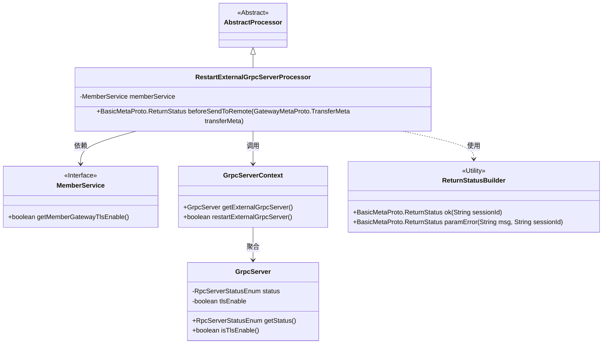
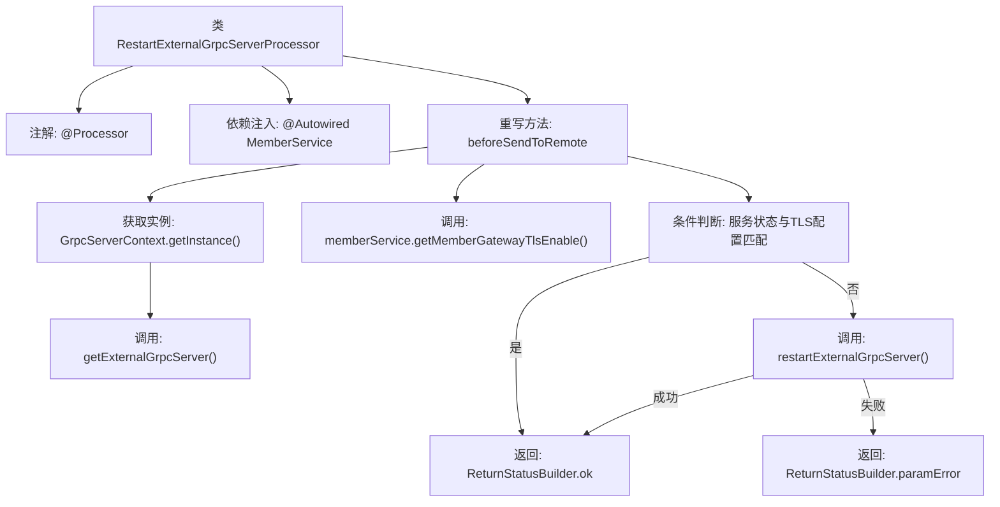

# 基础信息

|      |      |
|------|------|
| 名称 | RestartExternalGrpcServerProcessor |
| 编码语言 | .java |
| 代码路径 | WeFe/gateway/src/main/java/com/welab/wefe/gateway/service/processors/RestartExternalGrpcServerProcessor.java |
| 包名 | com.welab.wefe.gateway.service.processors |
| 依赖项 | ['com.welab.wefe.common.wefe.enums.GatewayProcessorType', 'com.welab.wefe.gateway.api.meta.basic.BasicMetaProto', 'com.welab.wefe.gateway.api.meta.basic.GatewayMetaProto', 'com.welab.wefe.gateway.base.Processor', 'com.welab.wefe.gateway.common.ReturnStatusBuilder', 'com.welab.wefe.gateway.common.RpcServerStatusEnum', 'com.welab.wefe.gateway.init.grpc.GrpcServer', 'com.welab.wefe.gateway.init.grpc.GrpcServerContext', 'com.welab.wefe.gateway.service.MemberService', 'org.springframework.beans.factory.annotation.Autowired'] |
| 概述说明 | RestartExternalGrpcServerProcessor类用于重启外部gRPC服务器，检查服务器状态和TLS设置，若需重启则执行操作并返回状态结果。 |

# 说明

这是一个名为RestartExternalGrpcServerProcessor的处理器类，用于重启外部gRPC服务器。它继承自AbstractProcessor，标注为GatewayProcessorType.restartExternalGrpcServer类型。类中注入了MemberService成员服务，并重写了beforeSendToRemote方法。该方法首先检查当前gRPC服务器状态和TLS设置，若符合条件则返回成功；否则尝试重启服务器，成功返回成功状态，失败则返回参数错误信息。整个过程会关联传输元数据的会话ID。

# 类列表 Class Summary

| 名称   | 类型  | 说明 |
|-------|------|-------------|
| RestartExternalGrpcServerProcessor | class | RestartExternalGrpcServerProcessor类用于重启外部gRPC服务，检查服务状态和TLS设置，成功返回OK，失败返回错误信息。 |

## 类 RestartExternalGrpcServerProcessor

|      |      |
|------|------|
| 访问范围 | @Processor(type = GatewayProcessorType.restartExternalGrpcServer, desc = "Restart external grpc server processor");public |
| 类型 | class |
| 名称 | RestartExternalGrpcServerProcessor |
| 说明 | RestartExternalGrpcServerProcessor类用于重启外部gRPC服务，检查服务状态和TLS设置，成功返回OK，失败返回错误信息。 |

### UML类图

这段代码展示了一个用于重启外部gRPC服务器的处理器类结构。核心类`RestartExternalGrpcServerProcessor`继承自抽象处理器，通过`GrpcServerContext`获取服务器实例，并依赖`MemberService`获取TLS配置。当服务器状态为运行中且TLS配置匹配时直接返回成功，否则尝试重启服务器。类图中清晰地展现了各组件间的依赖关系和职责划分，包括工具类`ReturnStatusBuilder`的使用。

### 内部方法调用关系图

该流程图展示了RestartExternalGrpcServerProcessor的核心处理逻辑。首先通过GrpcServerContext获取外部gRPC服务实例，然后检查服务运行状态与TLS配置是否匹配。若匹配则直接返回成功，否则尝试重启服务。重启成功返回OK状态，失败则返回参数错误。整个过程涉及多个条件分支和外部服务调用，体现了对gRPC服务状态管理的完整控制流程。

### 字段列表 Field List

| 名称  | 类型  | 说明 |
|-------|-------|------|
| memberService | MemberService | 自动注入MemberService实例。 |

### 方法列表

| 名称  | 类型  | 说明 |
|-------|-------|------|
| beforeSendToRemote | BasicMetaProto.ReturnStatus | 方法检查gRPC服务器状态，若运行中且TLS配置匹配则返回成功；否则尝试重启服务器，成功返回成功，失败返回错误信息。 |

