# 基础信息

|      |      |
|------|------|
| 名称 | processors |
| 编码语言 | .java |
| 代码路径 | WeFe/gateway/src/main/java/com/welab/wefe/gateway/service/processors |
| 包名 | docs.gateway.src.main.java.com.welab.wefe.gateway.service.processors |
| 概述说明 | 分布式服务可用性检查框架，含网关连接验证和后端健康检查，支持多层级探针和双轨模式，覆盖网络到存储全链路验证，含多种处理器实现如MySQL检查、缓存刷新等。 |

# 说明

## 概述  
该模块是分布式系统的服务健康管理框架，核心职责包括网关连通性检测和微服务状态检查，类似多层探针体系。采用Processor抽象类（beforeSendToRemote/remoteProcess）与Checkpoint机制（doCheck/desc）双轨接口规范，关键数据结构含传输元数据URI、ReturnStatusBuilder响应体和多类型检查点（如MySQL/Storage）。依赖项涵盖网关网络、函数计算、MySQL、文件系统等基础设施，例如FileSystemCheckpoint验证目录权限，GatewayAliveProcessor检测双网连通性。

## 主要业务场景  
模块支持网关级（如网络拓扑验证）和服务级（如MySQL连接检查）两类检测场景，采用"本地预检→远程验证"分层策略。典型流程如GatewayAvailableProcessor先校验会话合法性再执行多检查点扫描，完整覆盖网络到存储的全链路验证。集成案例包括JNI调用存储服务、SM4加密通信（BoardHttpProcessor）和gRPC服务重启（RestartExternalGrpcServerProcessor），类似分布式自愈系统。缓存刷新（如RefreshMemberCacheProcessor）和异步消息处理（DbFlowTableProcessor）构成辅助业务流。

### 包内部结构视图

```mermaid
graph TD
    processors --> available
    processors --> RefreshFcStorageProcessor.java
    processors --> RefreshMemberBlacklistCacheProcessor.java
    processors --> DbFlowTableProcessor.java
    processors --> BoardHttpProcessor.java
    processors --> DbChatTableProcessor.java
    processors --> RefreshMemberCacheProcessor.java
    processors --> RefreshSystemConfigCacheProcessor.java
    processors --> ResidentMemoryProcessor.java
    processors --> RemoteCallbackProcessor.java
    processors --> AbstractProcessor.java
    processors --> RestartExternalGrpcServerProcessor.java
    processors --> RefreshPartnerConfigCacheProcessor.java
    processors --> RefreshPersistentStorageProcessor.java
    processors --> DsourceProcessor.java
    processors --> AvailableCheckBeforeStartJobProcessor.java
    processors --> ProcessorContext.java
    available --> checkpoint
    available --> GatewayAliveProcessor.java
    available --> GatewayAvailableProcessor.java
    checkpoint --> FcCheckpoint.java
    checkpoint --> MysqlCheckpoint.java
    checkpoint --> FileSystemCheckpoint.java
    checkpoint --> StorageCheckpoint.java
    checkpoint --> BoardCheckpoint.java
    checkpoint --> UnionCheckpoint.java
```

该流程图展示了WeFe网关服务处理器的层级结构。根节点processors包含两个主要分支：available目录和多个独立处理器文件。available目录下又分为checkpoint子目录和两个处理器文件，checkpoint子目录包含六种不同类型的检查点处理器实现。整体结构清晰展示了处理器模块的组织方式，顶层处理器与特定功能处理器分层明确。

# 文件列表

| 名称   | 类型  | 说明 |
|-------|------|-------------|
| [RefreshFcStorageProcessor.java](RefreshFcStorageProcessor.md) | file | 刷新FC存储处理器，初始化存储管理器并返回成功状态。 |
| [RefreshMemberBlacklistCacheProcessor.java](RefreshMemberBlacklistCacheProcessor.md) | file | 刷新成员黑名单缓存的处理器类，继承自AbstractProcessor，通过beforeSendToRemote方法调用MemberBlacklistCache刷新缓存，返回成功或失败状态。 |
| [DbFlowTableProcessor.java](DbFlowTableProcessor.md) | file | DbFlowTableProcessor将消息存入MySQL流程动作队列，处理异常并返回状态。 |
| [BoardHttpProcessor.java](BoardHttpProcessor.md) | file | BoardHttpProcessor是HTTP模式的消息处理器，负责加密传输数据并推送至board模块，记录耗时及处理异常。包含加解密逻辑和远程请求处理。 |
| [DbChatTableProcessor.java](DbChatTableProcessor.md) | file | DbChatTableProcessor将消息存入MySQL交换中心队列，处理异常并返回状态。 |
| [RefreshMemberCacheProcessor.java](RefreshMemberCacheProcessor.md) | file | 刷新成员缓存处理器，检查并更新本地缓存，失败返回错误，成功返回状态。 |
| [RefreshSystemConfigCacheProcessor.java](RefreshSystemConfigCacheProcessor.md) | file | 刷新系统配置缓存的处理器类，通过refreshCache方法更新缓存，返回操作状态（成功或失败）。 |
| [ResidentMemoryProcessor.java](ResidentMemoryProcessor.md) | file | 常驻内存处理器，处理传输元数据，设置状态为完成并持久化，成功则存入缓存（不含内容），失败则标记错误并通知客户端。 |
| [RemoteCallbackProcessor.java](RemoteCallbackProcessor.md) | file | 远程回调处理器类，通过消息服务保存成员错误消息并返回处理状态。 |
| [AbstractProcessor.java](AbstractProcessor.md) | file | 抽象类AbstractProcessor提供消息处理框架，包含发送前处理、远程推送及接收处理等方法，支持子类扩展。关键方法包括beforeSendToRemote、toRemote和remoteProcess，并包含目标成员检查功能dstMemberIsSelf。 |
| [RestartExternalGrpcServerProcessor.java](RestartExternalGrpcServerProcessor.md) | file | RestartExternalGrpcServerProcessor类用于重启外部gRPC服务器，检查服务器状态和TLS设置，若需重启则执行操作并返回状态结果。 |
| [RefreshPartnerConfigCacheProcessor.java](RefreshPartnerConfigCacheProcessor.md) | file | 刷新合作伙伴配置缓存的处理器类，通过调用PartnerConfigCache实例的refreshCache方法更新缓存，成功返回OK状态，失败返回错误信息及会话ID。 |
| [RefreshPersistentStorageProcessor.java](RefreshPersistentStorageProcessor.md) | file | 刷新持久存储处理器类，继承抽象处理器，通过初始化存储管理器返回操作状态，成功返回OK，失败返回错误信息。 |
| [DsourceProcessor.java](DsourceProcessor.md) | file | DsouceProcessor类负责大数据传输处理，如CK数据库数据。包含发送前验证、数据持久化及缓存、推送流数据到远程端及接收处理远程数据的方法。验证数据结构和必填字段，持久化成功后缓存数据，失败记录错误。推送和接收数据分别调用transferMetaDataSource和transferMetaDataSink处理。 |
| [AvailableCheckBeforeStartJobProcessor.java](AvailableCheckBeforeStartJobProcessor.md) | file | 可用性检查处理器，在任务启动前检查持久化服务是否初始化，未初始化则返回异常状态。 |
| [ProcessorContext.java](ProcessorContext.md) | file | ProcessorContext类通过静态块加载所有处理器类到PROCESSOR_MAP，提供getProcessor方法根据名称获取处理器实例，若不存在则抛出异常。 |
| [available](available/_module.md) | package | 服务可用性检查框架，通过继承AbstractCheckpoint实现六类后端服务连通性验证，包括函数计算、MySQL等。统一接口规范含服务类型、描述和检查逻辑。关键组件有配置服务、持久化存储等。应用于系统启动预检和定时监控。网关处理器类检查内外网连接状态和服务健康状态。 |

