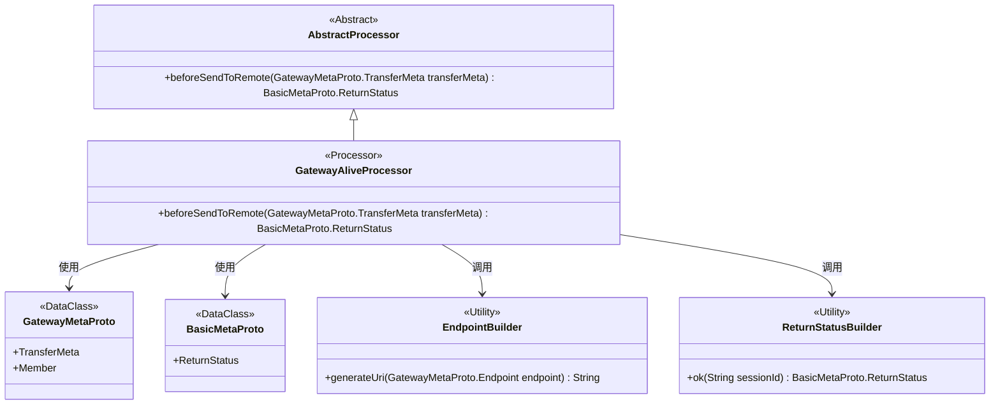
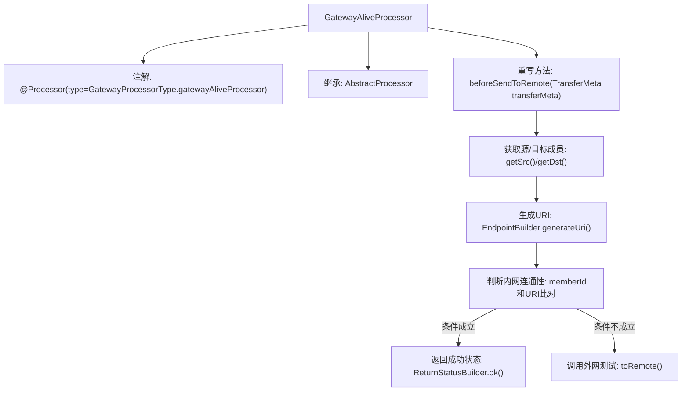

# 基础信息

|      |      |
|------|------|
| 名称 | GatewayAliveProcessor |
| 编码语言 | .java |
| 代码路径 | WeFe/gateway/src/main/java/com/welab/wefe/gateway/service/processors/available/GatewayAliveProcessor.java |
| 包名 | com.welab.wefe.gateway.service.processors.available |
| 依赖项 | ['com.welab.wefe.common.wefe.enums.GatewayProcessorType', 'com.welab.wefe.gateway.api.meta.basic.BasicMetaProto', 'com.welab.wefe.gateway.api.meta.basic.GatewayMetaProto', 'com.welab.wefe.gateway.base.Processor', 'com.welab.wefe.gateway.common.EndpointBuilder', 'com.welab.wefe.gateway.common.ReturnStatusBuilder', 'com.welab.wefe.gateway.service.processors.AbstractProcessor'] |
| 概述说明 | Gateway存活处理器，检查内外网连接状态，通过URI比对和远程调用验证。 |

# 说明

该代码定义了一个网关存活处理器类GatewayAliveProcessor，继承自AbstractProcessor。它被注解标记为网关存活处理器类型。核心功能是通过beforeSendToRemote方法检测网关连接状态：首先获取传输元数据中的源成员和目标成员信息，生成对应的URI地址。若源成员ID与目标成员ID相同且URI一致，则返回成功状态；否则调用toRemote方法测试外网连通性。该方法主要用于验证网关内外网的连接可用性。

# 类列表 Class Summary

| 名称   | 类型  | 说明 |
|-------|------|-------------|
| GatewayAliveProcessor | class | GatewayAliveProcessor类用于检测网关存活状态，处理内外网连接测试，继承自AbstractProcessor。通过比较源和目标成员信息判断连接类型，返回状态结果。 |

## 类 GatewayAliveProcessor

|      |      |
|------|------|
| 访问范围 | @Processor(type = GatewayProcessorType.gatewayAliveProcessor, desc = "Gateway survival processor");public |
| 类型 | class |
| 名称 | GatewayAliveProcessor |
| 说明 | GatewayAliveProcessor类用于检测网关存活状态，处理内外网连接测试，继承自AbstractProcessor。通过比较源和目标成员信息判断连接类型，返回状态结果。 |

### UML类图

该图展示了网关存活处理器的类结构。GatewayAliveProcessor继承自AbstractProcessor，通过注解标记为网关存活处理器。它依赖GatewayMetaProto处理传输元数据，使用BasicMetaProto返回状态，调用EndpointBuilder生成URI，并利用ReturnStatusBuilder构建返回状态。处理器核心逻辑通过比较源/目标成员ID和URI来检测内外网连通性。

### 内部方法调用关系图

该流程图描述了GatewayAliveProcessor处理网关存活检测的核心逻辑。处理器首先解析传输元数据中的源/目标成员信息，生成对应的URI地址。若检测到是内网自连通测试（相同memberId和URI），直接返回成功状态；否则继续执行外网连通性测试。整个过程体现了对网络连接状态的层次化验证机制。

### 字段列表 Field List

| 名称  | 类型  | 说明 |
|-------|-------|------|

### 方法列表

| 名称  | 类型  | 说明 |
|-------|-------|------|
| beforeSendToRemote | BasicMetaProto.ReturnStatus | 方法beforeSendToRemote检查传输元数据，验证源与目标成员ID和URI是否相同（内网测试），相同返回成功状态，否则调用toRemote进行外网测试。 |

