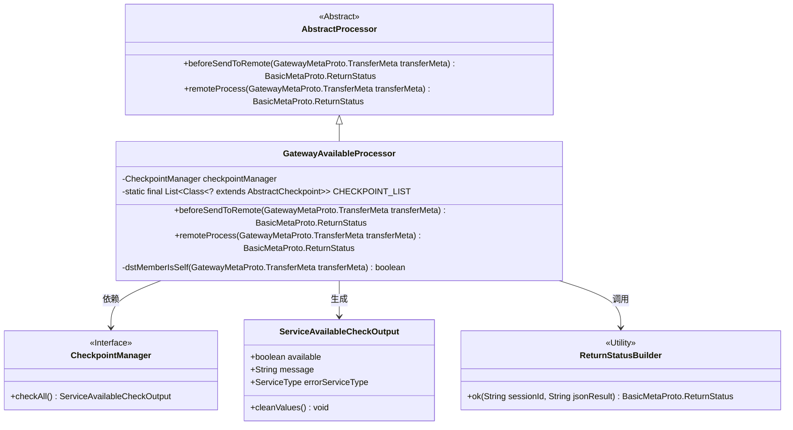
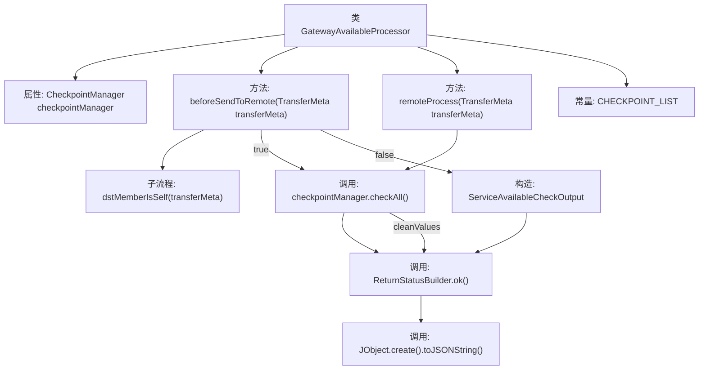
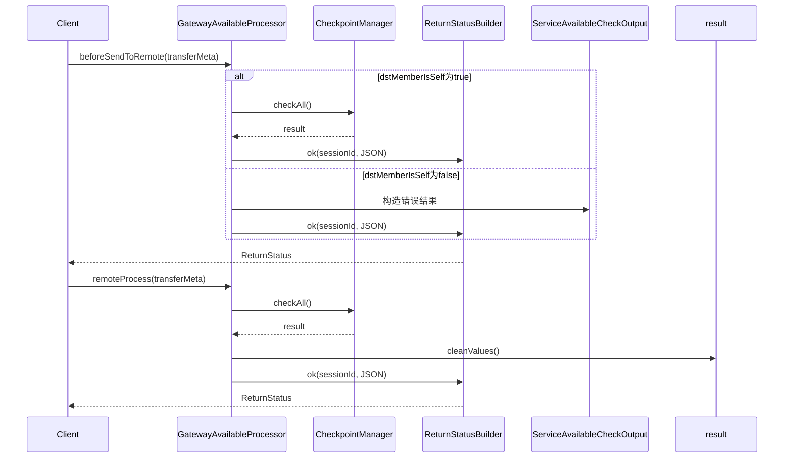

# 基础信息

|      |      |
|------|------|
| 名称 | GatewayAvailableProcessor |
| 编码语言 | .java |
| 代码路径 | WeFe/gateway/src/main/java/com/welab/wefe/gateway/service/processors/available/GatewayAvailableProcessor.java |
| 包名 | com.welab.wefe.gateway.service.processors.available |
| 依赖项 | ['com.welab.wefe.common.util.JObject', 'com.welab.wefe.common.wefe.checkpoint.AbstractCheckpoint', 'com.welab.wefe.common.wefe.checkpoint.CheckpointManager', 'com.welab.wefe.common.wefe.checkpoint.dto.ServiceAvailableCheckOutput', 'com.welab.wefe.common.wefe.enums.GatewayProcessorType', 'com.welab.wefe.common.wefe.enums.ServiceType', 'com.welab.wefe.gateway.api.meta.basic.BasicMetaProto', 'com.welab.wefe.gateway.api.meta.basic.GatewayMetaProto', 'com.welab.wefe.gateway.base.Processor', 'com.welab.wefe.gateway.common.ReturnStatusBuilder', 'com.welab.wefe.gateway.service.processors.AbstractProcessor', 'com.welab.wefe.gateway.service.processors.available.checkpoint', 'org.springframework.beans.factory.annotation.Autowired', 'java.util.Arrays', 'java.util.List'] |
| 概述说明 | GatewayAvailableProcessor检查服务可用性，通过checkpointManager验证MySQL、存储等组件状态，处理本地和远程请求，返回状态信息。 |

# 说明

这是一个网关可用性处理器类，用于检查网关服务状态。类中包含两个主要方法：beforeSendToRemote在发送到远程前检查目标成员是否为本机，若是则调用checkpointManager检查所有服务状态；remoteProcess方法处理远程请求并返回检查结果。检查点列表包含MySQL、存储、联合、看板和文件系统等检查项。当检测到非法会话来源时会返回错误信息。所有检查结果都通过ReturnStatusBuilder构建返回状态。

# 类列表 Class Summary

| 名称   | 类型  | 说明 |
|-------|------|-------------|
| GatewayAvailableProcessor | class | GatewayAvailableProcessor检查服务可用性，包括MySQL、存储等，返回状态信息。处理本地和远程请求，验证会话来源。 |

## 类 GatewayAvailableProcessor

|      |      |
|------|------|
| 访问范围 | @Processor(type = GatewayProcessorType.gatewayAvailableProcessor, desc = "Gateway availability processor");public |
| 类型 | class |
| 名称 | GatewayAvailableProcessor |
| 说明 | GatewayAvailableProcessor检查服务可用性，包括MySQL、存储等，返回状态信息。处理本地和远程请求，验证会话来源。 |

### UML类图

该图展示了网关可用性处理器的类结构，GatewayAvailableProcessor继承自AbstractProcessor，通过CheckpointManager进行服务可用性检查，生成ServiceAvailableCheckOutput结果，并使用ReturnStatusBuilder构建返回状态。处理器包含静态检查点列表，通过beforeSendToRemote和remoteProcess方法处理不同场景的网关请求，确保服务可用性验证的完整性。

### 内部方法调用关系图

这段代码实现了一个网关可用性处理器，主要包含两个核心方法：beforeSendToRemote用于前置检查，根据目标成员是否为本节点分别返回不同的服务可用性检查结果；remoteProcess则统一执行所有检查点的健康检查并返回状态。流程图展示了类结构和关键方法调用关系，时序图则详细描述了两种场景下的交互流程和数据处理逻辑。该处理器通过CheckpointManager整合多种基础设施(MySQL/存储/文件系统等)的健康状态检查。

### 字段列表 Field List

| 名称  | 类型  | 说明 |
|-------|-------|------|
| checkpointManager | CheckpointManager | 自动注入CheckpointManager实例。 |
| CHECKPOINT_LIST = Arrays.asList(            MysqlCheckpoint.class,            StorageCheckpoint.class,            UnionCheckpoint.class,            BoardCheckpoint.class,            FileSystemCheckpoint.class    ) | List<Class<? extends AbstractCheckpoint>> | 定义了一个私有静态不可变列表CHECKPOINT_LIST，包含五种检查点类：Mysql、Storage、Union、Board和FileSystem。 |

### 方法列表

| 名称  | 类型  | 说明 |
|-------|-------|------|
| beforeSendToRemote | BasicMetaProto.ReturnStatus | 检查目标成员是否为本机，是则返回服务可用性检查结果，否则返回无权访问错误信息。 |
| remoteProcess | BasicMetaProto.ReturnStatus | 该方法检查所有服务可用性，清理结果后返回包含会话ID和JSON格式结果的成功状态。 |

