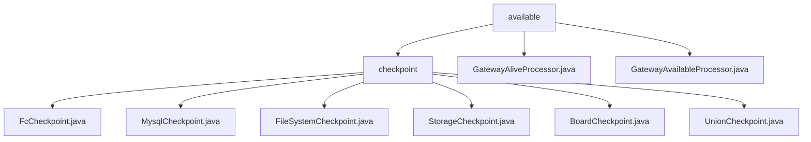

# 基础信息

|      |      |
|------|------|
| 名称 | available |
| 编码语言 | .java |
| 代码路径 | WeFe/gateway/src/main/java/com/welab/wefe/gateway/service/processors/available |
| 包名 | docs.gateway.src.main.java.com.welab.wefe.gateway.service.processors.available |
| 概述说明 | 服务可用性检查框架，通过继承AbstractCheckpoint实现六类后端服务连通性验证，包括函数计算、MySQL等。统一接口规范含服务类型、描述和检查逻辑。关键组件有配置服务、持久化存储等。应用于系统启动预检和定时监控。网关处理器类检查内外网连接状态和服务健康状态。 |

# 说明

## 概述  
该模块是分布式环境下的服务可用性检查框架，核心职责包括网关连接状态验证和后端服务健康检查，类似多层级探针系统。接口规范统一采用Processor抽象类（beforeSendToRemote/remoteProcess方法）和Checkpoint机制（doCheck/desc方法）双轨模式。关键数据结构涵盖传输元数据URI、ReturnStatusBuilder响应体和检查点列表（MySQL/Storage/Union等）。外部依赖涉及网关网络连接、函数计算、MySQL、文件系统、Storage服务和Board-Service等。例如GatewayAliveProcessor检测内外网连通性，FileSystemCheckpoint验证目录权限。

## 主要业务场景  
模块支持网关级和微服务级两类检查场景：前者如GatewayAliveProcessor通过URI比对验证网络拓扑，后者包含六种Checkpoint实现（如验证MySQL连接的MysqlCheckpoint）。交互模式采用"本地优先→远程检测"分层策略，例如GatewayAvailableProcessor先检查会话合法性再执行多检查点扫描。完整功能覆盖从网络层到存储层的全链路验证，典型应用于网关握手阶段或定时心跳检测。API集成案例包括JNI调用存储服务和POSIX文件操作，类似分布式系统的自愈机制。

### 包内部结构视图

该流程图展示了WeFe网关服务中可用性处理模块的层级结构。顶层是available目录，包含checkpoint子目录和两个处理器文件。checkpoint目录下包含6个不同类型的检查点实现文件，分别处理不同存储系统的检查点功能。整个结构清晰地反映了网关可用性处理模块的文件组织方式。

# 文件列表

| 名称   | 类型  | 说明 |
|-------|------|-------------|
| [GatewayAliveProcessor.java](GatewayAliveProcessor.md) | file | Gateway存活处理器，检查内外网连接状态，通过URI比对和远程调用验证。 |
| [checkpoint](checkpoint/_module.md) | package | FcCheckpoint检查函数计算环境可用性。MysqlCheckpoint验证mysql服务可用性。FileSystemCheckpoint检查文件系统访问功能。StorageCheckpoint验证storage服务可用性。BoardCheckpoint检查与board-service连通性。UnionCheckpoint处理Union连接检查点逻辑。 |
| [GatewayAvailableProcessor.java](GatewayAvailableProcessor.md) | file | GatewayAvailableProcessor检查服务可用性，通过checkpointManager验证MySQL、存储等组件状态，处理本地和远程请求，返回状态信息。 |

