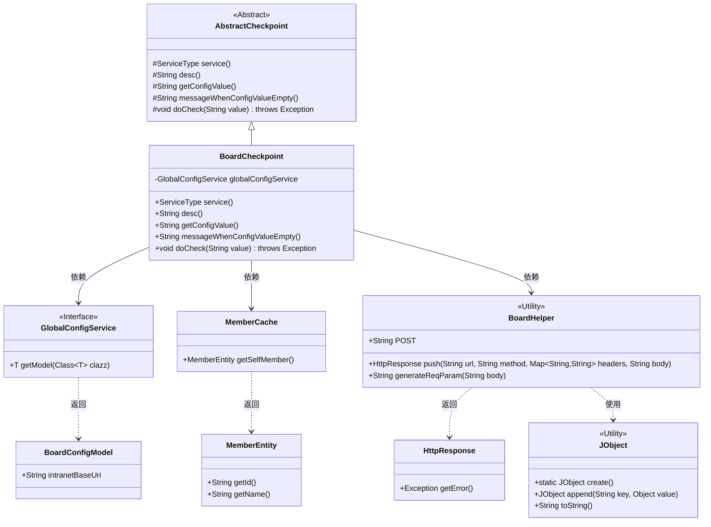
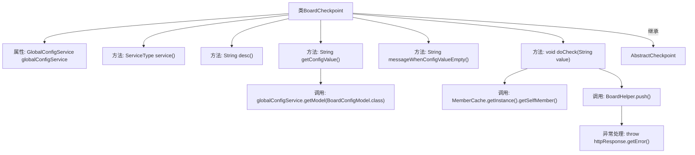

# 基础信息

|      |      |
|------|------|
| 名称 | BoardCheckpoint |
| 编码语言 | .java |
| 代码路径 | WeFe/gateway/src/main/java/com/welab/wefe/gateway/service/processors/available/checkpoint/BoardCheckpoint.java |
| 包名 | com.welab.wefe.gateway.service.processors.available.checkpoint |
| 依赖项 | ['com.welab.wefe.common.http.HttpResponse', 'com.welab.wefe.common.util.JObject', 'com.welab.wefe.common.wefe.checkpoint.AbstractCheckpoint', 'com.welab.wefe.common.wefe.dto.global_config.BoardConfigModel', 'com.welab.wefe.common.wefe.enums.ServiceType', 'com.welab.wefe.gateway.cache.MemberCache', 'com.welab.wefe.gateway.entity.MemberEntity', 'com.welab.wefe.gateway.sdk.BoardHelper', 'com.welab.wefe.gateway.service.GlobalConfigService', 'org.springframework.beans.factory.annotation.Autowired', 'org.springframework.stereotype.Service', 'java.util.HashMap'] |
| 概述说明 | BoardCheckpoint类用于检查gateway与board-service的连通性，通过全局配置获取内网地址并发送请求验证，配置缺失时提示用户设置。 |

# 说明

这是一个名为BoardCheckpoint的Spring服务类，继承自AbstractCheckpoint。它用于检查gateway与board-service服务的连通性。通过globalConfigService获取board-service的内网地址配置，若未配置会提示用户设置。检查时构建包含调用方信息和API路径的请求体，向board-service发送/gateway/redirect请求，若响应包含错误则抛出异常。主要涉及配置获取、请求构建和连通性验证功能。

# 类列表 Class Summary

| 名称   | 类型  | 说明 |
|-------|------|-------------|
| BoardCheckpoint | class | BoardCheckpoint类检查gateway与board-service连通性，通过全局配置获取内网地址，未配置时提示设置，调用服务接口验证连接。 |

## 类 BoardCheckpoint

|      |      |
|------|------|
| 访问范围 | @Service;public |
| 类型 | class |
| 名称 | BoardCheckpoint |
| 说明 | BoardCheckpoint类检查gateway与board-service连通性，通过全局配置获取内网地址，未配置时提示设置，调用服务接口验证连接。 |

### UML类图

类图描述：该图展示了BoardCheckpoint类继承自AbstractCheckpoint抽象类，并依赖GlobalConfigService接口获取配置。BoardCheckpoint通过MemberCache获取成员信息，使用BoardHelper工具类发起HTTP请求，处理响应时可能抛出异常。JObject用于构建请求体，BoardConfigModel存储配置数据。整体实现了服务连通性检查功能，涉及配置获取、成员信息处理和网络请求等协作关系。

### 内部方法调用关系图

流程图描述：该流程图展示了BoardCheckpoint类的结构及其方法调用关系。该类继承自AbstractCheckpoint，包含全局配置服务注入属性和多个重写方法。核心逻辑在doCheck方法中，涉及获取成员信息、构建请求参数、调用BoardHelper推送请求，并在响应错误时抛出异常。配置值获取通过globalConfigService实现，形成完整的服务连通性检查流程。

### 字段列表 Field List

| 名称  | 类型  | 说明 |
|-------|-------|------|
| globalConfigService | GlobalConfigService | 代码片段使用@Autowired注解自动注入GlobalConfigService实例。 |

### 方法列表

| 名称  | 类型  | 说明 |
|-------|-------|------|
| service | ServiceType | 重写service方法，返回类型为ServiceType，默认返回null。 |
| desc | String | 检查gateway与board-service服务的连通性。 |
| getConfigValue | String | 方法重写获取配置值，若配置模型为空返回null，否则返回内网基础URI。 |
| messageWhenConfigValueEmpty | String | 当配置值为空时提示用户：在全局设置-系统设置中配置board-service的后台内网地址。 |
| doCheck | void | 方法doCheck检查服务存活状态，构造包含调用者信息和API路径的请求体，通过BoardHelper推送至指定URL，若响应有错误则抛出异常。 |

