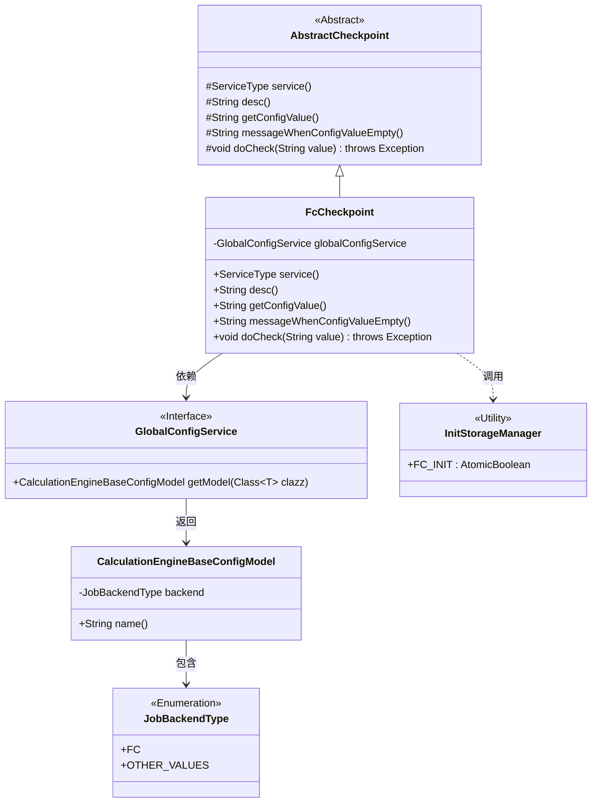
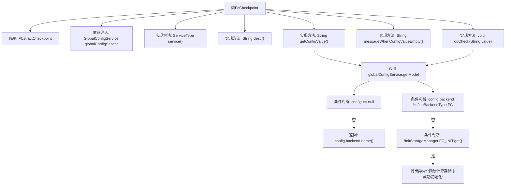

# 基础信息

|      |      |
|------|------|
| 名称 | FcCheckpoint |
| 编码语言 | .java |
| 代码路径 | WeFe/gateway/src/main/java/com/welab/wefe/gateway/service/processors/available/checkpoint/FcCheckpoint.java |
| 包名 | com.welab.wefe.gateway.service.processors.available.checkpoint |
| 依赖项 | ['com.welab.wefe.common.wefe.checkpoint.AbstractCheckpoint', 'com.welab.wefe.common.wefe.dto.global_config.calculation_engine.CalculationEngineBaseConfigModel', 'com.welab.wefe.common.wefe.enums.JobBackendType', 'com.welab.wefe.common.wefe.enums.ServiceType', 'com.welab.wefe.gateway.init.InitStorageManager', 'com.welab.wefe.gateway.service.GlobalConfigService', 'org.springframework.beans.factory.annotation.Autowired', 'org.springframework.stereotype.Service'] |
| 概述说明 | FcCheckpoint类继承AbstractCheckpoint，检查函数计算环境可用性，验证配置和存储初始化状态。 |

# 说明

FcCheckpoint是一个继承AbstractCheckpoint的服务类，用于检查函数计算环境可用性。它通过globalConfigService获取计算引擎配置，若配置不存在或后端类型非FC则跳过检查。当函数计算存储未初始化时抛出异常提示用户检查配置。服务类型为FcService，描述为检查函数计算环境是否可用。

# 类列表 Class Summary

| 名称   | 类型  | 说明 |
|-------|------|-------------|
| FcCheckpoint | class | FcCheckpoint类继承AbstractCheckpoint，检查函数计算环境可用性，验证配置和存储初始化状态。 |

## 类 FcCheckpoint

|      |      |
|------|------|
| 访问范围 | @Service;public |
| 类型 | class |
| 名称 | FcCheckpoint |
| 说明 | FcCheckpoint类继承AbstractCheckpoint，检查函数计算环境可用性，验证配置和存储初始化状态。 |

### UML类图

类图描述：该图展示了FcCheckpoint类继承自AbstractCheckpoint抽象类，实现了服务类型检查、配置获取和校验逻辑。FcCheckpoint依赖GlobalConfigService接口获取计算引擎配置，配置模型CalculationEngineBaseConfigModel包含JobBackendType枚举类型。校验过程中会调用InitStorageManager的工具类状态。整体结构体现了Spring服务组件的分层设计，通过抽象基类实现校验模板模式。

### 内部方法调用关系图

该流程图展示了FcCheckpoint类的结构和主要逻辑流程。该类继承AbstractCheckpoint，通过globalConfigService获取配置信息，包含5个核心方法实现。重点逻辑在doCheck方法中，会检查配置有效性及存储初始化状态，若未通过则抛出异常提示用户检查函数计算配置。整个流程体现了配置获取、条件验证和异常处理的完整链路，用于确保函数计算环境可用性。

### 字段列表 Field List

| 名称  | 类型  | 说明 |
|-------|-------|------|
| globalConfigService | GlobalConfigService | 使用@Autowired自动注入GlobalConfigService实例。 |

### 方法列表

| 名称  | 类型  | 说明 |
|-------|-------|------|
| messageWhenConfigValueEmpty | String | 方法重写，返回空值表示配置值为空时的消息。 |
| getConfigValue | String | 方法getConfigValue获取全局配置中的CalculationEngineBaseConfigModel，返回其backend名称，若无配置则返回null。 |
| desc | String | 检查函数计算环境可用性 |
| service | ServiceType | 重写service方法，返回FcService类型。 |
| doCheck | void | 检查函数计算配置：若全局配置不存在或后端非FC则跳过；若存储未初始化则报错提示检查配置。 |

