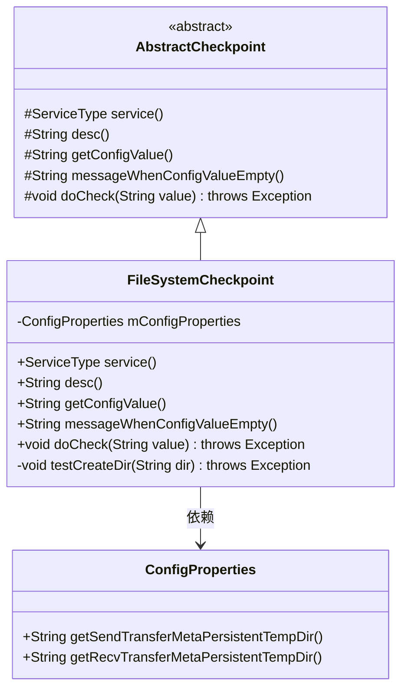
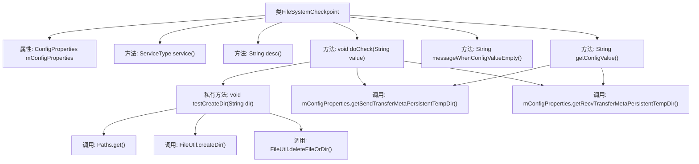

# 基础信息

|      |      |
|------|------|
| 名称 | FileSystemCheckpoint |
| 编码语言 | .java |
| 代码路径 | WeFe/gateway/src/main/java/com/welab/wefe/gateway/service/processors/available/checkpoint/FileSystemCheckpoint.java |
| 包名 | com.welab.wefe.gateway.service.processors.available.checkpoint |
| 依赖项 | ['com.welab.wefe.common.util.FileUtil', 'com.welab.wefe.common.wefe.checkpoint.AbstractCheckpoint', 'com.welab.wefe.common.wefe.enums.ServiceType', 'com.welab.wefe.gateway.config.ConfigProperties', 'org.springframework.beans.factory.annotation.Autowired', 'org.springframework.stereotype.Service', 'java.io.File', 'java.nio.file.Path', 'java.nio.file.Paths'] |
| 概述说明 | FileSystemCheckpoint类继承AbstractCheckpoint，检查文件系统访问，验证配置的发送和接收目录是否可创建和删除。 |

# 说明

FileSystemCheckpoint是一个继承自AbstractCheckpoint的服务类，用于检查文件系统访问功能。它通过ConfigProperties获取发送和接收目录配置，并验证这些目录的创建和删除操作是否正常。若配置缺失会提示设置send.transfer.meta.persistent.temp.dir和recv.transfer.meta.persistent.temp.dir。核心逻辑包括测试目录创建删除功能，失败时抛出异常。

# 类列表 Class Summary

| 名称   | 类型  | 说明 |
|-------|------|-------------|
| FileSystemCheckpoint | class | FileSystemCheckpoint类继承AbstractCheckpoint，检查文件系统访问，验证发送和接收目录的创建与删除功能，依赖配置属性。 |

## 类 FileSystemCheckpoint

|      |      |
|------|------|
| 访问范围 | @Service;public |
| 类型 | class |
| 名称 | FileSystemCheckpoint |
| 说明 | FileSystemCheckpoint类继承AbstractCheckpoint，检查文件系统访问，验证发送和接收目录的创建与删除功能，依赖配置属性。 |

### UML类图

这段代码展示了一个文件系统检查点服务`FileSystemCheckpoint`，它继承自抽象类`AbstractCheckpoint`并实现了多个检查相关的抽象方法。该类通过`ConfigProperties`获取发送和接收目录配置，并提供了目录创建和删除的测试功能。类图中清晰地显示了继承关系和依赖关系，其中`FileSystemCheckpoint`负责具体的文件系统访问检查逻辑，包括验证目录可读写性，而配置信息则通过依赖注入的`ConfigProperties`获取。整个设计体现了面向对象的抽象和职责分离原则。

### 内部方法调用关系图

该流程图展示了FileSystemCheckpoint类的结构和方法调用关系。类继承AbstractCheckpoint，包含配置属性注入和核心检查逻辑。主要流程为：通过getConfigValue获取目录配置，在doCheck中调用testCreateDir测试目录创建/删除功能。testCreateDir方法通过Paths构建路径，使用FileUtil进行目录操作验证，若失败则抛出异常。整体实现了对文件系统访问能力的验证机制。

### 字段列表 Field List

| 名称  | 类型  | 说明 |
|-------|-------|------|
| mConfigProperties | ConfigProperties | 自动注入配置属性对象。 |

### 方法列表

| 名称  | 类型  | 说明 |
|-------|-------|------|
| getConfigValue | String | 该方法重写父类逻辑，通过配置属性获取发送和接收目录路径，并以竖线分隔拼接返回。 |
| messageWhenConfigValueEmpty | String | 配置文件未配置send或recv的temp.dir项，需在config.properties中设置。 |
| desc | String | 检查文件系统访问是否正常。 |
| service | ServiceType | 重写service方法，返回FileSystem服务类型。 |
| doCheck | void | 检查并创建发送和接收临时目录。 |
| testCreateDir | void | 测试创建和删除文件夹功能，验证路径是否存在，失败时抛出异常。 |

