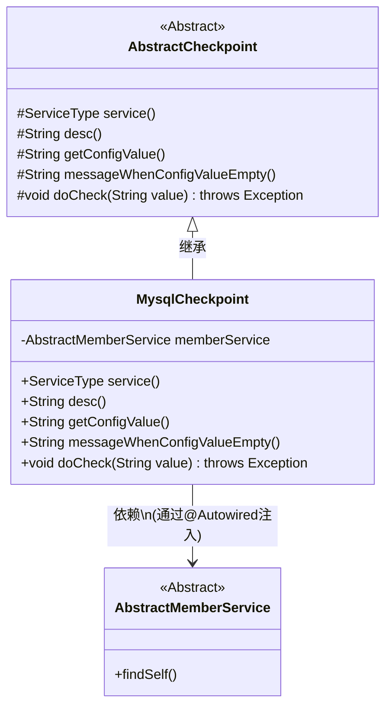
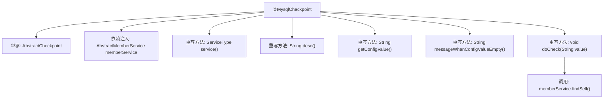

# 基础信息

|      |      |
|------|------|
| 名称 | MysqlCheckpoint |
| 编码语言 | .java |
| 代码路径 | WeFe/gateway/src/main/java/com/welab/wefe/gateway/service/processors/available/checkpoint/MysqlCheckpoint.java |
| 包名 | com.welab.wefe.gateway.service.processors.available.checkpoint |
| 依赖项 | ['com.welab.wefe.common.wefe.checkpoint.AbstractCheckpoint', 'com.welab.wefe.common.wefe.enums.ServiceType', 'com.welab.wefe.gateway.service.base.AbstractMemberService', 'org.springframework.beans.factory.annotation.Autowired', 'org.springframework.stereotype.Service'] |
| 概述说明 | MysqlCheckpoint类继承AbstractCheckpoint，检查mysql服务可用性，通过调用memberService.findSelf()实现。 |

# 说明

这是一个名为MysqlCheckpoint的Spring服务类，继承自AbstractCheckpoint抽象类。它通过@Autowired注入了AbstractMemberService成员服务。该类重写了父类的多个方法：service方法返回MysqlService服务类型，desc方法描述其功能为检查mysql服务可用性。getConfigValue和messageWhenConfigValueEmpty方法返回null。核心检查逻辑在doCheck方法中实现，通过调用memberService的findSelf方法来验证服务可用性。

# 类列表 Class Summary

| 名称   | 类型  | 说明 |
|-------|------|-------------|
| MysqlCheckpoint | class | MysqlCheckpoint类继承AbstractCheckpoint，检查mysql服务可用性，通过调用memberService.findSelf()实现。 |

## 类 MysqlCheckpoint

|      |      |
|------|------|
| 访问范围 | @Service;public |
| 类型 | class |
| 名称 | MysqlCheckpoint |
| 说明 | MysqlCheckpoint类继承AbstractCheckpoint，检查mysql服务可用性，通过调用memberService.findSelf()实现。 |

### UML类图

这段代码展示了一个MySQL服务检查点实现类MysqlCheckpoint，它继承自抽象类AbstractCheckpoint。该类通过依赖注入获取AbstractMemberService实例，在doCheck方法中调用成员服务的findSelf()来验证MySQL服务可用性。作为具体实现类，它重写了父类的抽象方法，指定服务类型为MysqlService并提供了检查描述。类图清晰地呈现了继承关系和依赖注入模式，体现了Spring框架中典型的服务组件设计方式。

### 内部方法调用关系图

这段代码展示了一个名为MysqlCheckpoint的Spring服务类，继承自AbstractCheckpoint抽象类。主要功能是检查MySQL服务的可用性，通过注入的memberService调用findSelf()方法实现核心检查逻辑。类中重写了父类的5个抽象方法，其中service()和desc()分别返回服务类型和描述信息，而getConfigValue()和messageWhenConfigValueEmpty()返回空值，doCheck()方法包含实际检查逻辑。该设计体现了模板方法模式，父类定义检查流程框架，子类实现具体细节。

### 字段列表 Field List

| 名称  | 类型  | 说明 |
|-------|-------|------|
| memberService | AbstractMemberService | 自动注入成员服务实例。 |

### 方法列表

| 名称  | 类型  | 说明 |
|-------|-------|------|
| service | ServiceType | 重写service方法，返回MysqlService类型。 |
| getConfigValue | String | 方法重写返回空值。 |
| messageWhenConfigValueEmpty | String | 空配置值时返回null。 |
| desc | String | 检查MySQL服务是否可用。 |
| doCheck | void | 检查方法调用成员服务查找自身信息。 |

