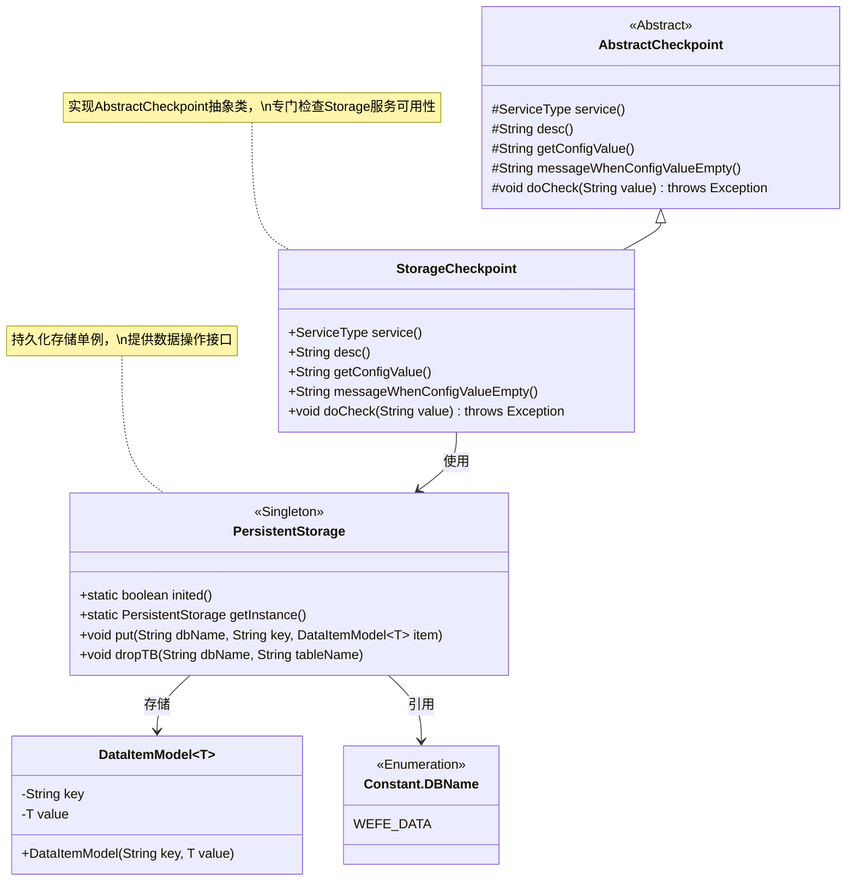
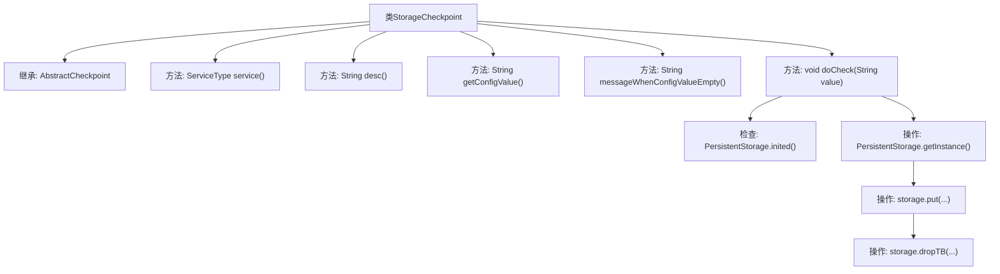

# 基础信息

|      |      |
|------|------|
| 名称 | StorageCheckpoint |
| 编码语言 | .java |
| 代码路径 | WeFe/gateway/src/main/java/com/welab/wefe/gateway/service/processors/available/checkpoint/StorageCheckpoint.java |
| 包名 | com.welab.wefe.gateway.service.processors.available.checkpoint |
| 依赖项 | ['com.welab.wefe.common.data.storage.common.Constant', 'com.welab.wefe.common.data.storage.model.DataItemModel', 'com.welab.wefe.common.data.storage.service.persistent.PersistentStorage', 'com.welab.wefe.common.wefe.checkpoint.AbstractCheckpoint', 'com.welab.wefe.common.wefe.enums.ServiceType', 'org.apache.commons.lang3.RandomStringUtils', 'org.springframework.stereotype.Service'] |
| 概述说明 | StorageCheckpoint类继承AbstractCheckpoint，检查storage服务访问是否正常，验证存储初始化及读写操作。 |

# 说明

StorageCheckpoint是一个继承自AbstractCheckpoint的服务类，用于检查gateway对storage服务的访问状态。其服务类型定义为StorageService，功能描述为验证storage服务的可用性。该类重写了父类的多个方法，其中doCheck方法为核心逻辑：首先检查PersistentStorage是否初始化，未初始化则抛出异常提示检查存储配置；随后执行测试操作，包括生成随机名称、通过PersistentStorage实例写入测试数据到WEFE_DATA数据库表，最后删除该测试表以完成验证流程。其他配置相关方法返回null值。

# 类列表 Class Summary

| 名称   | 类型  | 说明 |
|-------|------|-------------|
| StorageCheckpoint | class | StorageCheckpoint类继承AbstractCheckpoint，检查gateway对storage服务的访问。验证存储初始化状态，执行测试写入和删除操作。若存储未初始化则抛出异常。 |

## 类 StorageCheckpoint

|      |      |
|------|------|
| 访问范围 | @Service;public |
| 类型 | class |
| 名称 | StorageCheckpoint |
| 说明 | StorageCheckpoint类继承AbstractCheckpoint，检查gateway对storage服务的访问。验证存储初始化状态，执行测试写入和删除操作。若存储未初始化则抛出异常。 |

### UML类图

类图描述：
该图展示了StorageCheckpoint服务及其相关类的结构关系。StorageCheckpoint继承自AbstractCheckpoint抽象类，实现了检查存储服务可用性的具体逻辑。它依赖PersistentStorage单例类进行实际存储操作，PersistentStorage使用泛型类DataItemModel来封装数据项，并引用Constant.DBName枚举类标识数据库名称。整体结构体现了分层设计和职责分离原则，StorageCheckpoint专注于检查逻辑，PersistentStorage处理底层存储操作。

### 内部方法调用关系图

该流程图展示了StorageCheckpoint类的结构及其核心方法调用关系。该类继承AbstractCheckpoint，主要实现服务类型声明、描述信息返回等抽象方法，核心逻辑集中在doCheck方法中：首先验证存储系统初始化状态，然后通过随机生成的测试数据进行存储操作验证（包含数据写入和表删除两个步骤）。整个流程体现了对存储服务可用性的完整检查机制，包含异常状态检测和正常操作验证两个分支路径。

### 字段列表 Field List

| 名称  | 类型  | 说明 |
|-------|-------|------|

### 方法列表

| 名称  | 类型  | 说明 |
|-------|-------|------|
| doCheck | void | 方法doCheck检查数据集存储是否初始化，未初始化则抛出异常。随后生成随机名称，存储测试数据并立即删除。 |
| getConfigValue | String | 方法重写，返回空配置值。 |
| service | ServiceType | 重写service方法，返回StorageService类型。 |
| messageWhenConfigValueEmpty | String | 方法重写，返回空值表示配置值为空时的消息。 |
| desc | String | 检查gateway访问storage服务是否正常。 |

