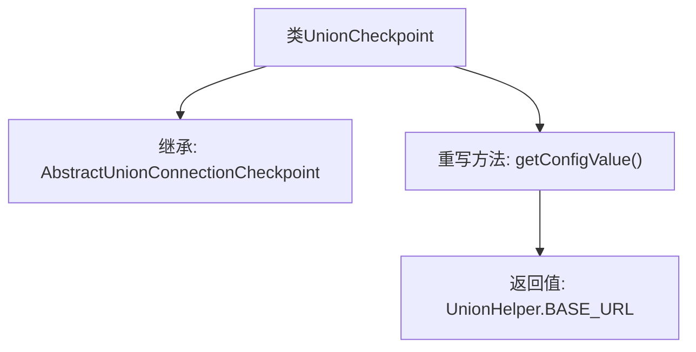

# 基础信息

|      |      |
|------|------|
| 名称 | UnionCheckpoint |
| 编码语言 | .java |
| 代码路径 | WeFe/gateway/src/main/java/com/welab/wefe/gateway/service/processors/available/checkpoint/UnionCheckpoint.java |
| 包名 | com.welab.wefe.gateway.service.processors.available.checkpoint |
| 依赖项 | ['com.welab.wefe.common.wefe.checkpoint.AbstractUnionConnectionCheckpoint', 'com.welab.wefe.gateway.sdk.UnionHelper', 'org.springframework.stereotype.Service'] |
| 概述说明 | UnionCheckpoint类继承AbstractUnionConnectionCheckpoint，重写getConfigValue方法返回UnionHelper.BASE_URL。 |

# 说明

该内容描述了一个名为UnionCheckpoint的服务类，继承自AbstractUnionConnectionCheckpoint抽象类。该类重写了getConfigValue方法，返回UnionHelper.BASE_URL作为配置值。这表示该类用于处理与Union连接相关的检查点逻辑，并通过基类提供的抽象方法获取基础URL配置。整个实现简洁，专注于特定配置值的返回。

# 类列表 Class Summary

| 名称   | 类型  | 说明 |
|-------|------|-------------|
| UnionCheckpoint | class | UnionCheckpoint类继承AbstractUnionConnectionCheckpoint，重写getConfigValue方法返回UnionHelper.BASE_URL。 |


## 类 UnionCheckpoint

|      |      |
|------|------|
| 访问范围 | @Service;public |
| 类型 | class |
| 名称 | UnionCheckpoint |
| 说明 | UnionCheckpoint类继承AbstractUnionConnectionCheckpoint，重写getConfigValue方法返回UnionHelper.BASE_URL。 |


### UML类图

```mermaid
classDiagram
    class AbstractUnionConnectionCheckpoint {
        <<Abstract>>
        +String getConfigValue()*
    }
    // AbstractUnionConnectionCheckpoint 是抽象基类，定义抽象方法 getConfigValue

    class UnionCheckpoint {
        +String getConfigValue()
    }
    // UnionCheckpoint 继承并实现 AbstractUnionConnectionCheckpoint 的抽象方法

    class UnionHelper {
        <<final>>
        +String BASE_URL
    }
    // UnionHelper 提供常量 BASE_URL

    AbstractUnionConnectionCheckpoint <|-- UnionCheckpoint : 继承实现
    UnionCheckpoint --> UnionHelper : 依赖常量
```

这段类图展示了UnionCheckpoint继承自抽象类AbstractUnionConnectionCheckpoint并实现其getConfigValue方法，该方法返回UnionHelper类中的BASE_URL常量。UnionCheckpoint作为具体服务类，通过继承关系实现配置值的获取逻辑，而UnionHelper作为工具类提供基础URL常量。整个设计体现了模板方法模式的应用，抽象类定义算法骨架，具体子类实现特定步骤。


### 内部方法调用关系图



该流程图展示了UnionCheckpoint类的结构，它是一个继承自AbstractUnionConnectionCheckpoint的服务类，并重写了getConfigValue()方法。该方法返回UnionHelper.BASE_URL的值。整个流程简洁明了，展示了类之间的继承关系和方法的重写逻辑。

### 字段列表 Field List

| 名称  | 类型  | 说明 |
|-------|-------|------|

### 方法列表

| 名称  | 类型  | 说明 |
|-------|-------|------|
| getConfigValue | String | 重写方法返回UnionHelper的BASE_URL值。 |


