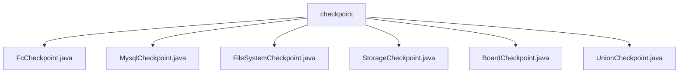

# 基础信息

|      |      |
|------|------|
| 名称 | checkpoint |
| 编码语言 | .java |
| 代码路径 | WeFe/gateway/src/main/java/com/welab/wefe/gateway/service/processors/available/checkpoint |
| 包名 | docs.gateway.src.main.java.com.welab.wefe.gateway.service.processors.available.checkpoint |
| 概述说明 | FcCheckpoint检查函数计算环境可用性。MysqlCheckpoint验证mysql服务可用性。FileSystemCheckpoint检查文件系统访问功能。StorageCheckpoint验证storage服务可用性。BoardCheckpoint检查与board-service连通性。UnionCheckpoint处理Union连接检查点逻辑。 |

# 说明

## 概述  
该模块为服务可用性检查框架，核心职责是通过继承AbstractCheckpoint实现各类后端服务的连通性验证，类似健康检查探针。接口规范统一采用服务类型定义（如FcService/MysqlService）、描述信息（desc方法）和核心检查逻辑（doCheck方法）三要素。关键数据结构包括GlobalConfigService配置服务、PersistentStorage持久化存储和ConfigProperties目录配置。外部依赖涉及函数计算环境、MySQL数据库、文件系统、Storage服务和Board-Service等。例如FcCheckpoint验证函数计算配置，FileSystemCheckpoint测试目录读写能力。

## 主要业务场景  
模块支持六类典型检查场景：函数计算配置校验（FcCheckpoint）、MySQL服务连通性测试（MysqlCheckpoint）、文件系统权限验证（FileSystemCheckpoint）、Storage服务读写测试（StorageCheckpoint）、Board-Service接口调用（BoardCheckpoint）和Union连接检查（UnionCheckpoint）。交互模式均遵循"配置获取→测试操作→异常处理"流程，例如StorageCheckpoint通过创建临时表验证数据库写入能力。完整功能覆盖从基础设施到微服务的多层次健康检查，典型应用于系统启动时的环境预检或定时监控任务。API集成案例包括通过JNI调用本地存储服务、基于POSIX的文件操作等。

### 包内部结构视图

该流程图展示了WeFe网关项目中checkpoint目录下的文件结构关系。checkpoint作为父节点，包含6个具体的检查点实现类文件，包括FcCheckpoint、MysqlCheckpoint等，这些文件都位于相同的目录层级，用于处理不同类型的可用性检查点功能。每个文件都直接隶属于checkpoint目录，没有更深层次的嵌套关系。

# 文件列表

| 名称   | 类型  | 说明 |
|-------|------|-------------|
| [FcCheckpoint.java](FcCheckpoint.md) | file | FcCheckpoint类继承AbstractCheckpoint，检查函数计算环境可用性，验证配置和存储初始化状态。 |
| [MysqlCheckpoint.java](MysqlCheckpoint.md) | file | MysqlCheckpoint类继承AbstractCheckpoint，检查mysql服务可用性，通过调用memberService.findSelf()实现。 |
| [FileSystemCheckpoint.java](FileSystemCheckpoint.md) | file | FileSystemCheckpoint类继承AbstractCheckpoint，检查文件系统访问，验证配置的发送和接收目录是否可创建和删除。 |
| [StorageCheckpoint.java](StorageCheckpoint.md) | file | StorageCheckpoint类继承AbstractCheckpoint，检查storage服务访问是否正常，验证存储初始化及读写操作。 |
| [BoardCheckpoint.java](BoardCheckpoint.md) | file | BoardCheckpoint类用于检查gateway与board-service的连通性，通过全局配置获取内网地址并发送请求验证，配置缺失时提示用户设置。 |
| [UnionCheckpoint.java](UnionCheckpoint.md) | file | UnionCheckpoint类继承AbstractUnionConnectionCheckpoint，重写getConfigValue方法返回UnionHelper.BASE_URL。 |

