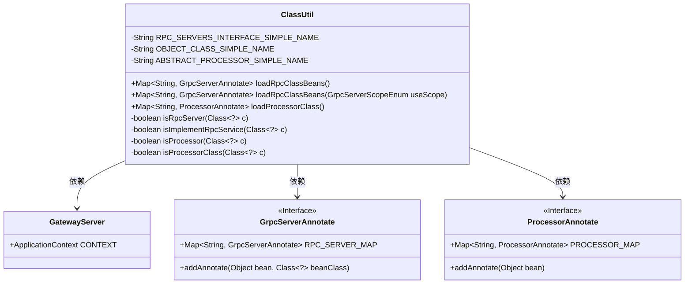
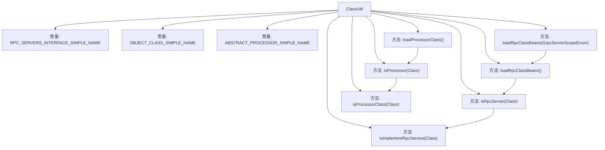

# 基础信息

|      |      |
|------|------|
| 名称 | ClassUtil |
| 编码语言 | .java |
| 代码路径 | WeFe/gateway/src/main/java/com/welab/wefe/gateway/util/ClassUtil.java |
| 包名 | com.welab.wefe.gateway.util |
| 依赖项 | ['com.welab.wefe.gateway.GatewayServer', 'com.welab.wefe.gateway.base.Processor', 'com.welab.wefe.gateway.base.ProcessorAnnotate', 'com.welab.wefe.gateway.base.GrpcServer', 'com.welab.wefe.gateway.base.GrpcServerAnnotate', 'com.welab.wefe.gateway.common.GrpcServerScopeEnum', 'java.lang.reflect.Modifier', 'java.util.HashMap', 'java.util.Map'] |
| 概述说明 | ClassUtil工具类提供加载RPC服务和处理器类的方法。包含判断类是否为RPC服务或处理器的方法，支持按范围筛选RPC服务。返回包含注解信息的Map结构。 |

# 说明

ClassUtil是一个工具类，主要用于加载和判断特定类型的类。它包含三个常量定义：RPC服务基类名、Java对象基类名和处理器基类名。提供两个主要功能：一是加载带有@RpcServer注解的gRPC服务类，返回包含类路径和注解信息的映射；二是加载带有@Processor注解的处理器类，返回包含处理器名称和注解信息的映射。类中还包含多个私有方法，用于判断类是否为gRPC服务类或处理器类，通过检查注解、继承关系和接口实现来完成验证。所有加载的数据会被保存到对应的静态映射中供后续使用。

# 类列表 Class Summary

| 名称   | 类型  | 说明 |
|-------|------|-------------|
| ClassUtil | class | ClassUtil工具类提供加载RPC服务和处理器类的功能，包含判断类是否为RPC服务或处理器的方法，支持按范围筛选RPC服务类。 |

## 类 ClassUtil

|      |      |
|------|------|
| 访问范围 | public |
| 类型 | class |
| 名称 | ClassUtil |
| 说明 | ClassUtil工具类提供加载RPC服务和处理器类的功能，包含判断类是否为RPC服务或处理器的方法，支持按范围筛选RPC服务类。 |

### UML类图

这段代码展示了一个工具类ClassUtil，主要用于加载和识别带有特定注解（@RpcServer和@Processor）的类。ClassUtil通过静态方法检查类是否实现了特定接口或继承特定父类，并将符合条件的类信息存储在GrpcServerAnnotate和ProcessorAnnotate的静态Map中。GatewayServer提供了Spring应用上下文用于获取bean定义。该工具类主要用于GRPC服务和处理器类的动态加载和分类管理。

### 内部方法调用关系图

该流程图展示了ClassUtil类的结构和主要方法调用关系。类包含3个常量定义和6个核心方法，其中loadRpcClassBeans()和loadProcessorClass()是公开入口方法，分别调用isRpcServer()和isProcessor()进行类类型判断。isRpcServer()会进一步调用isImplementRpcService()检查接口实现，而isProcessor()会调用isProcessorClass()检查父类继承关系。方法间形成清晰的层级调用链，共同完成gRPC服务和处理器类的加载功能。

### 字段列表 Field List

| 名称  | 类型  | 说明 |
|-------|-------|------|
| ABSTRACT_PROCESSOR_SIMPLE_NAME = "AbstractProcessor" | String | 定义常量ABSTRACT_PROCESSOR_SIMPLE_NAME，值为"AbstractProcessor"。 |
| RPC_SERVERS_INTERFACE_SIMPLE_NAME = "BindableService" | String | 定义常量字符串RPC_SERVERS_INTERFACE_SIMPLE_NAME，值为BindableService。 |
| OBJECT_CLASS_SIMPLE_NAME = "Object" | String | 定义私有静态常量OBJECT_CLASS_SIMPLE_NAME，值为"Object"。 |

### 方法列表

| 名称  | 类型  | 说明 |
|-------|-------|------|
| loadRpcClassBeans | Map<String, GrpcServerAnnotate> | 该方法扫描Spring容器中的Bean，筛选带有RPC服务注解的类，将其注册到全局映射表并返回。 |
| isProcessor | boolean | 检查类是否为处理器：需是公共类且含Processor注解，或其父类符合处理器条件，否则返回false。 |
| loadRpcClassBeans | Map<String, GrpcServerAnnotate> | 加载指定范围的gRPC服务类，返回符合条件的注解映射表。 |
| loadProcessorClass | Map<String, ProcessorAnnotate> | 该方法加载所有处理器类，检查是否为处理器类型，若是则保存到常量映射中，最后返回处理器映射。 |
| isRpcServer | boolean | 检查类是否为gRPC服务端：需满足公共类、含GrpcServer注解且实现RPC服务接口，否则返回false。 |
| isImplementRpcService | boolean | 检查类是否实现RPC服务接口，通过比对接口名与预设值判断。 |
| isProcessorClass | boolean | 检查类是否为处理器类，通过比较类名与预设的抽象处理器名称是否一致。 |

