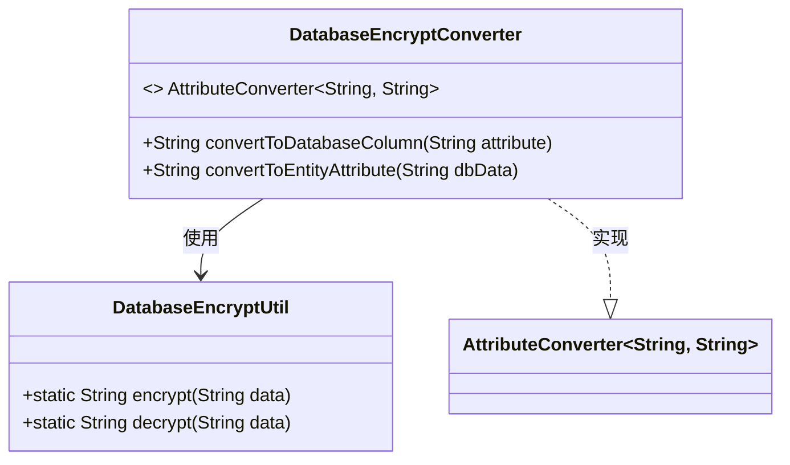
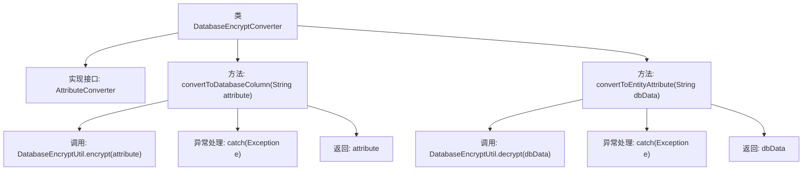

# 基础信息

|      |      |
|------|------|
| 名称 | DatabaseEncryptConverter |
| 编码语言 | .java |
| 代码路径 | WeFe/gateway/src/main/java/com/welab/wefe/gateway/util/DatabaseEncryptConverter.java |
| 包名 | com.welab.wefe.gateway.util |
| 依赖项 | ['javax.persistence.AttributeConverter'] |
| 概述说明 | DatabaseEncryptConverter类实现属性转换接口，提供加密解密方法，异常时返回原值。 |

# 说明

DatabaseEncryptConverter类实现了AttributeConverter接口，用于字符串类型的数据库字段加密与解密。该类包含两个核心方法：convertToDatabaseColumn方法调用DatabaseEncryptUtil.encrypt对属性值进行加密处理，若加密失败则返回原始值；convertToEntityAttribute方法调用DatabaseEncryptUtil.decrypt对数据库数据进行解密，若解密失败同样返回原始数据。该转换器实现了数据存储时的自动加密和读取时的自动解密功能。

# 类列表 Class Summary

| 名称   | 类型  | 说明 |
|-------|------|-------------|
| DatabaseEncryptConverter | class | 数据库加密转换器类，实现字符串属性与数据库列的加密解密转换，异常时返回原值。 |

## 类 DatabaseEncryptConverter

|      |      |
|------|------|
| 访问范围 | public |
| 类型 | class |
| 名称 | DatabaseEncryptConverter |
| 说明 | 数据库加密转换器类，实现字符串属性与数据库列的加密解密转换，异常时返回原值。 |

### UML类图

这段代码展示了一个数据库加密转换器DatabaseEncryptConverter，它实现了AttributeConverter<String, String>接口，用于在实体属性和数据库列值之间进行加密/解密转换。该类通过调用DatabaseEncryptUtil的静态加密/解密方法来实现功能，若转换失败则返回原始值。类图清晰地表现了实现关系、依赖关系和工具类的调用方式。

### 内部方法调用关系图

这段代码展示了一个数据库加密转换器类，实现了AttributeConverter接口，用于在实体属性和数据库列之间进行双向加密转换。流程图清晰地描述了两个核心方法convertToDatabaseColumn和convertToEntityAttribute的执行逻辑，包括正常加密/解密流程和异常处理路径。当加密或解密过程中出现异常时，方法会返回原始数据，体现了健壮的错误处理机制。整个流程展示了从方法调用到最终返回值的完整处理链条。

### 字段列表 Field List

| 名称  | 类型  | 说明 |
|-------|-------|------|

### 方法列表

| 名称  | 类型  | 说明 |
|-------|-------|------|
| convertToEntityAttribute | String | 方法convertToEntityAttribute尝试解密dbData，失败则返回原值。 |
| convertToDatabaseColumn | String | 该方法用于将字符串属性加密后存入数据库，若加密失败则返回原值。 |

