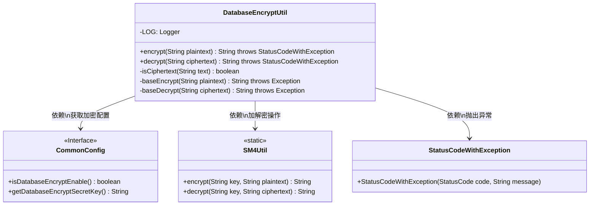
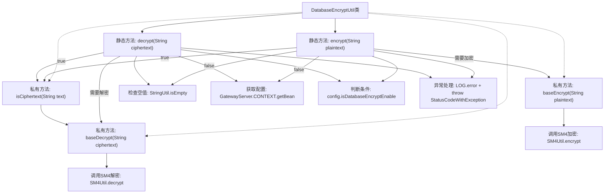

# 基础信息

|      |      |
|------|------|
| 名称 | DatabaseEncryptUtil |
| 编码语言 | .java |
| 代码路径 | WeFe/gateway/src/main/java/com/welab/wefe/gateway/util/DatabaseEncryptUtil.java |
| 包名 | com.welab.wefe.gateway.util |
| 依赖项 | ['com.welab.wefe.common.StatusCode', 'com.welab.wefe.common.exception.StatusCodeWithException', 'com.welab.wefe.common.util.SM4Util', 'com.welab.wefe.common.util.StringUtil', 'com.welab.wefe.gateway.GatewayServer', 'com.welab.wefe.gateway.config.CommonConfig', 'org.slf4j.Logger', 'org.slf4j.LoggerFactory'] |
| 概述说明 | DatabaseEncryptUtil类提供数据库加密解密功能，包含加密、解密及密文判断方法，使用SM4算法，支持配置开关。 |

# 说明

DatabaseEncryptUtil是一个提供数据库加密解密的工具类，包含加密、解密和判断是否为密文的功能。加密方法首先检查明文是否为空或已加密，若未加密则调用SM4算法加密；解密方法类似，检查密文是否为空或未加密，若已加密则调用SM4解密。加解密操作依赖CommonConfig配置的密钥和开关状态，失败时记录日志并抛出异常。isCiphertext方法通过尝试解密判断字符串是否为密文。

# 类列表 Class Summary

| 名称   | 类型  | 说明 |
|-------|------|-------------|
| DatabaseEncryptUtil | class | DatabaseEncryptUtil类提供数据库加密解密功能，包含加密、解密及判断密文方法，使用SM4算法，支持配置开关。 |

## 类 DatabaseEncryptUtil

|      |      |
|------|------|
| 访问范围 | public |
| 类型 | class |
| 名称 | DatabaseEncryptUtil |
| 说明 | DatabaseEncryptUtil类提供数据库加密解密功能，包含加密、解密及判断密文方法，使用SM4算法，支持配置开关。 |

### UML类图

这段代码展示了一个数据库加密工具类DatabaseEncryptUtil，它提供了静态方法用于字符串的加密和解密操作。该类依赖于CommonConfig接口获取加密配置，使用SM4Util进行实际的加解密操作，并在出错时抛出StatusCodeWithException异常。主要功能包括：检查字符串是否为密文(isCiphertext)、基础加密(baseEncrypt)和解密(baseDecrypt)方法，以及对外暴露的encrypt和decrypt方法。加密功能可通过配置动态开启/关闭，实现了业务逻辑与加密实现的解耦。

### 内部方法调用关系图

流程图描述了DatabaseEncryptUtil类的加密解密流程。核心逻辑分为加密(encrypt)和解密(decrypt)两条主线，均会先检查输入空值，然后获取配置判断是否启用加密功能。加密时会先检测是否为密文避免重复加密，解密时则相反验证是否为有效密文。实际加解密操作委托给SM4Util实现，整个过程包含完善的异常处理和日志记录。私有方法isCiphertext通过尝试解密来验证文本加密状态，形成内部调用闭环。

### 字段列表 Field List

| 名称  | 类型  | 说明 |
|-------|-------|------|
| LOG = LoggerFactory.getLogger(DatabaseEncryptUtil.class) | Logger | 声明DatabaseEncryptUtil类的私有静态日志常量LOG，使用LoggerFactory创建。 |

### 方法列表

| 名称  | 类型  | 说明 |
|-------|-------|------|
| baseEncrypt | String | 私有方法baseEncrypt使用SM4算法加密明文，密钥从CommonConfig获取。 |
| encrypt | String | 加密方法：空文本或已加密直接返回；配置未启用加密也返回原文；否则调用基础加密。失败记录日志并抛系统错误。 |
| isCiphertext | boolean | 该方法通过尝试解密输入文本判断是否为密文，解密成功返回true，失败返回false。 |
| decrypt | String | 静态方法decrypt用于解密字符串。若输入为空或未启用加密，直接返回原值。解密失败时记录日志并抛出异常。 |
| baseDecrypt | String | 私有方法baseDecrypt用于解密字符串，调用SM4Util并读取配置中的密钥进行解密。 |

