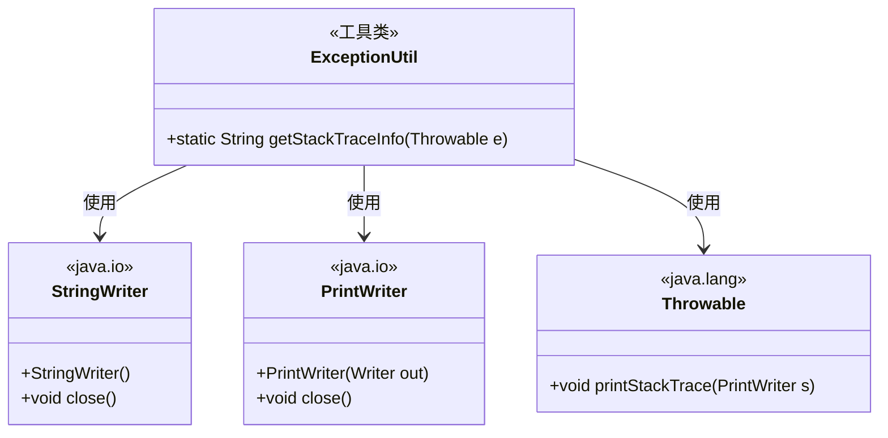
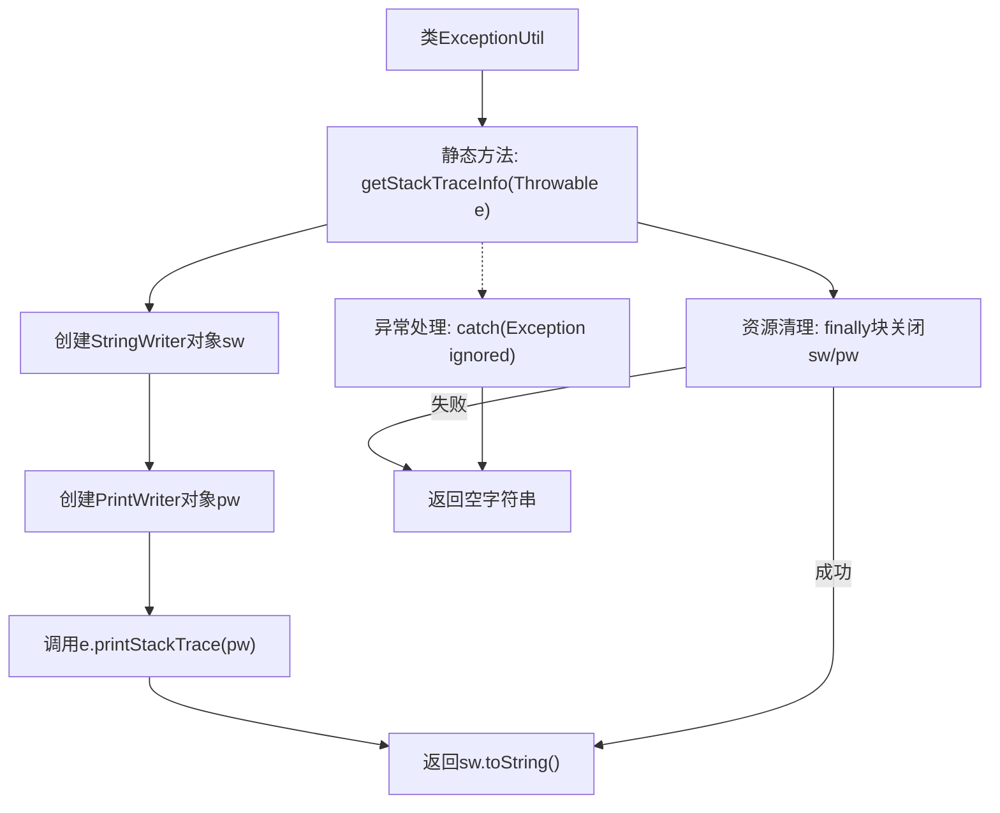

# 基础信息

|      |      |
|------|------|
| 名称 | ExceptionUtil |
| 编码语言 | .java |
| 代码路径 | WeFe/gateway/src/main/java/com/welab/wefe/gateway/util/ExceptionUtil.java |
| 包名 | com.welab.wefe.gateway.util |
| 依赖项 | ['java.io.PrintWriter', 'java.io.StringWriter'] |
| 概述说明 | ExceptionUtil类提供静态方法getStackTraceInfo，用于捕获并返回异常的堆栈信息字符串，包含资源清理逻辑。 |

# 说明

ExceptionUtil类包含一个静态方法getStackTraceInfo，用于获取异常堆栈信息。该方法接收Throwable参数，通过StringWriter和PrintWriter将异常堆栈信息转换为字符串返回。内部使用try-catch-finally结构确保资源正确释放，若出现异常则返回空字符串。方法处理了所有可能的异常情况，确保程序健壮性。

# 类列表 Class Summary

| 名称   | 类型  | 说明 |
|-------|------|-------------|
| ExceptionUtil | class | ExceptionUtil类提供静态方法getStackTraceInfo，用于获取异常堆栈信息并返回字符串形式，包含资源清理逻辑。 |

## 类 ExceptionUtil

|      |      |
|------|------|
| 访问范围 | public |
| 类型 | class |
| 名称 | ExceptionUtil |
| 说明 | ExceptionUtil类提供静态方法getStackTraceInfo，用于获取异常堆栈信息并返回字符串形式，包含资源清理逻辑。 |

### UML类图

这段代码展示了一个异常处理工具类ExceptionUtil，它通过StringWriter和PrintWriter将Throwable对象的堆栈信息转换为字符串。类图清晰地显示了工具类与Java I/O类(StringWriter、PrintWriter)及异常基类Throwable之间的依赖关系，体现了资源获取-使用-释放的典型模式，并在finally块中确保资源关闭。

### 内部方法调用关系图

该流程图展示了ExceptionUtil类中获取异常堆栈信息的方法执行过程。方法首先初始化StringWriter和PrintWriter，通过printStackTrace输出异常信息到writer，最终返回字符串形式的结果。流程包含正常执行路径和异常处理路径，确保在两种情况下都会正确关闭IO资源。无论是否发生异常，方法都会返回有效结果（堆栈信息或空字符串），体现了健壮的错误处理机制。

### 字段列表 Field List

| 名称  | 类型  | 说明 |
|-------|-------|------|

### 方法列表

| 名称  | 类型  | 说明 |
|-------|-------|------|
| getStackTraceInfo | String | 获取异常的堆栈跟踪信息，使用StringWriter和PrintWriter捕获并返回字符串，确保资源关闭。 |

