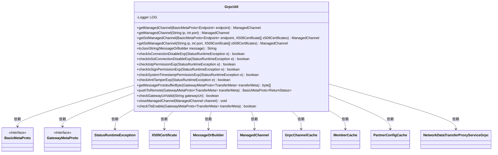

# 基础信息

|      |      |
|------|------|
| 名称 | GrpcUtil |
| 编码语言 | .java |
| 代码路径 | WeFe/gateway/src/main/java/com/welab/wefe/gateway/util/GrpcUtil.java |
| 包名 | com.welab.wefe.gateway.util |
| 依赖项 | ['java.security.cert.X509Certificate', 'java.util.Arrays', 'java.util.Date', 'java.util.List', 'java.util.concurrent.TimeUnit', 'javax.net.ssl.SSLException', 'com.welab.wefe.gateway.cache.PartnerConfigCache', 'org.apache.commons.lang3.math.NumberUtils', 'org.slf4j.Logger', 'org.slf4j.LoggerFactory', 'com.google.protobuf.MessageOrBuilder', 'com.google.protobuf.util.JsonFormat', 'com.welab.wefe.common.util.DateUtil', 'com.welab.wefe.common.util.StringUtil', 'com.welab.wefe.common.util.ThreadUtil', 'com.welab.wefe.gateway.api.meta.basic.BasicMetaProto', 'com.welab.wefe.gateway.api.meta.basic.GatewayMetaProto', 'com.welab.wefe.gateway.api.service.proto.NetworkDataTransferProxyServiceGrpc', 'com.welab.wefe.gateway.cache.GrpcChannelCache', 'com.welab.wefe.gateway.cache.MemberCache', 'com.welab.wefe.gateway.common.EndpointBuilder', 'com.welab.wefe.gateway.common.GrpcConstant', 'com.welab.wefe.gateway.common.ReturnStatusBuilder', 'com.welab.wefe.gateway.entity.MemberEntity', 'com.welab.wefe.gateway.interceptor.AntiTamperMetadataBuilder', 'com.welab.wefe.gateway.interceptor.ClientCallCredentials', 'com.welab.wefe.gateway.interceptor.SignVerifyMetadataBuilder', 'com.welab.wefe.gateway.interceptor.SystemTimestampMetadataBuilder', 'io.grpc.ManagedChannel', 'io.grpc.ManagedChannelBuilder', 'io.grpc.StatusRuntimeException', 'io.grpc.netty.GrpcSslContexts', 'io.grpc.netty.NegotiationType', 'io.grpc.netty.NettyChannelBuilder', 'io.netty.handler.ssl.SslContextBuilder', 'io.netty.handler.ssl.util.InsecureTrustManagerFactory'] |
| 概述说明 | GrpcUtil类提供gRPC工具方法，包括创建管理通道（普通/SSL）、异常检查（连接、SSL、IP白名单等）、消息推送、通道关闭及TLS启用判断等功能。 |

# 说明

GrpcUtil是一个工具类，提供gRPC通信相关功能。主要功能包括：创建普通和SSL加密的ManagedChannel；将Protobuf消息转为JSON字符串；检查异常类型（如连接异常、SSL异常、IP白名单异常、签名异常、时间戳差异异常、防篡改异常）；推送消息到远程节点（支持失败重试和异常处理）；验证网关地址格式；关闭通道；检查目标地址是否启用TLS加密。类中还包含日志记录和工具方法，用于处理gRPC通信中的常见场景和错误。

# 类列表 Class Summary

| 名称   | 类型  | 说明 |
|-------|------|-------------|
| GrpcUtil | class | GrpcUtil类提供gRPC通信工具方法，包括创建管理通道、SSL通道、异常检查、消息推送、JSON转换等，支持连接重试和错误处理。 |

## 类 GrpcUtil

|      |      |
|------|------|
| 访问范围 | public |
| 类型 | class |
| 名称 | GrpcUtil |
| 说明 | GrpcUtil类提供gRPC通信工具方法，包括创建管理通道、SSL通道、异常检查、消息推送、JSON转换等，支持连接重试和错误处理。 |

### UML类图

该代码是一个gRPC工具类，主要功能包括：创建和管理gRPC通道（包括普通和SSL加密通道）、消息格式转换、异常状态检查、远程消息推送等。类图中展示了GrpcUtil与多个外部类的依赖关系，包括协议缓冲区生成的接口类、证书类、通道类等。该类封装了gRPC通信的核心功能，特别是处理了多种异常场景（如SSL验证失败、签名异常等），并提供了消息传输的完整生命周期管理。

### 内部方法调用关系图

该流程图展示了GrpcUtil类的主要结构，包含18个核心方法，主要用于gRPC通道管理、异常检测和消息传输。时序图重点描述了pushToRemote方法的完整调用流程，包括通道获取、TLS检查、gRPC调用和异常处理机制，展现了消息推送过程中与通道缓存和服务存根的交互过程。该类实现了完善的gRPC通信功能，包含SSL/TLS支持、多种异常检测和重试机制。

### 字段列表 Field List

| 名称  | 类型  | 说明 |
|-------|-------|------|
| LOG = LoggerFactory.getLogger(GrpcUtil.class) | Logger | GrpcUtil类中定义了一个静态不可变的日志记录器实例LOG。 |

### 方法列表

| 名称  | 类型  | 说明 |
|-------|-------|------|
| checkIsIpPermissionExp | boolean | 检查IP权限异常：静态方法通过异常消息判断是否为IP权限过期，需非空且包含特定标识。 |
| checkSystemTimestampPermissionExp | boolean | 检查系统时间戳权限异常：静态方法通过错误消息判断是否为权限过期异常，需非空且包含特定标识。 |
| checkAntiTamperExp | boolean | 静态方法检查异常是否因防篡改失效触发，通过判断异常消息非空且包含特定无效参数标识。 |
| checkIsConnectionDisableExp | boolean | 检查连接是否因异常禁用：若错误信息为空或包含特定消息则返回真。 |
| checkIsSslConnectionDisableExp | boolean | 静态方法检查SSL连接异常，通过匹配异常堆栈中的特定关键字（如SSLHandshakeException和证书错误）判断是否因SSL问题导致连接禁用。 |
| checkIsSignPermissionExp | boolean | 检查异常是否为签名权限过期：通过异常消息判断是否包含特定过期标识。 |
| getSslManagedChannel | ManagedChannel | 该方法创建并返回一个支持SSL的ManagedChannel。根据传入的X509证书数组是否为空，决定使用不安全信任管理器或指定证书。设置TLS协商类型、最大消息大小，并在有证书时覆盖授权机构。最后构建并返回通道实例。 |
| pushToRemote | BasicMetaProto.ReturnStatus | 方法pushToRemote通过gRPC将transferMeta推送到远程网关，支持5次失败重试。处理TLS、签名验证、系统时间差、防篡改等异常，返回状态信息。失败时检查网络、证书、地址有效性，并记录日志。 |
| getSslManagedChannel | ManagedChannel | 静态方法getSslManagedChannel接收Endpoint和X509证书数组，返回基于SSL的ManagedChannel，内部调用同名方法处理IP和端口参数。 |
| getManagedChannel | ManagedChannel | 静态方法getManagedChannel接收Endpoint参数，调用同名方法并返回ManagedChannel对象，参数转为IP和端口。 |
| getMessageProtobufferByte | byte[] | 该方法将GatewayMetaProto.TransferMeta对象转为字节数组，若对象为空则返回空字节数组。 |
| getManagedChannel | ManagedChannel | 该方法创建一个gRPC管理通道，指定目标IP和端口，设置最大入站消息大小为无限制，并使用明文传输。 |
| toJsonString | String | 将MessageOrBuilder对象转为JSON字符串，失败返回null。 |
| checkGatewayUriValid | boolean | 检查网关URI有效性：非空且格式为"主机:端口"，端口需为数字。 |
| closeManagedChannel | void | 关闭Grpc通道的方法，非空检查后立即关闭并等待3秒，捕获异常记录日志。 |
| checkTlsEnable | boolean | 检查TLS启用状态：若目标成员非自身且启用TLS则返回true，否则false。 |

