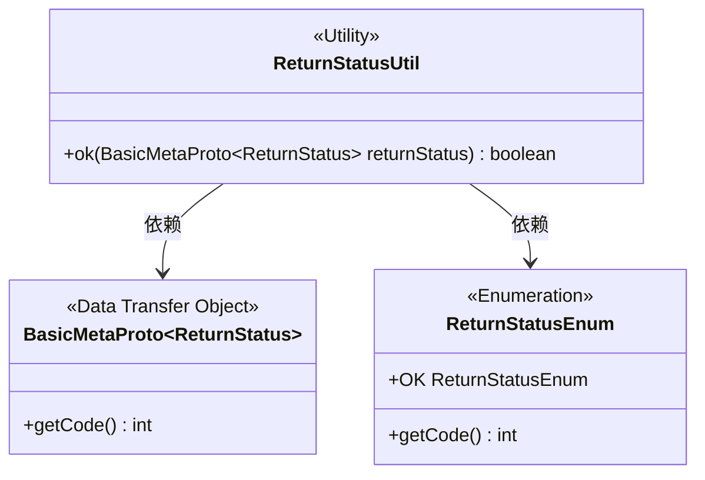
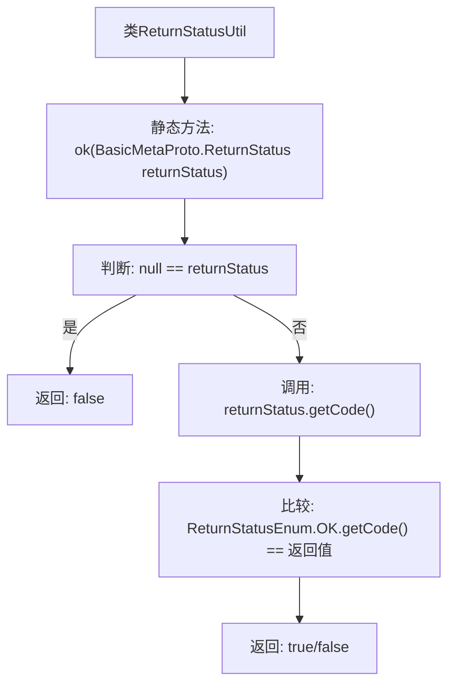

# 基础信息

|      |      |
|------|------|
| 名称 | ReturnStatusUtil |
| 编码语言 | .java |
| 代码路径 | WeFe/gateway/src/main/java/com/welab/wefe/gateway/util/ReturnStatusUtil.java |
| 包名 | com.welab.wefe.gateway.util |
| 依赖项 | ['com.welab.wefe.gateway.api.meta.basic.BasicMetaProto', 'com.welab.wefe.gateway.common.ReturnStatusEnum'] |
| 概述说明 | ReturnStatusUtil类提供静态方法ok，检查BasicMetaProto.ReturnStatus是否为OK状态，非空且状态码匹配返回true。 |

# 说明

ReturnStatusUtil是一个工具类，包含一个静态方法ok，用于检查BasicMetaProto.ReturnStatus对象的状态是否为OK。方法首先判断输入是否为null，若为null则返回false；否则比较对象的code值与ReturnStatusEnum.OK的code值，相等则返回true，表示状态正常。该方法用于简化状态判断逻辑。

# 类列表 Class Summary

| 名称   | 类型  | 说明 |
|-------|------|-------------|
| ReturnStatusUtil | class | ReturnStatusUtil类提供静态方法ok，检查BasicMetaProto.ReturnStatus是否为null或状态码等于OK的枚举值，返回布尔结果。 |

## 类 ReturnStatusUtil

|      |      |
|------|------|
| 访问范围 | public |
| 类型 | class |
| 名称 | ReturnStatusUtil |
| 说明 | ReturnStatusUtil类提供静态方法ok，检查BasicMetaProto.ReturnStatus是否为null或状态码等于OK的枚举值，返回布尔结果。 |

### UML类图

该类图展示了ReturnStatusUtil工具类与BasicMetaProto.ReturnStatus数据传输对象、ReturnStatusEnum枚举之间的关系。ReturnStatusUtil通过静态方法ok()验证ReturnStatus对象的状态码是否等于枚举OK的值，其中BasicMetaProto.ReturnStatus提供状态码获取接口，ReturnStatusEnum定义了OK状态码常量。三者构成一个典型的状态验证工具类结构，体现了静态工具类对枚举和DTO的依赖关系。

### 内部方法调用关系图

该流程图描述了ReturnStatusUtil类中ok方法的逻辑流程。首先检查输入参数returnStatus是否为null，如果是则直接返回false；否则获取其code值并与ReturnStatusEnum.OK的code进行比较，最终返回比较结果。整个过程清晰展示了空值防御和状态码验证的两层关键判断逻辑。

### 字段列表 Field List

| 名称  | 类型  | 说明 |
|-------|-------|------|

### 方法列表

| 名称  | 类型  | 说明 |
|-------|-------|------|
| ok | boolean | 静态方法检查返回状态是否为OK，若为空或非OK码则返回false。 |

