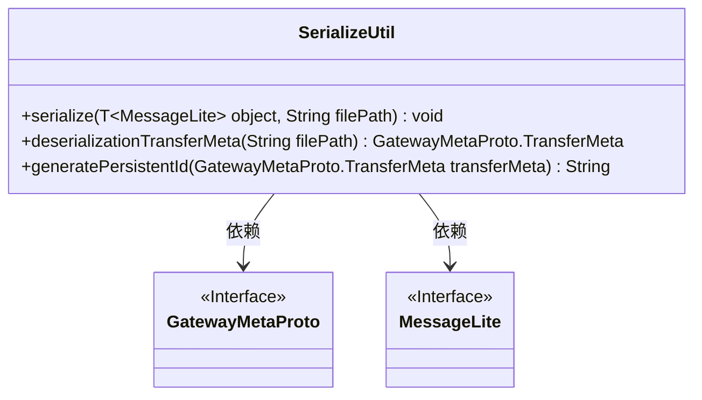
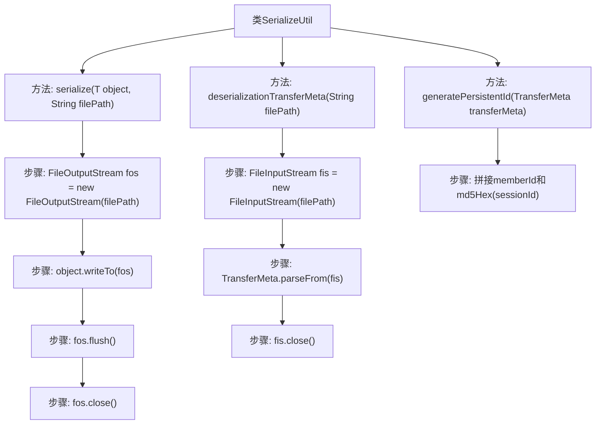

# 基础信息

|      |      |
|------|------|
| 名称 | SerializeUtil |
| 编码语言 | .java |
| 代码路径 | WeFe/gateway/src/main/java/com/welab/wefe/gateway/util/SerializeUtil.java |
| 包名 | com.welab.wefe.gateway.util |
| 依赖项 | ['com.google.protobuf.MessageLite', 'com.welab.wefe.gateway.api.meta.basic.GatewayMetaProto', 'org.apache.commons.codec.digest.DigestUtils', 'java.io.FileInputStream', 'java.io.FileOutputStream', 'java.io.IOException'] |
| 概述说明 | SerializeUtil类提供序列化、反序列化及生成持久化ID功能。包含将对象序列化到文件、从文件反序列化为TransferMeta对象、基于TransferMeta生成唯一ID的方法。 |

# 说明

SerializeUtil类提供序列化与反序列化功能。包含三个方法：serialize将MessageLite对象序列化到指定文件路径；deserializationTransferMeta从文件路径反序列化获取TransferMeta对象；generatePersistentId根据TransferMeta对象生成持久化文件名，格式为源成员ID_目标成员ID_会话ID的MD5值。所有文件操作均包含资源清理逻辑。

# 类列表 Class Summary

| 名称   | 类型  | 说明 |
|-------|------|-------------|
| SerializeUtil | class | SerializeUtil类提供序列化、反序列化及生成持久化ID功能，支持对象到文件的读写操作。 |

## 类 SerializeUtil

|      |      |
|------|------|
| 访问范围 | public |
| 类型 | class |
| 名称 | SerializeUtil |
| 说明 | SerializeUtil类提供序列化、反序列化及生成持久化ID功能，支持对象到文件的读写操作。 |

### UML类图

该类图展示了`SerializeUtil`工具类，它提供对象序列化/反序列化功能。其中包含三个静态方法：`serialize`将实现了`MessageLite`接口的对象写入文件；`deserializationTransferMeta`从文件反序列化`GatewayMetaProto.TransferMeta`对象；`generatePersistentId`根据传输元数据生成持久化ID。类依赖`MessageLite`和`GatewayMetaProto`两个接口，分别用于泛型约束和返回类型定义。

### 内部方法调用关系图

该流程图展示了SerializeUtil类的三个核心方法：serialize用于将对象序列化到文件，deserializationTransferMeta用于从文件反序列化对象，generatePersistentId用于生成持久化文件名。每个方法都清晰地展示了其内部处理步骤，包括文件流操作、数据转换和资源释放等关键环节，体现了完整的对象序列化/反序列化生命周期。

### 字段列表 Field List

| 名称  | 类型  | 说明 |
|-------|-------|------|

### 方法列表

| 名称  | 类型  | 说明 |
|-------|-------|------|
| serialize | void | 静态方法将MessageLite对象序列化到指定文件，确保资源释放。 |
| deserializationTransferMeta | GatewayMetaProto.TransferMeta | 静态方法从文件反序列化TransferMeta对象，自动关闭文件流。 |
| generatePersistentId | String | 生成持久ID的方法：拼接源成员ID、目标成员ID和会话ID的MD5值。 |

