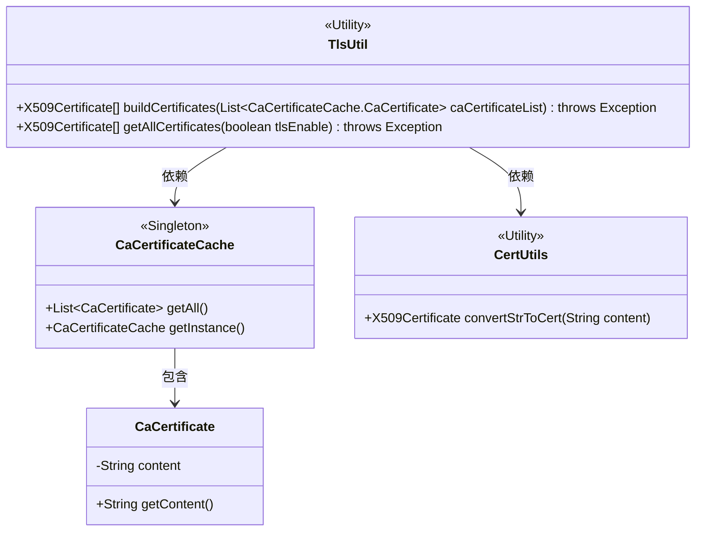
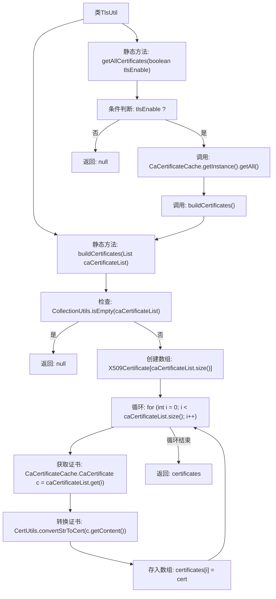

# 基础信息

|      |      |
|------|------|
| 名称 | TlsUtil |
| 编码语言 | .java |
| 代码路径 | WeFe/gateway/src/main/java/com/welab/wefe/gateway/util/TlsUtil.java |
| 包名 | com.welab.wefe.gateway.util |
| 依赖项 | ['com.webank.cert.toolkit.utils.CertUtils', 'com.welab.wefe.gateway.cache.CaCertificateCache', 'org.apache.commons.collections4.CollectionUtils', 'java.security.cert.X509Certificate', 'java.util.List'] |
| 概述说明 | TlsUtil类提供两个静态方法：buildCertificates将CA证书列表转为X509Certificate数组，getAllCertificates根据tlsEnable标志返回全部证书或null。 |

# 说明

TlsUtil类包含两个静态方法用于处理X509证书。buildCertificates方法接收CA证书列表，若列表为空则返回null，否则将每个证书内容转换为X509Certificate对象并存入数组返回。getAllCertificates方法根据tlsEnable参数决定是否调用buildCertificates，若启用则从CaCertificateCache获取全部证书并转换，否则返回null。两个方法都可能抛出异常。

# 类列表 Class Summary

| 名称   | 类型  | 说明 |
|-------|------|-------------|
| TlsUtil | class | TlsUtil类提供两个静态方法：buildCertificates将CA证书列表转为X509Certificate数组，若列表为空返回null；getAllCertificates根据tlsEnable参数决定是否获取全部CA证书并转换。 |

## 类 TlsUtil

|      |      |
|------|------|
| 访问范围 | public |
| 类型 | class |
| 名称 | TlsUtil |
| 说明 | TlsUtil类提供两个静态方法：buildCertificates将CA证书列表转为X509Certificate数组，若列表为空返回null；getAllCertificates根据tlsEnable参数决定是否获取全部CA证书并转换。 |

### UML类图

该代码展示了一个TLS工具类TlsUtil，用于构建X509证书数组。它依赖CaCertificateCache单例类获取CA证书列表，并通过CertUtils工具类将字符串转换为证书对象。CaCertificateCache包含内部类CaCertificate存储证书内容。整体设计遵循工具类模式，提供静态方法处理证书转换逻辑，支持根据TLS开关条件获取所有证书。

### 内部方法调用关系图

该流程图展示了TlsUtil类的两个核心方法逻辑。buildCertificates方法首先检查输入列表是否为空，若为空则返回null，否则遍历列表将每个证书内容转换为X509Certificate对象并存入数组。getAllCertificates方法根据tlsEnable标志决定是否获取并构建证书数组，体现了条件分支和内部方法调用的完整流程。

### 字段列表 Field List

| 名称  | 类型  | 说明 |
|-------|-------|------|

### 方法列表

| 名称  | 类型  | 说明 |
|-------|-------|------|
| buildCertificates | X509Certificate[] | 方法将CA证书列表转换为X509Certificate数组，若列表为空返回null。遍历列表，使用CertUtils将证书内容转为X509Certificate对象并存入数组。 |
| getAllCertificates | X509Certificate[] | 该方法根据tlsEnable参数决定返回所有TLS证书数组或null。若启用TLS，则从CaCertificateCache获取证书并构建数组；否则返回空值。 |

