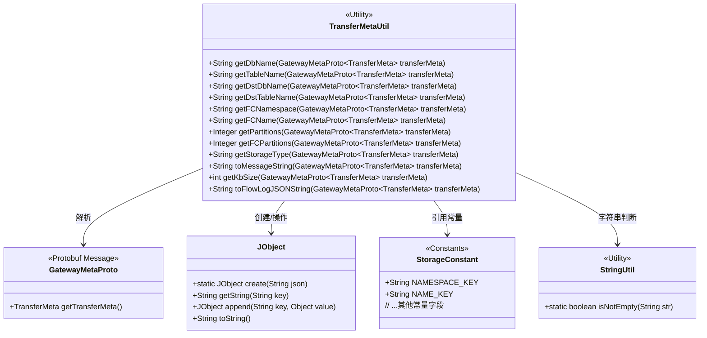
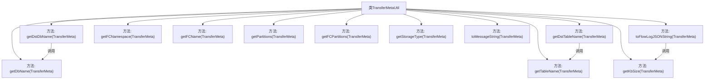

# 基础信息

|      |      |
|------|------|
| 名称 | TransferMetaUtil |
| 编码语言 | .java |
| 代码路径 | WeFe/gateway/src/main/java/com/welab/wefe/gateway/util/TransferMetaUtil.java |
| 包名 | com.welab.wefe.gateway.util |
| 依赖项 | ['com.welab.wefe.common.util.JObject', 'com.welab.wefe.common.util.StringUtil', 'com.welab.wefe.gateway.api.meta.basic.GatewayMetaProto', 'com.welab.wefe.gateway.common.StorageConstant', 'java.math.BigDecimal', 'java.math.RoundingMode'] |
| 概述说明 | TransferMetaUtil类提供从TransferMeta消息中提取数据库名、表名、目标库表名、分区数及生成日志的方法。 |

# 说明

TransferMetaUtil是一个工具类，提供从TransferMeta消息中提取各类信息的方法。主要功能包括获取数据库名、表名、目标数据库名、目标表名、FC命名空间和名称、分区数量、存储类型等。还能将消息转换为日志字符串格式，计算消息大小（KB），并生成流量日志JSON字符串。所有方法均通过解析消息内容中的JSON数据获取相应字段值。

# 类列表 Class Summary

| 名称   | 类型  | 说明 |
|-------|------|-------------|
| TransferMetaUtil | class | TransferMetaUtil类提供从TransferMeta消息中提取数据库名、表名、目标库名、目标表名、分区数及生成日志的方法。 |

## 类 TransferMetaUtil

|      |      |
|------|------|
| 访问范围 | public |
| 类型 | class |
| 名称 | TransferMetaUtil |
| 说明 | TransferMetaUtil类提供从TransferMeta消息中提取数据库名、表名、目标库名、目标表名、分区数及生成日志的方法。 |

### UML类图

类图描述：
TransferMetaUtil是一个工具类，专门用于处理GatewayMetaProto.TransferMeta消息的解析和转换。它提供12个静态方法，包括获取数据库/表名、分区数、存储类型等元数据，以及生成日志格式和计算数据大小。该类依赖GatewayMetaProto协议类获取原始数据，使用JObject处理JSON内容，引用StorageConstant的配置常量，并借助StringUtil进行字符串判空操作。所有方法均为public且无状态，符合工具类的设计原则。

### 内部方法调用关系图

该流程图展示了TransferMetaUtil工具类的结构，包含12个静态方法。核心功能分为三类：1) 元数据解析（如getDbName/getTableName）；2) 日志处理（如toMessageString/toFlowLogJSONString）；3) 数据计算（如getKbSize）。方法间存在调用关系，如getDstDbName会回退调用getDbName，toFlowLogJSONString依赖getKbSize计算结果。所有方法均围绕TransferMeta对象的字段提取和转换展开。

### 字段列表 Field List

| 名称  | 类型  | 说明 |
|-------|-------|------|

### 方法列表

| 名称  | 类型  | 说明 |
|-------|-------|------|
| getFCName | String | 该方法从传输元数据中提取内容字符串，解析为JSON对象后返回FC_NAME字段值。 |
| getStorageType | String | 该方法从传输元数据中提取存储类型，通过解析JSON内容获取目标存储类型字段值并返回。 |
| getFCNamespace | String | 静态方法获取FC命名空间，从传输元数据中解析内容字符串并提取指定字段值。 |
| getDbName | String | 该方法从传输元数据中提取数据库名称，通过解析内容字符串获取命名空间键值。 |
| getPartitions | Integer | 静态方法getPartitions从transferMeta中提取并解析分区数，返回整型结果。 |
| getDstTableName | String | 静态方法getDstTableName从transferMeta提取目标表名，若不存在则调用getTableName获取。 |
| getDstDbName | String | 静态方法getDstDbName从transferMeta提取目标数据库名，若不存在则调用getDbName获取。 |
| getFCPartitions | Integer | 静态方法getFCPartitions从transferMeta提取内容并解析为JObject，获取FC_PARTITIONS配置值后转为整数返回。 |
| getTableName | String | 静态方法getTableName从transferMeta提取dbConfig，返回其NAME_KEY对应的字符串值。 |
| toMessageString | String | 该方法将TransferMeta对象转换为字符串，包含会话ID、源成员ID和名称，以及目标成员ID和名称（若存在）。 |
| toFlowLogJSONString | String | 静态方法将传输元数据转为JSON日志字符串，包含大小和成员ID。 |
| getKbSize | int | 该方法计算传输元数据的KB大小，若为空返回0，否则将字节长度除以1024并四舍五入取整。 |

