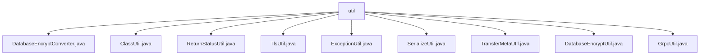

# 基础信息

|      |      |
|------|------|
| 名称 | util |
| 编码语言 | .java |
| 代码路径 | WeFe/gateway/src/main/java/com/welab/wefe/gateway/util |
| 包名 | docs.gateway.src.main.java.com.welab.wefe.gateway.util |
| 概述说明 | DatabaseEncryptConverter实现数据库字段加密解密。ClassUtil加载带特定注解的类。ReturnStatusUtil检查状态。TlsUtil处理证书。ExceptionUtil获取堆栈信息。SerializeUtil提供序列化功能。TransferMetaUtil提取消息信息。DatabaseEncryptUtil提供加密解密。GrpcUtil处理gRPC通信。 |

# 说明

## 概述  
该模块是网关系统的核心工具集，主要提供数据安全传输、类加载管理和gRPC通信支持三大功能。接口规范包括：AttributeConverter实现字段加解密、静态工具方法提供各类转换和校验能力（如状态检查、证书处理、异常捕获等）。关键数据结构涉及TransferMeta消息体、X509Certificate证书对象和BasicMetaProto.ReturnStatus状态对象。外部依赖包括SM4加密算法、gRPC框架、Protobuf序列化和TLS/SSL协议。例如DatabaseEncryptUtil使用SM4实现字段加密，GrpcUtil依赖gRPC进行远程通信。

## 主要业务场景  
模块支持安全数据传输流程：通过DatabaseEncryptConverter自动加密字段，使用SerializeUtil序列化TransferMeta消息，GrpcUtil建立TLS通道传输，异常由ExceptionUtil统一捕获。类加载机制类似插件系统，ClassUtil动态加载@RpcServer和@Processor注解类。典型应用包括加密数据存储（如SM4加密字段）、跨节点通信（如gRPC消息推送）和证书验证（如TlsUtil构建X509证书链）。API集成案例涵盖消息序列化、流量日志生成和通道状态管理。

### 包内部结构视图

该流程图展示了WeFe网关项目中util工具包下的文件结构关系。根节点"util"下直接包含9个工具类文件，包括数据库加密转换器、类操作工具、状态返回工具、TLS工具、异常处理工具、序列化工具、元数据传输工具、数据库加密工具和gRPC工具等实用工具类。这些工具类为网关项目提供基础功能支持。

# 文件列表

| 名称   | 类型  | 说明 |
|-------|------|-------------|
| [DatabaseEncryptConverter.java](DatabaseEncryptConverter.md) | file | DatabaseEncryptConverter类实现属性转换接口，提供加密解密方法，异常时返回原值。 |
| [ClassUtil.java](ClassUtil.md) | file | ClassUtil工具类提供加载RPC服务和处理器类的方法。包含判断类是否为RPC服务或处理器的方法，支持按范围筛选RPC服务。返回包含注解信息的Map结构。 |
| [ReturnStatusUtil.java](ReturnStatusUtil.md) | file | ReturnStatusUtil类提供静态方法ok，检查BasicMetaProto.ReturnStatus是否为OK状态，非空且状态码匹配返回true。 |
| [TlsUtil.java](TlsUtil.md) | file | TlsUtil类提供两个静态方法：buildCertificates将CA证书列表转为X509Certificate数组，getAllCertificates根据tlsEnable标志返回全部证书或null。 |
| [ExceptionUtil.java](ExceptionUtil.md) | file | ExceptionUtil类提供静态方法getStackTraceInfo，用于捕获并返回异常的堆栈信息字符串，包含资源清理逻辑。 |
| [SerializeUtil.java](SerializeUtil.md) | file | SerializeUtil类提供序列化、反序列化及生成持久化ID功能。包含将对象序列化到文件、从文件反序列化为TransferMeta对象、基于TransferMeta生成唯一ID的方法。 |
| [TransferMetaUtil.java](TransferMetaUtil.md) | file | TransferMetaUtil类提供从TransferMeta消息中提取数据库名、表名、目标库表名、分区数及生成日志的方法。 |
| [DatabaseEncryptUtil.java](DatabaseEncryptUtil.md) | file | DatabaseEncryptUtil类提供数据库加密解密功能，包含加密、解密及密文判断方法，使用SM4算法，支持配置开关。 |
| [GrpcUtil.java](GrpcUtil.md) | file | GrpcUtil类提供gRPC工具方法，包括创建管理通道（普通/SSL）、异常检查（连接、SSL、IP白名单等）、消息推送、通道关闭及TLS启用判断等功能。 |

