# 基础信息

|      |      |
|------|------|
| 名称 | com |
| 编码语言 | .java |
| 代码路径 | WeFe/manager/manager-service/src/main/java/com |
| 包名 | docs.manager.manager-service.src.main.java.com |
| 概述说明 | 数字证书管理模块实现申请、签发、密钥绑定全流程，核心组件CertOperationService依赖CertDao持久化，数据结构含CertRequestVO等，使用FastJSON序列化，异常由CertMgrException处理。联盟链管理系统负责多维资源管理及智能合约交互，采用分层设计，支持成员注册、数据标签化等场景，依赖MongoDB、FISCO BCOS SDK等，功能覆盖状态管理、权限验证。 |

# 说明

## 概述  
该模块实现联盟链生态下的多维资源全生命周期管理，核心职责包括数字证书管理（申请/签发/密钥绑定）、成员协作及智能合约交互，类似企业级RBAC与分布式配置中心的结合体。接口规范分层设计：RESTful API层继承AbstractApi基类，合约层提供CRUD/事件订阅，配置层动态加载。关键数据结构包括CertRequestVO（证书申请）、CertVO（证书实体）、InsertEventResponse（链上响应）及版本号字符串。外部依赖去重后为Java基础库、BouncyCastle、FastJSON、MongoDB驱动、FISCO BCOS SDK和国密算法库。例如CertOperationService同步链上链下状态，TransformUtils通过反射复制属性。

## 主要业务场景  
业务流程形成"成员注册→资源上传→权限设置"协作闭环和"申请→签发→绑定"证书管理闭环，类似工单系统与事件总线的结合。交互模式包括API层的参数校验链式调用（如UnionNode系列API维护节点）和合约层的事件驱动（如文件上传触发insertEvent）。典型应用含管理员维护节点列表、用户生成数据标签云，功能完整性体现在各实体具备状态管理和链下监听能力（如MemberContract管理公钥）。API类型覆盖查询（QueryAllApi）、操作（DeleteByTagId）及文件类（DownloadApi），形成配置→业务→区块链的三段式处理流。

### 包内部结构视图

```mermaid
graph TD
    com --> webank
    com --> welab
    webank --> cert
    cert --> mgr
    mgr --> utils
    utils --> TransformUtils.java
    mgr --> enums
    enums --> MgrExceptionCodeEnums.java
    mgr --> exception
    exception --> CertMgrException.java
    mgr --> service
    service --> CertOperationService.java
    mgr --> model
    model --> vo
    vo --> CertRequestVO.java
    vo --> CertVO.java
    vo --> CertKeyVO.java
    model --> CommonResponse.java
    mgr --> db
    db --> dao
    dao --> CertDao.java
    mgr --> config
    config --> CertBeans.java
    mgr --> CertApp.java
    welab --> wefe
    wefe --> manager
    manager --> service
    service --> api
    api --> cert
    cert --> QueryCertApi.java
    cert --> DetailCsrApi.java
    cert --> DownloadApi.java
    cert --> TrustCertsUpdateApi.java
    cert --> DetailKeyApi.java
    cert --> QueryCsrApi.java
    cert --> UpdateCertStatusApi.java
    cert --> InitApi.java
    cert --> QueryKeyApi.java
    cert --> DetailCertApi.java
    cert --> QueryTrustCertApi.java
    api --> account
    account --> SsoLoginApi.java
    api --> authtype
    authtype --> UpdateApi.java
    authtype --> DeleteApi.java
    authtype --> AddApi.java
    authtype --> QueryAllApi.java
    api --> dataresource
    dataresource --> QueryApi.java
    dataresource --> DetailApi.java
    dataresource --> DataResourceTagsApi.java
    dataresource --> EnableApi.java
    api --> common
    common --> DownloadFileApi.java
    api --> dataset
    dataset --> UpdateExtJsonApi.java
    dataset --> QueryApi.java
    dataset --> DetailApi.java
    dataset --> DataSetTagsApi.java
    api --> union
    union --> UpdateApi.java
    union --> DeleteApi.java
    union --> QueryAllApi.java
    union --> EnableApi.java
    api --> defaulttag
    defaulttag --> QueryApi.java
    defaulttag --> UpdateApi.java
    defaulttag --> DeleteApi.java
    defaulttag --> AddApi.java
    api --> agreement
    agreement --> UploadRealnameAuthAgreementTemplateApi.java
    agreement --> QueryApi.java
    agreement --> EnableApi.java
    api --> member
    member --> QueryApi.java
    member --> UpdateApi.java
    member --> RealNameAuthAuditApi.java
    member --> RealNameAuthInfoQueryApi.java
    service --> contract
    contract --> MemberAuthTypeContract.java
    contract --> DataSetContract.java
    contract --> TrustCertsContract.java
    contract --> MemberContract.java
    contract --> DataSetDefaultTagContract.java
    contract --> DataResourceContract.java
    contract --> RealnameAuthAgreementTemplateContract.java
    contract --> UnionNodeContract.java
    contract --> DataResourceDefaultTagContract.java
    contract --> DataSetMemberPermissionContract.java
    contract --> MemberFileInfoContract.java
    service --> constant
    constant --> UserConstant.java
    service --> util
    util --> FileCheckerUtil.java
    util --> VersionUtil.java
    service --> mapper
    mapper --> ImageDataSetMapper.java
    mapper --> DataSetMapper.java
    mapper --> TableDataSetMapper.java
    mapper --> BloomFilterMapper.java
    mapper --> MemberMapper.java
    mapper --> DataResourceMapper.java
    mapper --> TrustCertsMapper.java
    mapper --> AccountMapper.java
    mapper --> RealnameAuthAgreementTemplateMapper.java
    mapper --> UnionNodeMapper.java
    service --> service
    service --> DataSetContractService.java
    service --> RealNameAuthAuditService.java
    service --> RealnameAuthAgreementTemplateContractService.java
    service --> AbstractContractService.java
    service --> AccountService.java
    service --> DataResourceDefaultTagContractService.java
    service --> DatSetDefaultTagContractService.java
    service --> TrustCertsContractService.java
    service --> MemberAuthTypeContractService.java
    service --> PrivacyDatabaseEncryptService.java
    service --> DataResourceContractService.java
    service --> UnionNodeContractService.java
    service --> MemberContractService.java
    service --> dto
    dto --> cert
    cert --> TrustCertsQueryOutput.java
    cert --> TrustCertsAddInput.java
    dto --> account
    account --> ResetPasswordInput.java
    account --> AccountEnableInput.java
    account --> UpdatePasswordInput.java
    account --> LoginOutput.java
    account --> LoginInput.java
    account --> AccountRoleChangeInput.java
    account --> QueryAccountInput.java
    account --> QueryAccountOutput.java
    account --> RegisterInput.java
    account --> UpdateInput.java
    dto --> authtype
    authtype --> MemberAuthTypeDeleteInput.java
    authtype --> MemberAuthTypeAddInput.java
    authtype --> MemberAuthTypeUpdateInput.java
    dto --> dataresource
    dataresource --> ApiTableDataSetQueryOutput.java
    dataresource --> ApiBloomFilterQueryOutput.java
    dataresource --> ApiDataResourceQueryOutput.java
    dataresource --> ApiDataResourceDetailInput.java
    dataresource --> ApiImageDataSetQueryOutput.java
    dataresource --> ApiDataResourceQueryInput.java
    dto --> tag
    tag --> DataSetTagsQueryInput.java
    tag --> DataResourceDefaultTagUpdateInput.java
    tag --> ApiDataResourceDefaultTagQueryOutput.java
    tag --> DataResourceDefaultTagAddInput.java
    tag --> DataResourceDefaultTagDeleteInput.java
    tag --> ApiDataSetTagsQueryOutput.java
    tag --> TagsDTO.java
    dto --> common
    common --> UploadFileInput.java
    common --> QueryFileInput.java
    dto --> dataset
    dataset --> ApiDataSetQueryOutput.java
    dataset --> DataSetDetailInput.java
    dataset --> DataSetUpdateExtJsonInput.java
    dataset --> ApiDataSetQueryInput.java
    dto --> union
    union --> UnionNodeQueryOutput.java
    union --> UnionNodeEnableInput.java
    union --> UnionNodeAddInput.java
    union --> UnionNodeUpdateInput.java
    union --> UnionNodeDeleteInput.java
    dto --> operation
    operation --> OperationLogQueryOutput.java
    operation --> OperationLogQueryInput.java
    dto --> agreement
    agreement --> RealnameAuthAgreementTemplateEnableInput.java
    agreement --> RealnameAuthAgreementTemplateOutput.java
    dto --> member
    member --> MemberUpdateInput.java
    member --> RealNameAuthInfoQueryInput.java
    member --> MemberQueryInput.java
    member --> MemberQueryOutput.java
    member --> RealNameAuthInput.java
    dto --> base
    base --> BaseInput.java
    base --> BaseQueryInput.java
    base --> PageInput.java
    service --> operation
    operation --> ManagerApiLogger.java
    service --> task
    task --> UploadFileSyncToUnionTask.java
    service --> listener
    listener --> AutoPrivacyDatabaseEncryptListener.java
    service --> config
    config --> Config.java
    config --> BlockChainConfig.java
    service --> ManagerService.java
```

该流程图展示了一个复杂的Java项目结构，从顶层包com开始分为webank和welab两大分支。webank分支主要包含证书管理相关功能模块，如证书操作服务、异常处理、数据库访问等；welab分支则聚焦于联盟管理功能，包含丰富的API接口（如证书查询、账户登录、数据资源操作等）、合约服务、数据访问层和各类DTO对象。整个结构采用多层嵌套设计，体现了清晰的模块划分和职责分离。

# 文件列表

| 名称   | 类型  | 说明 |
|-------|------|-------------|
| [welab](welab/_module.md) | package | 联盟链资源管理模块群，提供证书、数据、节点等全生命周期管理，采用RESTful接口和MongoDB+智能合约实现数据同步。支持成员注册、数据上传、权限设置等业务闭环，含文件检查、版本生成、对象映射转换等功能。依赖Spring、MongoDB、FISCO BCOS SDK，确保事务一致性与安全加密。 |
| [webank](webank/_module.md) | package | TransformUtils提供对象转换功能，含三个静态常量和三个转换方法。CertMgrException是自定义异常类，含异常代码和描述。CertOperationService提供证书管理功能，包括更新状态、导出证书等。CertDao管理证书数据访问操作。CertBeans是Spring配置类，注册CertService。CertApp为空实现类，可能用于证书管理。模块实现数字证书全生命周期管理，涵盖申请、签发和密钥关联流程。 |

