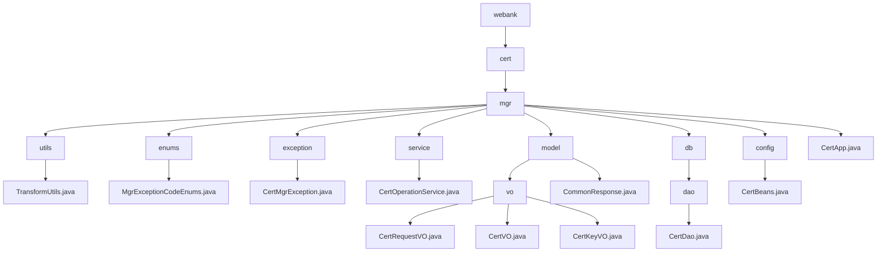

# 基础信息

|      |      |
|------|------|
| 名称 | webank |
| 编码语言 | .java |
| 代码路径 | WeFe/manager/manager-service/src/main/java/com/webank |
| 包名 | docs.manager.manager-service.src.main.java.com.webank |
| 概述说明 | TransformUtils提供对象转换功能，含三个静态常量和三个转换方法。CertMgrException是自定义异常类，含异常代码和描述。CertOperationService提供证书管理功能，包括更新状态、导出证书等。CertDao管理证书数据访问操作。CertBeans是Spring配置类，注册CertService。CertApp为空实现类，可能用于证书管理。模块实现数字证书全生命周期管理，涵盖申请、签发和密钥关联流程。 |

# 说明

## 概述  
该模块实现数字证书全生命周期管理，包括申请、签发、密钥绑定及异常处理。核心组件CertOperationService提供证书状态更新、签发及查询功能，依赖CertDao进行数据持久化。关键数据结构包括CertRequestVO（申请）、CertVO（证书实体）和CertKeyVO（密钥元数据），采用FastJSON序列化。外部依赖为Java基础库、BouncyCastle安全提供者和FastJSON框架。例如TransformUtils通过反射实现对象属性复制，CertMgrException枚举定义7种密钥管理异常（如1013表示不支持的密钥算法）。

## 主要业务场景  
业务流程遵循"申请→签发→绑定"三阶段闭环：用户提交CertRequestVO后，系统生成CertVO并关联CertKeyVO，类似工单系统。核心操作包括根证书初始化、CA证书签发及密钥对生成，支持证书链验证（通过pCertId父子关联）。交互通过标准化VO对象完成，例如CertDao分页查询证书列表，CertService处理证书有效期校验。异常场景统一由CertMgrException处理，类似事件总线模式的错误传递机制。

### 包内部结构视图

该流程图展示了WeFe项目中manager-service模块的Java包结构。从根目录webank开始，逐层展开到cert/mgr目录，包含utils、enums、exception等子目录及各类Java文件。图中清晰呈现了控制器、服务层、模型层、数据库访问层等典型Java项目结构，特别是展示了证书管理相关的核心类和工具类。所有节点均使用最后一级名称，严格遵循路径层级关系。

# 文件列表

| 名称   | 类型  | 说明 |
|-------|------|-------------|
| [cert](cert/_module.md) | package | TransformUtils提供对象转换功能，含三个静态常量和三个转换方法。CertMgrException是自定义异常类，含异常代码和描述。CertOperationService提供证书管理功能，包括更新状态、导出证书等。CertDao管理证书数据访问操作。CertBeans是Spring配置类，注册CertService。CertApp为空实现类，可能用于证书管理。模块实现数字证书全生命周期管理，涵盖申请、签发和密钥关联流程。 |

