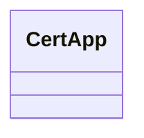
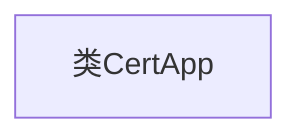

# 基础信息

|      |      |
|------|------|
| 名称 | CertApp |
| 编码语言 | .java |
| 代码路径 | WeFe/manager/manager-service/src/main/java/com/webank/cert/mgr/CertApp.java |
| 包名 | com.webank.cert.mgr |
| 依赖项 | [] |
| 概述说明 | CertApp是一个公开的Java类，目前为空。 |

# 说明

CertApp是一个公开的Java类，目前仅包含类定义，没有实现任何方法或属性。作为基础类结构，它可能用于证书相关功能，但具体用途需根据后续实现确定。类名暗示其可能涉及证书管理或应用程序，但当前为空实现。

# 类列表 Class Summary

| 名称   | 类型  | 说明 |
|-------|------|-------------|
| CertApp | class | CertApp是一个公开的Java类，目前为空。 |

## 类 CertApp

|      |      |
|------|------|
| 访问范围 | public |
| 类型 | class |
| 名称 | CertApp |
| 说明 | CertApp是一个公开的Java类，目前为空。 |

### UML类图

这段类图展示了一个名为`CertApp`的空类，目前没有任何属性和方法。这是一个基础框架，可根据实际需求扩展证书申请相关的业务逻辑和功能。类图清晰地表明了当前类的结构状态，为后续开发提供了起点。

### 内部方法调用关系图

这段流程图描述了一个名为CertApp的空类结构。图中仅包含一个节点表示类本身，没有任何属性或方法分支，因为这是一个尚未实现任何功能的空类框架。该图清晰地展示了类的基础形态，为后续添加类成员（如字段、构造函数、方法等）提供了可视化起点。这种最小化表示符合代码当前状态，保留了未来扩展的空间。

### 字段列表 Field List

| 名称  | 类型  | 说明 |
|-------|-------|------|

### 方法列表

| 名称  | 类型  | 说明 |
|-------|-------|------|

