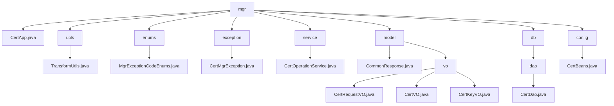

# 基础信息

|      |      |
|------|------|
| 名称 | mgr |
| 编码语言 | .java |
| 代码路径 | WeFe/manager/manager-service/src/main/java/com/webank/cert/mgr |
| 包名 | docs.manager.manager-service.src.main.java.com.webank.cert.mgr |
| 概述说明 | TransformUtils提供对象转换功能，含三个静态常量和三个转换方法。CertMgrException是自定义异常类，含异常代码和描述。CertOperationService提供证书管理功能，包括更新状态、导出证书等。CertDao管理证书数据访问操作。CertBeans是Spring配置类，注册CertService。CertApp为空实现类，可能用于证书管理。模块实现数字证书全生命周期管理，涵盖申请、签发和密钥关联流程。 |

# 说明

## 概述  
该模块实现数字证书全生命周期管理，包括申请、签发、密钥绑定及异常处理。核心组件CertOperationService提供证书状态更新、签发及查询功能，依赖CertDao进行数据持久化。关键数据结构包括CertRequestVO（申请）、CertVO（证书实体）和CertKeyVO（密钥元数据），采用FastJSON序列化。外部依赖为Java基础库、BouncyCastle安全提供者和FastJSON框架。例如TransformUtils通过反射实现对象属性复制，CertMgrException枚举定义7种密钥管理异常（如1013表示不支持的密钥算法）。

## 主要业务场景  
业务流程遵循"申请→签发→绑定"三阶段闭环：用户提交CertRequestVO后，系统生成CertVO并关联CertKeyVO，类似工单系统。核心操作包括根证书初始化、CA证书签发及密钥对生成，支持证书链验证（通过pCertId父子关联）。交互通过标准化VO对象完成，例如CertDao分页查询证书列表，CertService处理证书有效期校验。异常场景统一由CertMgrException处理，类似事件总线模式的错误传递机制。

### 包内部结构视图

该流程图展示了WeFe证书管理服务的Java包结构，以mgr作为根节点，包含8个主要子模块：utils工具类、enums枚举类、exception异常处理、service服务层、model数据模型、db数据库访问层、config配置类和主应用CertApp。其中model包含vo值对象子包，db包含dao数据访问对象子包，每个模块下都有对应的具体实现类文件，形成清晰的层级关系。

# 文件列表

| 名称   | 类型  | 说明 |
|-------|------|-------------|
| [model](model/_module.md) | package | 该模块管理数字证书生命周期，含请求、签发和密钥封装功能，提供三个Java类处理相关数据。遵循Java序列化标准，依赖FastJSON框架。支持证书全流程管理及序列化操作。CommonResponse类封装通用响应数据，含状态码、消息和数据体，提供成功和失败处理方法。 |
| [utils](utils/_module.md) | package | TransformUtils类提供对象转换功能，支持单对象和列表转换，利用反射和缓存优化性能。 |
| [CertApp.java](CertApp.md) | file | CertApp是一个公开的Java类，目前为空。 |
| [config](config/_module.md) | package | Java配置类CertBeans定义了一个Bean方法getCertService，返回CertService实例。 |
| [db](db/_module.md) | package | CertDao类管理证书、密钥和请求信息，提供保存、查询和更新功能，支持分页查询和状态更新。 |
| [service](service/_module.md) | package | CertOperationService提供证书管理功能，包括更新证书状态、查询证书、导出证书、初始化根证书、签发证书等操作，支持RSA和ECDSA算法，使用BouncyCastle安全库。 |
| [exception](exception/_module.md) | package | CertMgrException是自定义异常类，包含枚举类型错误码ece，提供两种构造方法：一种接收枚举设置异常信息，另一种直接接收字符串信息。提供获取错误码枚举的方法。 |
| [enums](enums/_module.md) | package | 枚举MgrExceptionCodeEnums定义了7个异常代码和消息，包括密钥算法不支持、用户账户不存在、证书请求不存在等，每个异常包含代码和描述信息。 |

