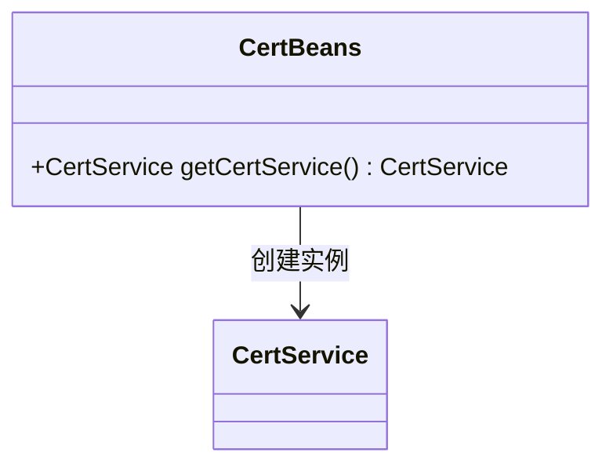
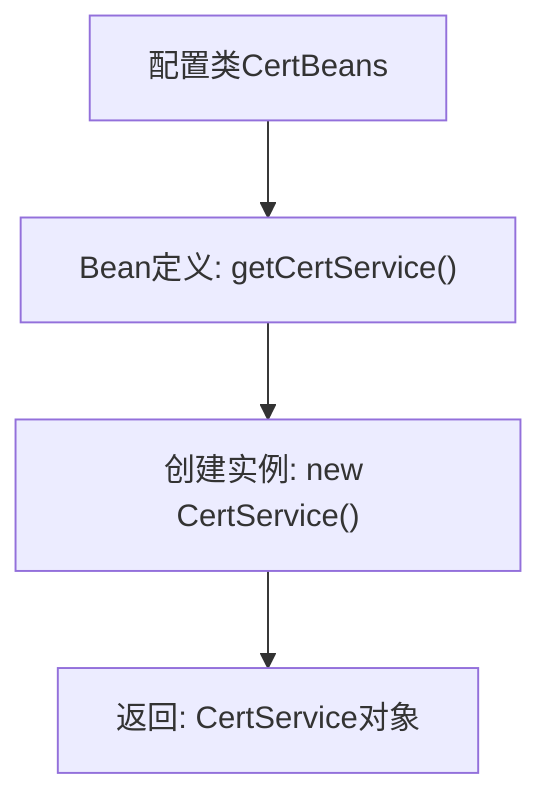

# 基础信息

|      |      |
|------|------|
| 名称 | CertBeans |
| 编码语言 | .java |
| 代码路径 | WeFe/manager/manager-service/src/main/java/com/webank/cert/mgr/config/CertBeans.java |
| 包名 | com.webank.cert.mgr.config |
| 依赖项 | ['com.webank.cert.toolkit.service.CertService', 'org.springframework.context.annotation.Bean', 'org.springframework.context.annotation.Configuration'] |
| 概述说明 | Java配置类CertBeans定义了一个Bean方法getCertService，返回CertService实例。 |

# 说明

该内容定义了一个名为CertBeans的Java配置类，使用@Configuration注解表明这是一个Spring配置类。类中包含一个使用@Bean注解的getCertService方法，该方法创建并返回一个CertService类的实例。这个配置类的作用是向Spring容器注册CertService作为一个可管理的bean，以便在其他组件中注入和使用。

# 类列表 Class Summary

| 名称   | 类型  | 说明 |
|-------|------|-------------|
| CertBeans | class | 这是一个Java配置类，定义了一个名为CertService的Bean，用于创建并返回CertService实例。 |

## 类 CertBeans

|      |      |
|------|------|
| 访问范围 | @Configuration;public |
| 类型 | class |
| 名称 | CertBeans |
| 说明 | 这是一个Java配置类，定义了一个名为CertService的Bean，用于创建并返回CertService实例。 |

### UML类图

这段类图展示了Spring配置类`CertBeans`与业务类`CertService`的关系。`CertBeans`作为配置类，通过`@Bean`注解的`getCertService()`方法创建并返回`CertService`实例，体现了Spring依赖注入的核心机制。图中清晰呈现了配置类对业务类的实例化依赖关系，符合Spring IoC容器的设计模式。`CertService`作为被管理的Bean，其具体实现细节未在图中展开，重点突出了配置类与Bean的声明式绑定关系。

### 内部方法调用关系图

该流程图描述了Spring配置类CertBeans的核心逻辑。CertBeans类通过@Configuration注解标记为配置类，其中定义了一个@Bean方法getCertService()。当Spring容器启动时，会调用该方法创建并返回一个CertService实例，该实例随后会被纳入Spring容器管理。整个过程展示了Spring依赖注入的基本单元配置方式。

### 字段列表 Field List

| 名称  | 类型  | 说明 |
|-------|-------|------|

### 方法列表

| 名称  | 类型  | 说明 |
|-------|-------|------|
| getCertService | CertService | 定义一个Spring Bean，返回CertService实例。 |

