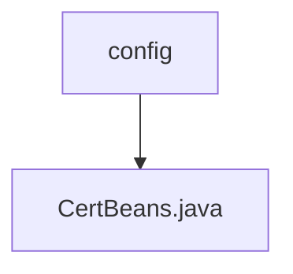

# 基础信息

|      |      |
|------|------|
| 名称 | config |
| 编码语言 | .java |
| 代码路径 | WeFe/manager/manager-service/src/main/java/com/webank/cert/mgr/config |
| 包名 | docs.manager.manager-service.src.main.java.com.webank.cert.mgr.config |
| 概述说明 | Java配置类CertBeans定义了一个Bean方法getCertService，返回CertService实例。 |

# 说明

该内容定义了一个名为CertBeans的Java配置类，使用@Configuration注解表明这是一个Spring配置类。类中包含一个使用@Bean注解的getCertService方法，该方法创建并返回一个CertService类的实例。这个配置类的作用是向Spring容器注册CertService作为一个可管理的bean，以便在其他组件中注入和使用。

### 包内部结构视图

该流程图展示了WeFe项目中manager-service模块下的配置目录结构。顶层节点为config目录，其下包含一个Java配置文件CertBeans.java。这种简洁的层级结构常用于存放Spring Boot应用的配置类文件，用于定义和管理应用中的各种Bean组件。

# 文件列表

| 名称   | 类型  | 说明 |
|-------|------|-------------|
| [CertBeans.java](CertBeans.md) | file | Java配置类CertBeans定义了一个Bean方法getCertService，返回CertService实例。 |

