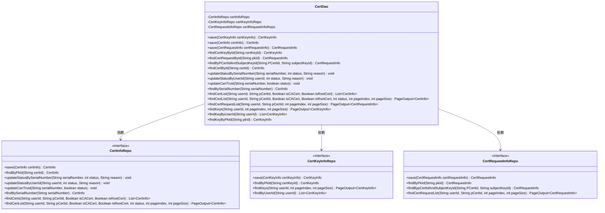

# 基础信息

|      |      |
|------|------|
| 名称 | CertDao |
| 编码语言 | .java |
| 代码路径 | WeFe/manager/manager-service/src/main/java/com/webank/cert/mgr/db/dao/CertDao.java |
| 包名 | com.webank.cert.mgr.db.dao |
| 依赖项 | ['java.util.List', 'org.springframework.beans.factory.annotation.Autowired', 'org.springframework.stereotype.Service', 'com.welab.wefe.common.data.mongodb.dto.PageOutput', 'com.welab.wefe.common.data.mongodb.entity.manager.CertInfo', 'com.welab.wefe.common.data.mongodb.entity.manager.CertKeyInfo', 'com.welab.wefe.common.data.mongodb.entity.manager.CertRequestInfo', 'com.welab.wefe.common.data.mongodb.repo.CertInfoRepo', 'com.welab.wefe.common.data.mongodb.repo.CertKeyInfoRepo', 'com.welab.wefe.common.data.mongodb.repo.CertRequestInfoRepo'] |
| 概述说明 | CertDao类管理证书、密钥和请求信息，提供保存、查询和更新功能，支持分页查询和状态更新。 |

# 说明

CertDao是一个服务类，负责管理证书、密钥和证书请求的数据访问操作。它通过三个自动注入的仓库接口（CertInfoRepo、CertKeyInfoRepo、CertRequestInfoRepo）实现数据的增删改查功能。主要功能包括保存证书、密钥和请求信息，根据ID查询各类信息，更新证书状态和信任状态，以及分页查询证书列表、请求列表和密钥列表。此外，还支持根据用户ID、序列号、父证书ID等条件进行查询。

# 类列表 Class Summary

| 名称   | 类型  | 说明 |
|-------|------|-------------|
| CertDao | class | CertDao类是一个服务组件，用于管理证书、密钥和请求信息。它提供了保存、查询和更新功能，支持按ID、序列号、用户ID等条件操作，并支持分页查询。 |

## 类 CertDao

|      |      |
|------|------|
| 访问范围 | @Service;public |
| 类型 | class |
| 名称 | CertDao |
| 说明 | CertDao类是一个服务组件，用于管理证书、密钥和请求信息。它提供了保存、查询和更新功能，支持按ID、序列号、用户ID等条件操作，并支持分页查询。 |

### UML类图

这段代码展示了一个证书管理系统的数据访问层设计。CertDao类作为核心服务类，通过依赖注入三个JPA仓库接口(CertInfoRepo、CertKeyInfoRepo、CertRequestInfoRepo)来实现对证书信息、密钥信息和证书请求信息的CRUD操作。类中提供了丰富的查询方法，包括按ID查询、按序列号查询、按用户ID查询等基础操作，以及支持分页查询的高级功能。所有仓库接口都遵循Spring Data JPA的命名规范，通过方法名自动生成查询逻辑。CertDao作为中间层，封装了底层数据访问细节，为上层业务逻辑提供统一的证书管理接口。

### 内部方法调用关系图

```mermaid
graph TD
    A["类CertDao"]
    B["属性: CertInfoRepo certInfoRepo"]
    C["属性: CertKeyInfoRepo certKeyInfoRepo"]
    D["属性: CertRequestInfoRepo certRequestInfoRepo"]
    E["方法: save(CertKeyInfo certKeyInfo)"]
    F["方法: save(CertInfo certInfo)"]
    G["方法: save(CertRequestInfo certRequestInfo)"]
    H["方法: findCertKeyById(String certKeyId)"]
    I["方法: findCertRequestById(String pkId)"]
    J["方法: findByPCertIdAndSubjectKeyId(String PCertId, String subjectKeyId)"]
    K["方法: findCertById(String certId)"]
    L["方法: updateStatusBySerialNumber(String serialNumber, int status, String reason)"]
    M["方法: updateStatusByUserId(String userId, int status, String reason)"]
    N["方法: updateCanTrust(String serialNumber, boolean status)"]
    O["方法: findBySerialNumber(String serialNumber)"]
    P["方法: findCertList(String userId, String pCertId, Boolean isCACert, Boolean isRootCert)"]
    Q["方法: findCertList(String userId, String pCertId, Boolean isCACert, Boolean isRootCert, int status, int pageIndex, int pageSize)"]
    R["方法: findCertRequestList(String userId, String pCertId, int pageIndex, int pageSize)"]
    S["方法: findKeys(String userId, int pageIndex, int pageSize)"]
    T["方法: findKeyByUserId(String userId)"]
    U["方法: findKeyByPkId(String pkId)"]

    A --> B
    A --> C
    A --> D
    A --> E
    A --> F
    A --> G
    A --> H
    A --> I
    A --> J
    A --> K
    A --> L
    A --> M
    A --> N
    A --> O
    A --> P
    A --> Q
    A --> R
    A --> S
    A --> T
    A --> U
```

该流程图展示了CertDao类的结构和功能，该类是一个服务类，用于管理证书、证书请求和密钥信息。它通过三个自动装配的仓库接口（CertInfoRepo、CertKeyInfoRepo、CertRequestInfoRepo）与数据库交互，提供了多种保存、查询和更新方法，包括按ID查找、按条件查询、分页查询以及状态更新等功能。这些方法主要用于处理证书生命周期管理中的各种操作。

### 字段列表 Field List

| 名称  | 类型  | 说明 |
|-------|-------|------|
| certKeyInfoRepo | CertKeyInfoRepo | 使用@Autowired自动注入CertKeyInfoRepo实例。 |
| certInfoRepo | CertInfoRepo | 自动注入CertInfoRepo实例。 |
| certRequestInfoRepo | CertRequestInfoRepo | 自动注入证书请求信息仓库实例。 |

### 方法列表

| 名称  | 类型  | 说明 |
|-------|-------|------|
| findByPCertIdAndSubjectKeyId | CertRequestInfo | 该方法通过证书ID和主题密钥ID查询证书请求信息，调用存储库方法返回结果。 |
| save | CertInfo | 保存证书信息并返回保存后的对象。 |
| findKeyByPkId | CertKeyInfo | 该方法通过pkId查询CertKeyInfo，调用certKeyInfoRepo的findByPkId方法返回结果。 |
| save | CertRequestInfo | 保存证书请求信息到仓库并返回该信息。 |
| updateCanTrust | void | 更新证书信任状态的方法，根据序列号和状态修改数据库记录。 |
| findCertRequestById | CertRequestInfo | 该方法通过ID查询证书请求信息，调用存储库接口根据主键ID返回对应数据对象。 |
| findCertKeyById | CertKeyInfo | 根据证书ID查询证书密钥信息。 |
| findKeyByUserId | List<CertKeyInfo> | 根据用户ID查询证书密钥信息列表，返回对应结果。 |
| findBySerialNumber | CertInfo | 根据序列号查询证书信息，返回匹配结果。 |
| findCertList | List<CertInfo> | 查询用户证书列表，支持按用户ID、父证书ID、是否CA证书和根证书条件筛选。 |
| updateStatusBySerialNumber | void | 更新证书状态方法：根据序列号修改证书状态及原因。 |
| save | CertKeyInfo | 该方法保存证书密钥信息到数据库并返回保存后的对象。 |
| updateStatusByUserId | void | 根据用户ID更新状态和原因，调用仓库方法执行操作。 |
| findKeys | PageOutput<CertKeyInfo> | 该方法通过用户ID分页查询证书密钥信息，返回分页结果。 |
| findCertRequestList | PageOutput<CertRequestInfo> | 该方法通过用户ID和证书ID查询证书请求列表，支持分页，返回分页结果。 |
| findCertById | CertInfo | 根据证书ID查询证书信息，调用certInfoRepo的findByPkId方法返回结果。 |
| findCertList | PageOutput<CertInfo> | 该方法根据用户ID、父证书ID、是否CA证书、是否根证书和状态查询证书列表，支持分页，返回分页结果。 |

