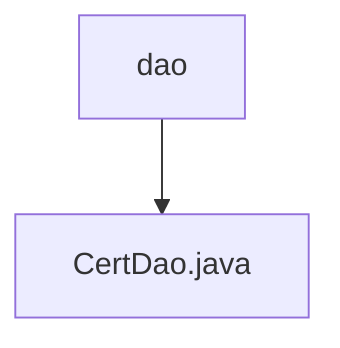

# 基础信息

|      |      |
|------|------|
| 名称 | dao |
| 编码语言 | .java |
| 代码路径 | WeFe/manager/manager-service/src/main/java/com/webank/cert/mgr/db/dao |
| 包名 | docs.manager.manager-service.src.main.java.com.webank.cert.mgr.db.dao |
| 概述说明 | CertDao类管理证书、密钥和请求信息，提供保存、查询和更新功能，支持分页查询和状态更新。 |

# 说明

CertDao是一个服务类，负责管理证书、密钥和证书请求的数据访问操作。它通过三个自动注入的仓库接口（CertInfoRepo、CertKeyInfoRepo、CertRequestInfoRepo）实现数据的增删改查功能。主要功能包括保存证书、密钥和请求信息，根据ID查询各类信息，更新证书状态和信任状态，以及分页查询证书列表、请求列表和密钥列表。此外，还支持根据用户ID、序列号、父证书ID等条件进行查询。

### 包内部结构视图

该流程图展示了数据库访问层的简单结构，dao目录下包含一个具体的数据库访问实现文件CertDao.java。这种结构常见于Java项目中，dao层通常负责与数据库交互，而CertDao.java则是实现具体数据库操作的类文件。

# 文件列表

| 名称   | 类型  | 说明 |
|-------|------|-------------|
| [CertDao.java](CertDao.md) | file | CertDao类管理证书、密钥和请求信息，提供保存、查询和更新功能，支持分页查询和状态更新。 |

