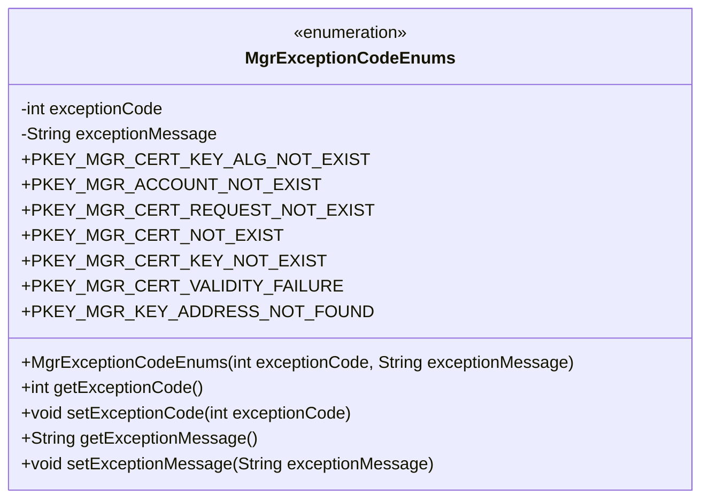

# 基础信息

|      |      |
|------|------|
| 名称 | MgrExceptionCodeEnums |
| 编码语言 | .java |
| 代码路径 | WeFe/manager/manager-service/src/main/java/com/webank/cert/mgr/enums/MgrExceptionCodeEnums.java |
| 包名 | com.webank.cert.mgr.enums |
| 依赖项 | [] |
| 概述说明 | 枚举MgrExceptionCodeEnums定义了7个异常代码和消息，包括密钥算法不支持、用户账户不存在、证书请求不存在等，每个异常包含代码和描述信息。 |

# 说明

该枚举类定义了密钥管理相关的异常代码和描述信息，包含7种异常类型。每种异常由错误代码和错误信息组成，例如1013表示不支持的密钥算法，1006表示用户账户不存在。类中提供了构造方法初始化这两个字段，并包含获取和设置异常代码及信息的公共方法。所有异常均与证书、密钥或账户管理相关，如证书不存在、私钥缺失、证书过期或密钥地址未找到等。

# 类列表 Class Summary

| 名称   | 类型  | 说明 |
|-------|------|-------------|
| MgrExceptionCodeEnums | enum | 枚举MgrExceptionCodeEnums定义了7个异常码及信息，包括密钥算法不支持、用户账户不存在、证书请求不存在、证书不存在、私钥不存在、证书有效期失效和密钥地址未找到。每个枚举项包含异常码和异常信息。 |

## 类 MgrExceptionCodeEnums

|      |      |
|------|------|
| 访问范围 | public |
| 类型 | enum |
| 名称 | MgrExceptionCodeEnums |
| 说明 | 枚举MgrExceptionCodeEnums定义了7个异常码及信息，包括密钥算法不支持、用户账户不存在、证书请求不存在、证书不存在、私钥不存在、证书有效期失效和密钥地址未找到。每个枚举项包含异常码和异常信息。 |

### UML类图

这段代码定义了一个枚举类 `MgrExceptionCodeEnums`，用于管理异常代码和对应的异常消息。枚举类包含7个预定义的枚举常量，每个常量都关联了一个异常代码和异常消息。类中提供了私有字段 `exceptionCode` 和 `exceptionMessage`，以及对应的getter和setter方法。枚举类的构造函数是私有的，用于初始化枚举常量的异常代码和消息。这个枚举类主要用于集中管理和标识不同类型的异常情况。

### 内部方法调用关系图

```mermaid
graph TD
    A["枚举类MgrExceptionCodeEnums"]
    B["枚举值: PKEY_MGR_CERT_KEY_ALG_NOT_EXIST(1013, 'key algorithms are not supported')"]
    C["枚举值: PKEY_MGR_ACCOUNT_NOT_EXIST(1006, 'user account does not exist')"]
    D["枚举值: PKEY_MGR_CERT_REQUEST_NOT_EXIST(1014, 'certificate request not exists')"]
    E["枚举值: PKEY_MGR_CERT_NOT_EXIST(1015, 'certificate not exists')"]
    F["枚举值: PKEY_MGR_CERT_KEY_NOT_EXIST(1016, 'certificate private key not exists')"]
    G["枚举值: PKEY_MGR_CERT_VALIDITY_FAILURE(1017, 'the current date is out of the validity of the certificate')"]
    H["枚举值: PKEY_MGR_KEY_ADDRESS_NOT_FOUND(1018, 'key address not found')"]
    I["构造方法: MgrExceptionCodeEnums(int exceptionCode, String exceptionMessage)"]
    J["属性: int exceptionCode"]
    K["属性: String exceptionMessage"]
    L["方法: getExceptionCode()"]
    M["方法: setExceptionCode(int exceptionCode)"]
    N["方法: getExceptionMessage()"]
    O["方法: setExceptionMessage(String exceptionMessage)"]

    A --> B
    A --> C
    A --> D
    A --> E
    A --> F
    A --> G
    A --> H
    A --> I
    A --> J
    A --> K
    A --> L
    A --> M
    A --> N
    A --> O
```

该流程图展示了MgrExceptionCodeEnums枚举类的完整结构，包含7个预定义的枚举值实例，每个实例通过构造方法初始化异常代码和消息。类中包含两个私有属性(exceptionCode和exceptionMessage)以及对应的getter/setter方法。枚举类通过预定义的错误码和描述信息，为系统提供标准化的异常类型管理能力，适用于密钥管理场景下的错误分类和处理。

### 字段列表 Field List

| 名称  | 类型  | 说明 |
|-------|-------|------|

### 方法列表

| 名称  | 类型  | 说明 |
|-------|-------|------|

