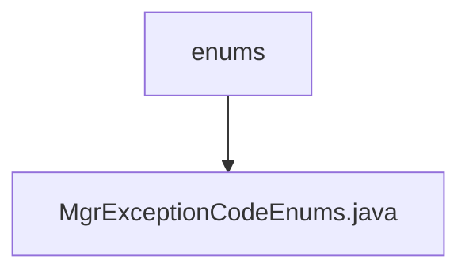

# 基础信息

|      |      |
|------|------|
| 名称 | enums |
| 编码语言 | .java |
| 代码路径 | WeFe/manager/manager-service/src/main/java/com/webank/cert/mgr/enums |
| 包名 | docs.manager.manager-service.src.main.java.com.webank.cert.mgr.enums |
| 概述说明 | 枚举MgrExceptionCodeEnums定义了7个异常代码和消息，包括密钥算法不支持、用户账户不存在、证书请求不存在等，每个异常包含代码和描述信息。 |

# 说明

该枚举类定义了密钥管理相关的异常代码和描述信息，包含7种异常类型。每种异常由错误代码和错误信息组成，例如1013表示不支持的密钥算法，1006表示用户账户不存在。类中提供了构造方法初始化这两个字段，并包含获取和设置异常代码及信息的公共方法。所有异常均与证书、密钥或账户管理相关，如证书不存在、私钥缺失、证书过期或密钥地址未找到等。

### 包内部结构视图

该流程图展示了WeFe项目中manager-service模块的枚举类结构。根节点为enums目录，其下包含一个具体的枚举类文件MgrExceptionCodeEnums.java。这种结构是典型的企业级项目中用于集中管理异常代码枚举的目录组织方式，体现了清晰的代码分层设计思想。

# 文件列表

| 名称   | 类型  | 说明 |
|-------|------|-------------|
| [MgrExceptionCodeEnums.java](MgrExceptionCodeEnums.md) | file | 枚举MgrExceptionCodeEnums定义了7个异常代码和消息，包括密钥算法不支持、用户账户不存在、证书请求不存在等，每个异常包含代码和描述信息。 |

