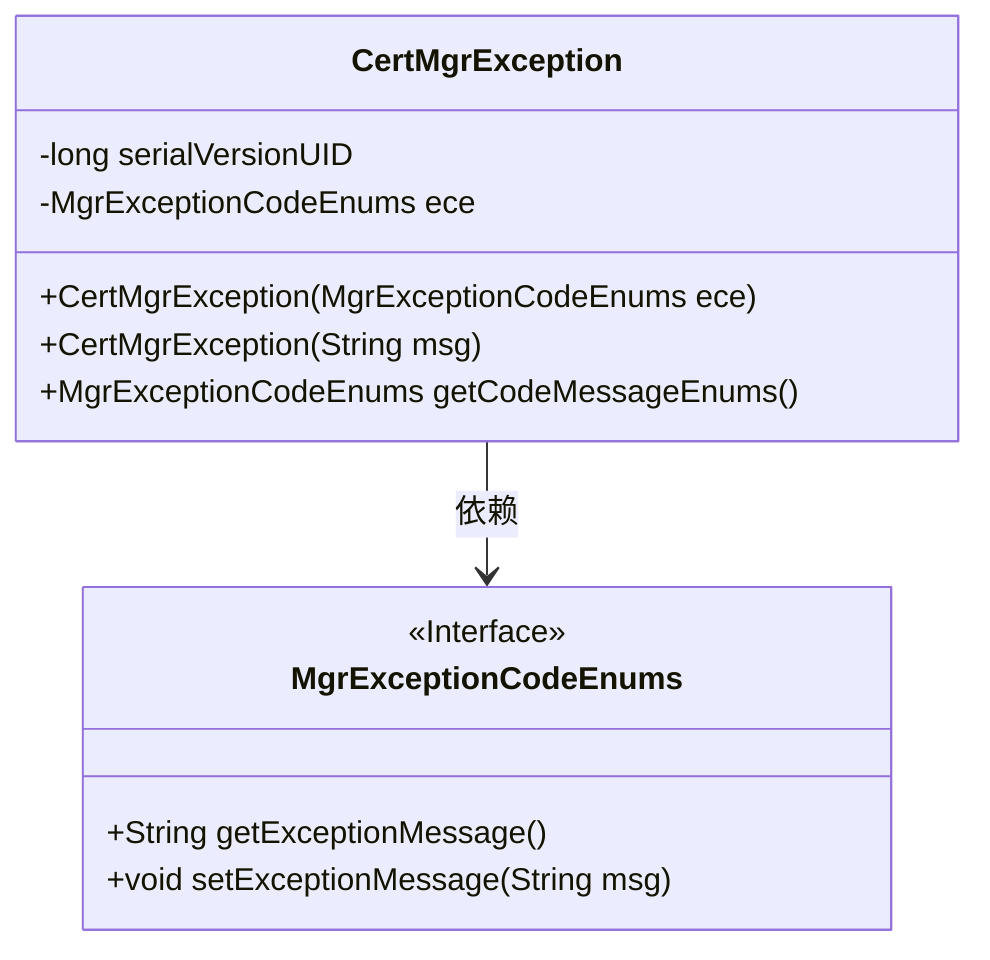
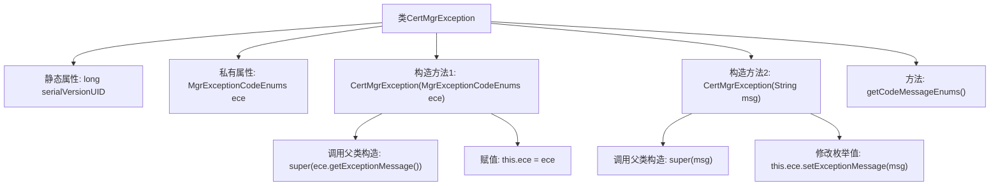

# 基础信息

|      |      |
|------|------|
| 名称 | CertMgrException |
| 编码语言 | .java |
| 代码路径 | WeFe/manager/manager-service/src/main/java/com/webank/cert/mgr/exception/CertMgrException.java |
| 包名 | com.webank.cert.mgr.exception |
| 依赖项 | ['com.webank.cert.mgr.enums.MgrExceptionCodeEnums'] |
| 概述说明 | CertMgrException是自定义异常类，包含枚举类型错误码ece，提供两种构造方法：一种接收枚举设置异常信息，另一种直接接收字符串信息。提供获取错误码枚举的方法。 |

# 说明

CertMgrException是一个自定义异常类，继承自Exception类。它包含一个私有静态serialVersionUID字段和一个MgrExceptionCodeEnums类型的私有字段ece。该类提供了两个构造函数：一个接收MgrExceptionCodeEnums参数并调用父类构造函数设置异常消息，另一个接收字符串消息并更新ece的异常消息。还提供了一个getCodeMessageEnums方法用于获取ece枚举值。

# 类列表 Class Summary

| 名称   | 类型  | 说明 |
|-------|------|-------------|
| CertMgrException | class | CertMgrException是自定义异常类，包含枚举类型错误码ece，提供两种构造方法：一种接收枚举设置异常信息，另一种直接接收字符串信息，并提供获取错误码枚举的方法。 |

## 类 CertMgrException

|      |      |
|------|------|
| 访问范围 | public |
| 类型 | class |
| 名称 | CertMgrException |
| 说明 | CertMgrException是自定义异常类，包含枚举类型错误码ece，提供两种构造方法：一种接收枚举设置异常信息，另一种直接接收字符串信息，并提供获取错误码枚举的方法。 |

### UML类图

这段代码展示了一个自定义异常类`CertMgrException`，它继承自`Exception`类。该类包含一个`MgrExceptionCodeEnums`类型的私有成员变量`ece`，用于存储异常代码枚举。类中提供了两个构造函数：一个接收枚举类型参数并设置异常消息，另一个直接接收字符串消息并更新枚举中的消息。此外，还提供了一个获取枚举对象的方法。`MgrExceptionCodeEnums`是一个接口，定义了获取和设置异常消息的方法。该异常类主要用于证书管理相关的错误处理场景。

### 内部方法调用关系图

该流程图展示了CertMgrException异常类的结构，包含两个构造方法和一个查询方法。核心逻辑是通过枚举类型MgrExceptionCodeEnums管理异常信息，构造方法1直接使用枚举初始化，构造方法2允许自定义消息并同步更新枚举值。serialVersionUID用于序列化兼容性，getCodeMessageEnums()提供对内部枚举的访问。流程清晰体现了异常消息的两种初始化路径和状态维护机制。

### 字段列表 Field List

| 名称  | 类型  | 说明 |
|-------|-------|------|
| ece | MgrExceptionCodeEnums | 私有异常码枚举变量ece。 |
| serialVersionUID = 893822168485972751L | long | 声明一个私有静态不可变的序列化版本ID，值为893822168485972751L。 |

### 方法列表

| 名称  | 类型  | 说明 |
|-------|-------|------|
| getCodeMessageEnums | MgrExceptionCodeEnums | 该方法返回MgrExceptionCodeEnums类型的枚举对象ece。 |

