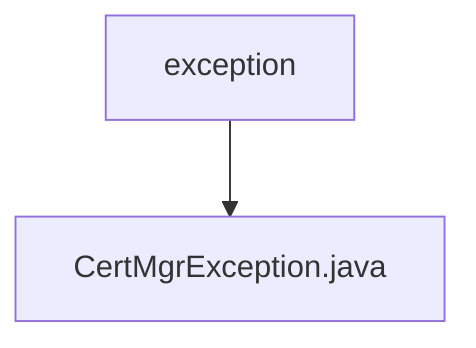

# 基础信息

|      |      |
|------|------|
| 名称 | exception |
| 编码语言 | .java |
| 代码路径 | WeFe/manager/manager-service/src/main/java/com/webank/cert/mgr/exception |
| 包名 | docs.manager.manager-service.src.main.java.com.webank.cert.mgr.exception |
| 概述说明 | CertMgrException是自定义异常类，包含枚举类型错误码ece，提供两种构造方法：一种接收枚举设置异常信息，另一种直接接收字符串信息。提供获取错误码枚举的方法。 |

# 说明

CertMgrException是一个自定义异常类，继承自Exception类。它包含一个私有静态serialVersionUID字段和一个MgrExceptionCodeEnums类型的私有字段ece。该类提供了两个构造函数：一个接收MgrExceptionCodeEnums参数并调用父类构造函数设置异常消息，另一个接收字符串消息并更新ece的异常消息。还提供了一个getCodeMessageEnums方法用于获取ece枚举值。

### 包内部结构视图

该流程图展示了WeFe项目中manager-service模块的异常处理结构。顶层节点为exception文件夹，包含一个具体的异常类CertMgrException.java。这种结构是典型的Java项目异常处理设计模式，将自定义异常类集中存放在exception包中，便于统一管理和维护异常处理逻辑。

# 文件列表

| 名称   | 类型  | 说明 |
|-------|------|-------------|
| [CertMgrException.java](CertMgrException.md) | file | CertMgrException是自定义异常类，包含枚举类型错误码ece，提供两种构造方法：一种接收枚举设置异常信息，另一种直接接收字符串信息。提供获取错误码枚举的方法。 |

