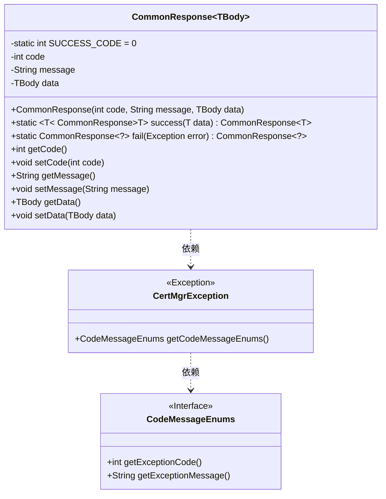
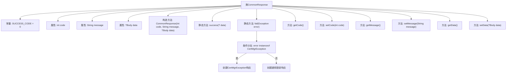

# 基础信息

|      |      |
|------|------|
| 名称 | CommonResponse |
| 编码语言 | .java |
| 代码路径 | WeFe/manager/manager-service/src/main/java/com/webank/cert/mgr/model/CommonResponse.java |
| 包名 | com.webank.cert.mgr.model |
| 依赖项 | ['com.webank.cert.mgr.exception.CertMgrException'] |
| 概述说明 | 通用响应类，包含状态码、消息和泛型数据体，提供成功和失败静态构建方法，支持异常处理和数据封装。 |

# 说明

CommonResponse是一个泛型类，用于封装通用响应数据。它包含三个主要属性：code表示状态码，message存储消息文本，data保存泛型类型的数据体。类中定义了SUCCESS_CODE常量表示成功状态码0。提供了两种静态工厂方法：success方法返回成功响应并携带数据，fail方法处理异常并返回错误响应，能识别特定异常类型CertMgrException以提取详细错误码和消息。此外还包含各属性的getter和setter方法，支持链式操作。

# 类列表 Class Summary

| 名称   | 类型  | 说明 |
|-------|------|-------------|
| CommonResponse | class | 通用响应类，包含状态码、消息和泛型数据。提供成功和失败静态方法，支持异常处理和属性访问。 |

## 类 CommonResponse

|      |      |
|------|------|
| 访问范围 | public |
| 类型 | class |
| 名称 | CommonResponse |
| 说明 | 通用响应类，包含状态码、消息和泛型数据。提供成功和失败静态方法，支持异常处理和属性访问。 |

### UML类图

这段代码定义了一个泛型类`CommonResponse<TBody>`，用于封装通用的响应数据。它包含成功和失败的静态工厂方法，其中`fail()`方法会处理`CertMgrException`异常。该类有三个主要字段：状态码、消息和泛型数据体，并提供了相应的getter和setter方法。`CertMgrException`是一个自定义异常类，它通过`CodeMessageEnums`接口获取错误码和消息。

### 内部方法调用关系图

这段代码定义了一个通用响应类CommonResponse，采用泛型设计可适应不同数据类型。核心功能包括：通过构造方法初始化响应对象，提供静态方法success()快速创建成功响应，fail()方法处理异常并生成错误响应（含CertMgrException特殊处理分支）。类包含标准getter/setter方法，维护状态码、消息和泛型数据体，SUCCESS_CODE常量定义成功状态码0。流程图清晰展示了类结构、方法调用关系和异常处理分支逻辑。

### 字段列表 Field List

| 名称  | 类型  | 说明 |
|-------|-------|------|
| data | TBody | 私有泛型变量data，类型为TBody。 |
| message | String | 私有字符串变量message |
| SUCCESS_CODE = 0 | int | 定义成功状态码常量SUCCESS_CODE，值为0。 |
| code | int | 私有整型变量code |

### 方法列表

| 名称  | 类型  | 说明 |
|-------|-------|------|
| setCode | void | 设置整型变量code的值。 |
| success | CommonResponse | 定义静态方法success，返回包含成功码、空消息和数据的CommonResponse对象。 |
| getMessage | String | 获取message字符串的方法。 |
| setMessage | void | 设置类成员变量message的值为传入参数。 |
| getData | TBody | 获取数据方法，返回TBody类型的数据对象。 |
| setData | void | 方法setData用于设置TBody类型的数据到当前对象的data属性。 |
| getCode | int | 这是一个Java方法，返回整型变量code的值。 |
| fail | CommonResponse | 静态方法fail处理异常，返回CommonResponse。若异常为CertMgrException，使用其错误码和消息；否则返回默认错误码-1及异常消息。 |

